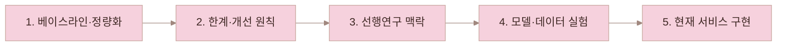
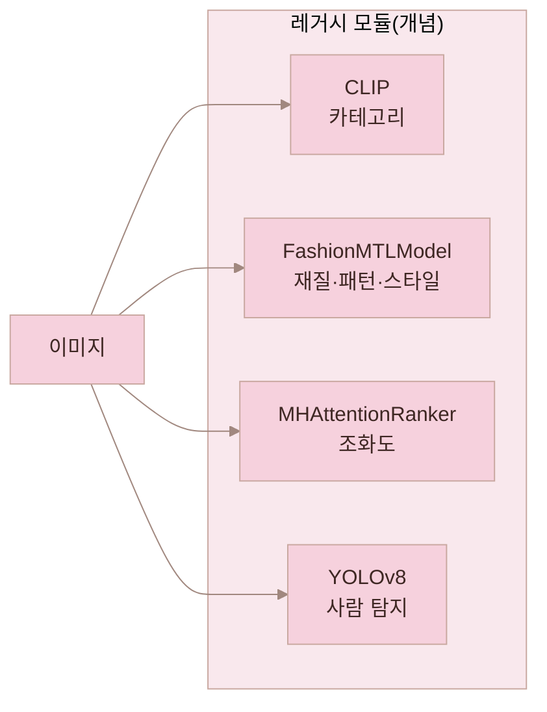
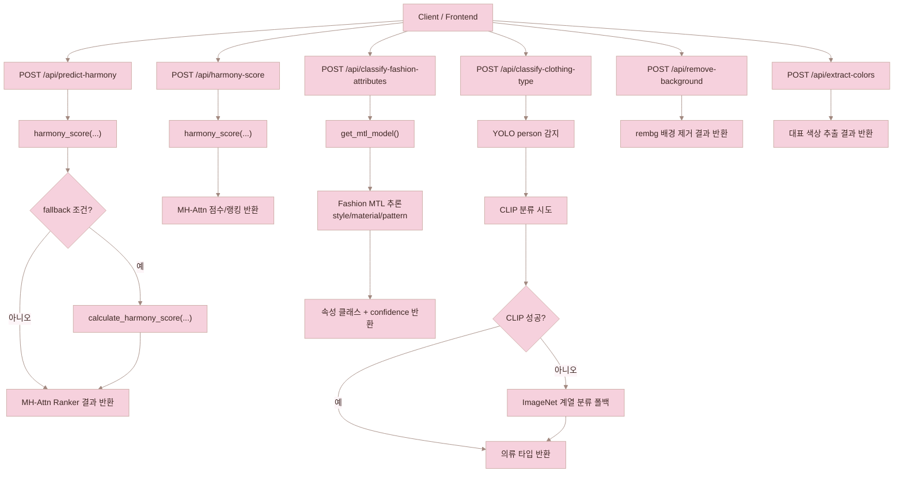
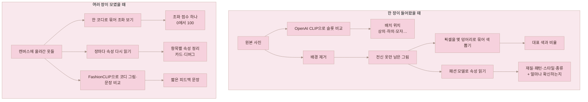
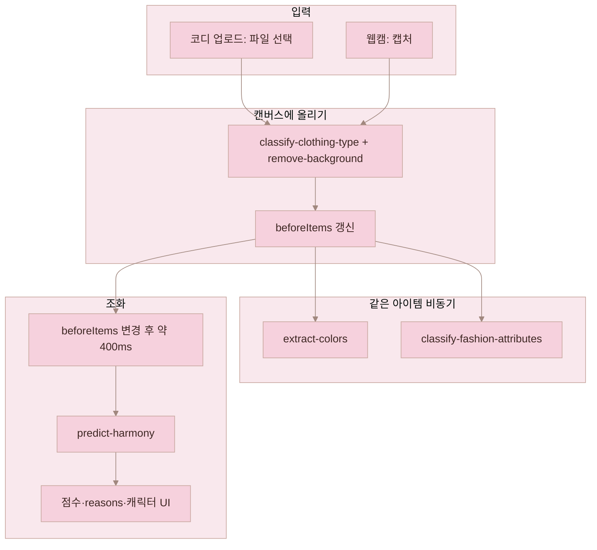
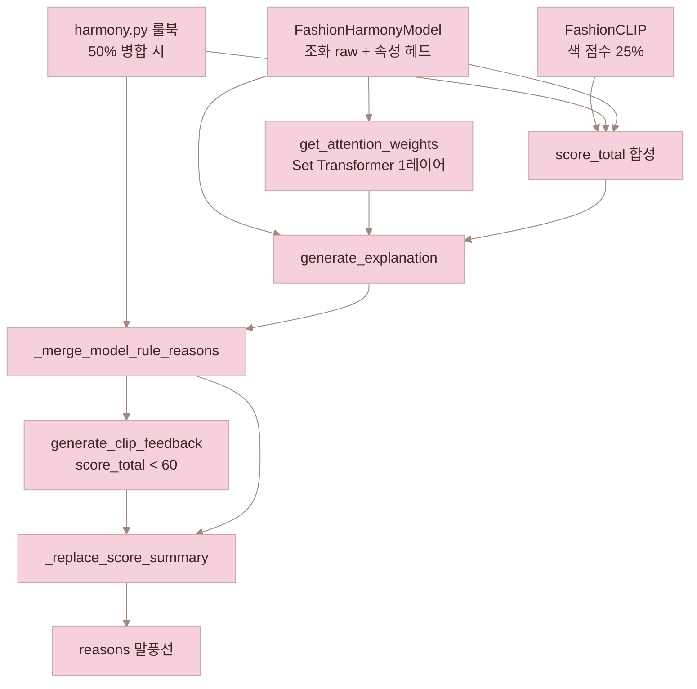

# HUWARI

패션 아이템 조합의 조화도를 분석하는 웹 애플리케이션이다.  

## 웹사이트 소개

HUWARI는 "지금 가진 옷 조합이 잘 어울리는지"를 빠르게 확인할 수 있도록 만든 코디 분석 웹사이트이다.
사용자는 이미지 업로드와 간단한 배치만으로 조화 점수와 속성 분석 결과를 받아볼 수 있으며, 결과를 히스토리에 저장해 이전 코디와 비교할 수 있다.

### 유용한 활용 상황

- 오늘 입을 코디 후보 중 어떤 조합이 더 안정적인지 판단하고 싶을 때
- 특정 아이템(예: 자켓, 신발)을 바꿨을 때 전체 스타일 균형이 어떻게 달라지는지 보고 싶을 때
- 색감은 괜찮은데 패턴/질감 조합이 어색한지 빠르게 점검하고 싶을 때

### 페이지 구성

- `Home`
  - 메인 작업 공간이다.
  - before/after 아이템을 올리고 분석을 실행하면 점수와 해석 결과를 확인할 수 있다.
- `History`
  - 저장된 분석 결과를 시간순으로 조회한다.
  - 과거 코디를 다시 불러와 현재 조합과 비교할 수 있다.
- `Info`
  - 서비스 설명 및 사용 가이드를 제공한다.

### 사용자 흐름

1. 이미지를 업로드하고 필요 시 배경 제거를 적용한다.
2. 아이템의 색상/속성 정보를 추출한다.
3. 조화 점수(총점 + 세부 항목)를 계산하고 결과를 해석한다.
4. 마음에 드는 결과는 히스토리에 저장해 재사용한다.

### HUWARI가 제공하는 가치

- 주관적 감각에 의존하던 코디 선택을 정량 지표로 보조
- 색/질감/패턴/스타일 관점의 다각도 피드백 제공 ([XAI 설명](#xai-explainability) 참고)
- 코디 실험(아이템 교체)을 빠르게 반복할 수 있는 인터랙티브 UX 제공

---

<a id="research-journey"></a>
## HUWARI 연구·개발 스토리 (베이스라인 → 선행연구 → 실험 → 현재 서비스)

먼저 **당시 HUWARI 레거시(모듈 분절) 파이프라인**을 구조·수치로 고정해 **어디가 병목인지**를 밝히고, 그 **문제를 해결할 방향을 찾기 위해 선행연구**를 살펴보았다. 이어서 도출한 **개선 원칙**을 **FashionHarmony·K-Fashion 실험**으로 옮기고, 마지막에 **지금 저장소의 서비스**로 구현한 과정을 한 흐름으로 묶었다.



---

<a id="baseline-eval"></a>
### 1. 베이스라인: 레거시 파이프라인 구조와 측정값

개선 실험에 앞서 **기존 파이프라인을 그대로 두고** 성능을 측정해, 이후 모든 변경의 **기준선(Baseline)** 으로 삼았다.

#### 1.1 모듈 구성(개념)와 엔드포인트

레거시 시스템은 하나의 거대한 순차 파이프라인이라기보다, **요청 목적별로 모델이 갈라지는 API 구조**였다. 조화·속성·의류 타입·전처리가 각각 분리되어 있었고, 이는 곧 **표현 공간이 통합되지 않음**을 의미한다.



`main.py` 기준으로 당시 운용은 대략 다음과 같다.

- **조화**: `POST /api/predict-harmony`·`POST /api/harmony-score` → `harmony_score(...)`(MH-Attn ranker), 일부 조건에서 `calculate_harmony_score(...)` 규칙 폴백
- **속성**: `POST /api/classify-fashion-attributes` → EfficientNet-B3 **Fashion MTL**
- **의류 타입**: `POST /api/classify-clothing-type` → YOLO 보조 + CLIP 우선, 실패 시 ImageNet 계열 폴백
- **전처리**: `POST /api/remove-background`, `POST /api/extract-colors`

엔드포인트별 호출 흐름은 아래와 같이 정리할 수 있다.



> **참고(현재 저장소)**: 위 다이어그램·목록은 **과거 레거시** 기준이다. 지금 `main.py`의 조화 API는 **`POST /api/predict-harmony`** 만이며(FashionHarmony + FashionCLIP), **`/api/harmony-score`는 제공하지 않는다.**

#### 1.2 평가 범위(베이스라인 실험에서 무엇을 봤는가)

| 측면 | 지표(예) |
|------|----------|
| **아이템 속성 (Fashion MTL)** | Accuracy, Macro F1, Weighted F1, Top-3 Accuracy |
| **조화 랭킹 (Harmony Ranker)** | Pairwise Accuracy(페어 단위 정답 비율) |

즉 **“아이템 이해”**와 **“조합 어울림”**을 동시에 본다.

#### 1.3 Harmony Ranker (MH-Attn) 성능

레거시 **MHAttentionRanker**는 오프라인 평가에서 **Pairwise Accuracy 약 0.756** 수준이었다. 이후 FashionHarmony 실험(AUC 등, 프로토콜 상이)과 비교할 때의 출발점으로 쓴다.

#### 1.4 Fashion MTL 분류 성능 (레거시 체크포인트 기준)

| Task     | Accuracy | Macro F1 | Weighted F1 | Top-3 Accuracy |
| -------- | -------- | -------- | ----------- | -------------- |
| Style    | 0.635833 | 0.634632 | 0.634632    | 0.899671       |
| Material | 0.666075 | 0.125872 | 0.631835    | 0.856772       |
| Pattern  | 0.844358 | 0.186979 | 0.821423    | 0.935371       |

`Pattern`은 상위 후보 포찡이 강하고, `Material`·`Pattern`의 Macro F1은 **클래스 불균형** 영향 가능성이 있다. 이 수치는 이후 **클래스 수를 줄이고 라벨을 정제하는 동기**(K-Fashion 등)로 이어진다.

---

### 2. 베이스라인이 드러낸 한계와 개선 원칙

사람은 코디를 **색 점수 + 재질 점수…**처럼 분해해 더하지 않는다. 상의·하의·신발이 한 장면에 있을 때 **톤·실루엣·질감·패턴 충돌**을 동시에 읽고 “어울린다”고 판단한다. 레거시는 이 인지 과정과 달리 **모듈을 쌓는 구조**에 가까웠다.

| 한계 | 설명 |
|------|------|
| **표현 공간 분리** | CLIP·MTL·랭커가 각자 학습·추론해 **공동 임베딩**으로 세트 맥락을 일관되게 쓰기 어렵다 |
| **세부 점수의 의미** | API 상 `score_color` 등이 **총점의 고정 비율**에 가깝게 채워지는 등, 축별 “진짜 분해”가 어렵다 |
| **랭커 상한** | MH-Attn은 베이스라인에서 쓸 만했으나 Pairwise Acc **~0.756**에 머물고, **세트 전체를 한 번에 학습한 모델** 여지가 있다 |
| **속성 과다 클래스** | 재질·패턴 세분류 + 노이즈 라벨은 **희귀 클래스** 예측을 불안정하게 한다 |
| **제품 공백** | **웹캠·실시간** 경로가 없었다 |

그래서 개선 원칙을 이렇게 세웠다.

- **공유 백본·통합 표현**: 속성 로짓과 조화 판단이 같은 특징 흐름을 공유하도록
- **데이터 기반 정렬**: contrastive / ranking 등으로 “맞는 조합·틀린 조합”을 표현 공간에서 정렬
- **세트 단위 구조**: attention 기반으로 **아웃핏 전체 상호작용**을 직접 모델링
- **설명 보강**: 축별 라벨이 없는 한 **FashionCLIP 피드백·총점 구간 문장**으로 사용자 설명을 보완(현재 서비스에 반영)

---

### 3. 학문적 배경과 선행연구

위와 같은 **구조적·정량적 한계**를 넘어설 아이디어를 찾기 위해, 패션 조화·호환성을 **학계에서 어떻게 다뤄 왔는지**를 정리했다. 패션 조화도 예측은 대체로 **pairwise**(아이템 쌍 단위)에서 **세트 단위(set-level) 상호작용** 모델링으로 확장되는 흐름이며, HUWARI가 Set Transformer 쪽을 택한 근거도 여기에 닿아 있다.

| 연구 | 핵심 아이디어 | 본 프로젝트와의 관계 |
|------|---------------|----------------------|
| **Type-Aware Embedding** (Vasileva et al., 2018) | 카테고리 쌍별 임베딩으로 궁합 학습, Polyvore 벤치 정착 | pairwise로는 **A-B, B-C가 맞아도 A-B-C 전체**가 조화롭다고 보기 어렵다는 구조적 한계를 이해하는 기준 |
| **VICTOR** (Papadopoulos et al., 2022) | Transformer로 아웃핏 내 여러 아이템 동시 처리, 텍스트·이미지 활용, Polyvore-Disjoint **AUC ~0.92** 보고 | 세트 동시 모델링 방향은 참고하되, **텍스트 입력 의존**은 실서비스 UX와 맞지 않아 피함 |
| **CLIP 하이브리드 멀티모달** (Kalashi & Teimourpour, 2024) | CLIP 기반 고성능 경향 | 역시 **텍스트가 필요한 설정**이 많아, HUWARI는 **이미지 중심 조화 경로**를 우선 |

**HUWARI가 택한 방향**은 위 흐름을 참고하되, (1) **Set Transformer로 세트 단위 판단**을 강화하고, (2) **이미지만으로 조화 예측**이 가능한 경로를 두며(Polyvore-U 학습 등에서 **AUC ~0.912**까지 확인한 실험 설정이 있음), (3) 그 결과를 **FastAPI + React·웹캠**까지 연결하는 **실사용 서비스**로 완성하는 것이다.

---

### 4. 개선 실험: FashionHarmony와 데이터 재정렬

원칙을 코드와 실험으로 옮긴 순서를 **단계**로 나누면 다음과 같다.

#### 4.1 Polyvore-U로 통합 조화 모델 학습 (FashionHarmonyModel)

**모델 골격**: EfficientNet-B3 특징 → **AttributeHeads**(카테고리·재질·패턴·스타일 등) → **Set Transformer**(패딩 마스크와 함께 세트 전체 조화 점수 0~1). 서비스에 올린 구현 요약은 [§5 현재 서비스](#improved-pipeline)의 **FashionHarmonyModel** 안내를, 코드·차원은 `models/fashion_harmony.py`를 본다.

**데이터 (Hugging Face `Marqo/polyvore`)**

| 항목 | 규모 |
|------|------|
| 이미지 | 약 84,686장 |
| 아웃핏 세트 | 약 20,062개 |

**학습 과정 요약 (예: Colab Pro, T4)**

| 단계 | 내용 | 비고 |
|------|------|------|
| Contrastive | 백본 표현 | 중간 분류 acc 약 **0.630** |
| 속성 헤드 | SigLIP 자동 라벨 등(예: 7,715장 규모) | 노이즈 이슈 → 이후 K-Fashion 동기 |
| Set Transformer | Polyvore-U 세트 단위 | acc 약 **0.707** |
| 파인튜닝 | 전체 미세조정 | acc 약 **0.729** |
| 평가 | 세트 호환성 | **AUC 약 0.912** (SigLIP 라벨·해당 실험 설정 기준) |

**트러블슈팅**: 임베딩 **L2 정규화 제거**, `OutfitDataset` pos/neg **버그 수정**, contrastive **temperature** 정리.

<a id="k-fashion-retrain"></a>
#### 4.2 K-Fashion으로 속성 체계 재정의·재학습

**문제**: `FashionMTLModel` 계열의 **과다 클래스**와 자동 라벨 노이즈로 희귀 클래스가 잘 안 잡힘.

**대응**: **AI Hub K-Fashion** 파싱, 스타일별 샘플링, **소수 그룹**(연구 노트 기준 예: 재질 8·패턴 9·스타일 10 등)으로 재정의·전문가 라벨 방향.

| 항목 | 규모 |
|------|------|
| 원본 이미지 | 약 967,806장 (zip 3개) |
| 스타일당 샘플 | 5,000장 |
| 실험 파싱 합 | 약 50,000장 |

**속성 분류만 본 지표 (K-Fashion)**

| 태스크 | Accuracy |
|--------|----------|
| style | **0.406** |
| material | **0.635** |
| pattern | **0.809** |
| 평균 | **0.617** |

스타일은 **단일 아이템**보다 **전체 코디**가 있어야 하는 태스크라 정확도가 상대적으로 낮다.

#### 4.3 Set Transformer 재학습 (속성·라벨 정렬 후)

| 지표 | 값 |
|------|-----|
| Accuracy | **0.768** |
| AUC | **0.871** |

| 모델 | 지표 | 값 |
|------|------|-----|
| MH-Attn (베이스라인) | Pairwise Acc | **0.756** |
| FashionHarmony (재학습 후) | AUC | **0.871** |

AUC와 Pairwise Accuracy는 **프로토콜이 다르다**. 다만 **세트 조화를 직접 학습한 통합 모델**로 실무 수준 판별 품질을 올렸고, **0.912 → 0.871**처럼 수치가 내려가도 **K-Fashion 라벨 신뢰도**와의 트레이드오프로 볼 수 있다.

#### 4.4 성과·운영 시 한계(요약)

| 항목 | 레거시 | 개선 후 |
|------|--------|---------|
| 조화 | MH-Attn 중심 (Pairwise Acc ~0.756) | FashionHarmony + Set Transformer (실험 AUC ~0.871 등) |
| 속성 | 다세분류·노이즈 | K-Fashion·축소 클래스 방향 + 통합 모델 헤드 |
| 웹캠 | 없음 | YOLO 크롭 + 동일 조화 함수 |
| 서비스 | API 단편 | FastAPI + React |

| # | 한계 |
|---|------|
| 1 | 스타일은 단일 이미지로 한계 — 전체 코디 맥락 필요 |
| 2 | 축별 **독립 조화 라벨** 부재 → 세부 점수 **모델 직접 분해** 어려움 → **FashionCLIP**(색 조화·`reasons` 문구)과 총점 구간 문장으로 보완, **캔버스 슬롯·카테고리**는 **OpenAI CLIP**(`clip-vit-base-patch32`) |
| 3 | 세부 점수 스키마: **`score_color`** 는 FashionCLIP 색 점수(0~100), **`score_texture`·`score_pattern`·`score_style`** 는 스키마 호환용 **`score_total`의 0.95배** — [§5.3](#predict-harmony-api) 참고 |

**이 저장소와의 대응**

- **조화·아이템 속성(한국어 클래스)**: 동일 **`FashionHarmonyModel`** + 체크포인트 **`models/fashion_harmony_retrained.pt`**. 속성 헤드 차원은 **`models/fashion_harmony.py`** 기준 **카테고리 5 · 재질 8 · 패턴 9 · 스타일 10**(속성 벡터 32차원 결합 후 Set 입력).
- **레거시 `FashionMTLModel`**(`models/fashion_mtl.py`)는 과거 실험·참고용으로 남아 있으며, **현재 `main.py` API 경로에서는 로드하지 않는다.**

---

<a id="improved-pipeline"></a>
### 5. 현재 서비스: 구현 개요

실험 모델을 **웹에서 쓰는 형태**로 옮긴 것이며, 본 절에서는 **역할 분담과 흐름**만 요약한다. **어떤 입력이 어떤 단계를 거쳐 무엇으로 바뀌는지**만 보려면 [§5.1.1 과정과 산출물](#model-flow-current)을 참고한다. 엔드포인트 목록은 [§5.6](#section-511-rest)에, 구현 세부는 저장소 소스에서 확인할 수 있다.

#### 5.1 설계 목표

1. 여러 아이템을 한 코디로 보고 **조화 점수(0~100)** 를 낸다(FashionHarmony 세트 raw와 FashionCLIP 색 점수를 **75% / 25%**로 합성).
2. 화면·히스토리용 **재질·패턴·스타일·카테고리**는 **`FashionHarmonyModel.get_attributes`** 로 채운다(한국어 클래스명).
3. **의류 타입(슬롯 배치·요청 `category` 없을 때)** 은 **OpenAI CLIP**(`openai/clip-vit-base-patch32`)으로 분류한다. 조화 API의 **`reasons`** 에는 **FashionCLIP**으로 코디 이미지와 문장 후보를 비교한 피드백을 **선택적으로** 덧붙인다(`generate_clip_feedback`).
4. **웹캠** 백엔드 경로에서는 **YOLOv8**으로 사람 영역을 찾아 크롭한 뒤 동일 조화 파이프라인을 탄다. **현재 Home UI**는 캡처 한 장을 업로드와 같이 처리한 뒤 **`predict-harmony`** 만 호출한다(§5.2).

스택은 **React·Vite + FastAPI**이며, **히스토리** 저장을 지원한다.

<a id="model-flow-current"></a>
#### 5.1.1 과정과 산출물

사용자가 올린 **한 장**과, 캔버스에 쌓인 **여러 장(한 코디)** 을 나누어 본다. 아래는 **「무슨 일을 하면 → 화면·응답에 무엇이 생기는지」** 만 정리한 것이다. (웹캠 전용 백엔드는 먼저 **사람 찾기·크롭**이 붙고, 그 다음은 아래 **여러 장**과 같은 종류의 결과를 만든다.)



**한 장**  
- **OpenAI CLIP**으로 “상의/하의/…” 후보와 이미지를 맞춰 보면 → **캔버스에 놓일 칸(슬롯)** 이 정해진다(프론트는 응답의 `clothing_type`을 **`category`** 로도 저장해 `predict-harmony`에 넘길 수 있다).  
- **배경 제거**를 거치면 → **옷만 남은 이미지**가 생기고, 그걸로 이후 단계가 이어진다.  
- **색 군집**을 돌리면 → **대표 색 몇 가지와 비율**이 나와 UI에 **색칩**으로 붙는다.  
- **통합 패션 모델**이 그 이미지를 읽으면 → **재질·패턴·스타일·종류(한글)** 과 **각각의 확률**이 나와 카드 툴팁 등에 쓰인다.

**여러 장(한 코디)**  
- **여러 장을 한 세트**로 묶어 보면 → **조화 점수 한 개(0~100)** 가 나온다. **FashionHarmony** Set 입력에는 **메인 의류 이미지 앞에서 최대 4장**만 쓰이고, **신발·모자·악세서리**는 세트 조화 텐서에는 넣지 않되 **색 조화(FashionCLIP)**·**피드백 문장**에는 메인과 함께 포함된다. 메인이 없고 악세서리만 있으면 서버에서 한쪽으로 합쳐 처리한다.  
- 같은 코디에 대해 **메인 이미지마다 속성을 읽으면** → **`debug.item_attrs`** 등에 붙는다.  
- **FashionCLIP**으로 코디 그림(가로 이어붙임)과 여러 문장 후보를 비교하면 → **짧은 피드백 문장**이 `reasons`에 덧붙을 수 있다(모델이 없으면 생략).

| 사용자 입장에서 생기는 것 | 한 줄 설명 |
|----------------------------|------------|
| 슬롯 | 어디 칸에 붙일지 |
| 전경 이미지 | 배경 없는 옷만 |
| 색 요약 | 대표 색·비율 |
| 속성 카드 | 재질·패턴·스타일·종류 |
| 조화 점수 | 코디 전체 한 점수 |
| 피드백 문장 | 이유·느낌 한두 줄 |

#### 5.2 런타임 흐름 (UI·서버)

**Home** 화면은 왼쪽에 **코디 작업 영역**, 오른쪽에 **조화 점수·피드백**을 둔다. 입력 방식은 상단에서 **「코디 업로드」** 와 **「웹캠」** 으로 바꿀 수 있으며, 선택 값은 `localStorage`의 `huwari_input_mode`에 저장된다.

**공통**: 캔버스에 올라간 아이템 목록(`beforeItems`)이 바뀔 때마다, 프론트는 약 **400ms 디바운스** 뒤 `POST /api/predict-harmony` 를 호출한다. 요청 본문은 `{ beforeItems, afterItems }` 이며, 현재 구현에서는 **`afterItems`는 빈 배열**로 고정되어 있어 **기준 코디만** 서버에 전달된다. 각 아이템에는 가능하면 **`category`**(상의·하의·신발·모자·악세서리)를 실어 보내고, 없으면 서버가 OpenAI CLIP으로 분류한다. 응답의 `score_total`, `reasons` 등으로 오른쪽 패널(점수·캐릭터 표정·피드백 문장)이 갱신되고, 동일 구성에 대한 결과는 `huwari_harmony_cache`에 시그니처와 함께 캐시된다. 아이템이 하나도 없으면 조화 요청은 보내지 않고 점수 영역을 비운다.

**코디 업로드** (`ItemPlacementArea`): 사용자가 파일을 고르면 서버에 **`/api/classify-clothing-type`**(의류 종류)와 **`/api/remove-background`**(배경 제거)를 병렬로 호출한다. 성공 시 종류에 맞는 위치에 **배경이 제거된 이미지(data URL)** 가 캔버스에 놓인다. 이어서 같은 아이템에 대해 비동기로 **`/api/extract-colors`**(대표 색)와 **`/api/classify-fashion-attributes`**(재질·패턴·스타일)를 호출해 카드 정보를 채운다. 사용자는 드래그·리사이즈로 배치를 바꿀 수 있으며, 배치가 바뀌어도 `beforeItems` 객체가 갱신되면 위 디바운스 규칙에 따라 조화가 다시 요청된다.

**웹캠**: 브라우저 **`getUserMedia`** 로 카메라를 켠 뒤, 캡처 시점의 프레임을 JPEG로 만든다. 이후 흐름은 업로드와 같게 **`/api/classify-clothing-type`** 와 **`/api/remove-background`** 를 병렬 호출하고, 나온 이미지를 캔버스에 한 아이템으로 추가한다. 색·속성 역시 **`extract-colors`**, **`classify-fashion-attributes`** 로 비동기 보강한다. 조화 계산은 역시 **`predict-harmony`** 한 경로이다.

백엔드에는 전신 프레임에서 사람을 찾아 상·하의로 나눈 뒤 조화까지 한 번에 처리하는 **`POST /api/webcam-harmony`** 도 있으나, **현재 `Home.tsx` 프론트는 이 경로를 호출하지 않는다.** (API 목록·다른 클라이언트용으로 유지된다.)



<a id="fashion-harmony-arch"></a>

**FashionHarmonyModel**은 EfficientNet-B3 계열 백본, 슬롯별 속성 헤드, Set Transformer로 세트 점수를 낸다. 가중치는 **`models/fashion_harmony_retrained.pt`**, 정의는 **`models/fashion_harmony.py`** 에 있다. 조화 계산 시 **Set 입력은 메인 의류 슬롯 4개(앞에서 최대 4장)** 에 맞춘다. **색상 조화**와 **`reasons` 내 FashionCLIP 피드백**은 별도로 **`Marqo/marqo-fashionCLIP`** 을 쓴다(의존성: `open-clip-torch`, Hugging Face `trust_remote_code` 로딩).

<a id="predict-harmony-api"></a>
#### 5.3 `predict-harmony` 조화 점수·응답

- **카테고리 분리**: `beforeItems`·`afterItems`를 합쳐 이미지를 로드한 뒤, `category`가 없으면 **OpenAI CLIP**으로 `상의`·`하의`·`모자`·`신발`·`악세서리` 중 하나를 고른다. **신발·모자·악세서리**는 “악세서리 이미지” 목록으로만 색·피드백에 쓰이며, **FashionHarmony** Set 조화 텐서에는 **메인 의류만**(최대 4장) 넣는다. 메인이 비고 악세서리만 있으면 서버가 메인으로 옮겨 처리한다.
- **총점 `score_total`**: 메인 최대 4장의 **FashionHarmony** raw(0~1)와, 메인+악세서리를 가로로 이은 이미지의 **FashionCLIP 색 점수**(0~1)를 **`harmony_raw × 0.75 + color × 0.25`** 로 합친 뒤 0~100으로 반올림한다.
- **`score_color`**: 위 FashionCLIP 색 분기의 **퍼센트 값**(0~100 근사). **`score_texture`·`score_pattern`·`score_style`** 은 스키마 호환을 위해 **`score_total`의 약 0.95배**로 채우며, 축별 독립 추정은 아니다.
- **`reasons`**: 말풍선 피드백 문장 배열. 생성 방식은 [XAI (설명 가능 AI)](#xai-explainability) 절을 본다.
- **`debug`**: 경과 시간, 메인/악세서리 이미지 수, `harmony_raw`, `color_score`, **`attention_weights`**(아이템 간 attention 행렬), 메인 이미지별 `classify_attributes` 결과 등.

#### 5.4 응답·운용 시 유의사항

- **기준 코디가 비어 있으면** 중립 점수(50대)와 고정 안내 문구를 반환한다.
- **미리보기 전용** API는 조화 점수 없이 검출·크롭 정보만 반환한다.

UI 속성 라벨과 조화 모델 내부 헤드의 클래스 구성은 다를 수 있다. MTL·버킷 매핑과 K-Fashion 맥락은 [4.2절](#k-fashion-retrain)을 참고한다.

#### 5.5 부가 기능·로컬 실행

**배경 제거**, **대표 색 추출**, **히스토리**는 필요 시 별도 API로 쓴다. 히스토리는 **서버 메모리**에 두며 재시작 시 비워진다. 로컬 개발 시 프론트는 보통 **3000**, 백엔드는 **8000** 포트이며, Vite가 `/api` 를 FastAPI로 넘긴다.

<a id="section-511-rest"></a>
#### 5.6 주요 HTTP 엔드포인트

| 기능 | HTTP 경로 | 비고 |
|------|-----------|------|
| 조화·이미지별 속성(캔버스) | `POST /api/predict-harmony` | before/after URL·data URL, 아이템별 선택 필드 **`category`** |
| 웹캠 조화·크롭 속성 | `POST /api/webcam-harmony` | multipart 1장 |
| 웹캠 미리보기(검출만) | `POST /api/detect-clothing` | 조화 없음 |
| 속성만 | `POST /api/classify-fashion-attributes` | 1장 |
| 의류 타입만 | `POST /api/classify-clothing-type` | 1장 |
| 배경 제거·색·히스토리 | `remove-background`, `extract-colors`, `save-history`, `get-history`, `delete-history/{id}` | 히스토리는 메모리 |

**요약**: **`FashionHarmonyModel`** 이 메인 의류 세트의 조화 raw와 **아이템 속성(한국어)** 을 담당한다. **OpenAI CLIP**(`clip-vit-base-patch32`)은 **의류 타입(슬롯·`predict-harmony`에서 `category` 추론)** 에 쓰이고, **FashionCLIP**(`Marqo/marqo-fashionCLIP`)은 **색 조화 점수**·**`reasons` 피드백 문구**에 쓰인다. **YOLOv8**은 **`webcam-harmony`**·**`detect-clothing`** 등에서 사람 검출·크롭에 쓰인다.

---

<a id="xai-explainability"></a>
## XAI (설명 가능 AI)

HUWARI는 조화 **점수만 숫자로 주는 것**이 아니라, **왜 그렇게 보였는지**를 `reasons` 말풍선과 `debug` 필드로 설명한다. 구현은 `main.py`의 **`generate_explanation`** 파이프라인이 중심이며, 모델 내부 신호·규칙·멀티모달 문장을 **한국어 문장**으로 합성한다.

### XAI가 답하는 질문

| 질문 | 설명 수단 |
|------|-----------|
| 어떤 아이템 관계가 중요한가? | Set Transformer **self-attention** → `_explain_attention` |
| 색·재질·패턴·스타일은 어떤가? | 속성 분류 + **규칙 템플릿** (`_explain_colors` 등) |
| 룰북 기준으로 어디가 어색한가? | `harmony.py` **`calculate_harmony_score`** reason 병합 |
| 색 조화는 이미지 기준으로? | **FashionCLIP** 색 점수 + (저점수 시) 부정 문장 |
| 전체적으로 괜찮은가 / 고칠 곳은? | **총점 구간 요약** + 저점수 시 **개선·부정 톤** |

### 피드백 생성 파이프라인

`POST /api/predict-harmony` 응답 직전에, 최종 `score_total`을 기준으로 `reasons`를 **다시 조립**한다(속성 수정·룰북 병합 반영).



### 1. Attention 기반 설명 (모델 내부 XAI)

- **함수**: `get_attention_weights` → `_explain_attention`
- **방식**: `FashionHarmonyModel` Set Transformer **첫 번째 레이어 self-attention** 가중치에서, 유효 메인 아이템(최대 4장) 간 **가장 강한 쌍**을 찾는다.
- **출력 예**: 「상의와 하의의 조화가 코디의 핵심 요소입니다」, 「아우터와 상의의 레이어링이 포인트입니다」
- **조건**: 메인 아이템이 **2장 이상**일 때만 생성. **`score_total` &lt; 60** 이면 긍정적 attention 문장은 넣지 않고, 대신 개선·부정 문장 비중을 높인다.
- **UI**: 문장만 표시. 행렬 원본은 응답 **`debug.attention_weights`** 에만 포함(히트맵 UI 없음).

### 2. 속성·색 규칙 템플릿 (해석 가능 규칙 XAI)

- **함수**: `generate_explanation` 내 `_explain_colors`, `_explain_texture`, `_explain_pattern`, `_explain_style`
- **입력**: 메인 아이템별 **재질·패턴·스타일**(모델 `classify_attributes` + 요청의 UI 수정값 `request_attrs_main` 우선), 캔버스 **대표색**(`extract-colors` → `beforeItems.colors`)
- **톤**:
  - **`score_total` ≥ 60**: 중립~긍정 (예: 「미니멀 스타일이 통일된 깔끔한 코디입니다」)
  - **`score_total` &lt; 60**: 개선·부정 (예: 「패턴이 겹쳐 시선이 분산됩니다」, 「스타일이 부딪혀 일관되지 않습니다」)
  - **`score_total` &lt; 40**: 추가로 「코디 밸런스를 다시 맞춰 볼 필요」 등 강한 안내
- **문장 순서**: Attention(고점수만) → 색(최대 2줄) → 재질 → 패턴 → 스타일 → **총점 구간 요약**(마지막 1줄). 최대 **7줄**(`_FEEDBACK_MAX_LINES` + 요약).

### 3. 룰북 설명 (`harmony.py`)

- **함수**: `calculate_harmony_score` → `_merge_model_rule_reasons`
- **내용**: 색상환·채도/명도 차이, 재질·패턴·스타일 **조합 점수표**에 따른 reason (예: 「재질: 면와(과) 가죽 조합이 조화롭지 않음」, 「채도 차이가 커 조화가 어려움」)
- **병합**: `before_rule_items`가 있을 때 모델 점수와 **50:50** 병합 후, **`score_total` &lt; 60** 이면 **부정 reason을 앞쪽에 우선** 배치한다.
- **필터**: 「중립으로 계산」 등 내부용 문장은 `_is_user_facing_reason`으로 말풍선에서 제외한다.

### 4. FashionCLIP 멀티모달 설명

- **색 점수**: `get_clip_color_score` — 코디 이미지(메인+악세서리 가로 합성)와 「조화로운 색 / 충돌하는 색」 문장 유사도 → 총점의 **25%** 가중 (`harmony_raw` 75%)
- **부정 피드백 문장**: `generate_clip_feedback` — **`score_total` &lt; 60** 일 때만, ✓ 없는 부정 라벨(예: 「색상 톤이 맞지 않습니다」)을 최대 2개 `reasons` 앞쪽에 삽입
- **로딩**: `open-clip-torch`의 `hf-hub:Marqo/marqo-fashionCLIP` (`get_clip_model`)

### 5. 총점 구간 요약 (캘리브레이션된 narrative XAI)

| `score_total` | 마지막 요약 문장 성격 |
|---------------|------------------------|
| ≥ 80 | 완성도 높음 |
| ≥ 60 | 균형 잡힘 |
| ≥ 40 | 일부 교체·조정 제안 |
| &lt; 40 | 색·스타일 통일감 개선 제안 |

### `debug`에서 확인할 수 있는 XAI 원천

| 필드 | 의미 |
|------|------|
| `attention_weights` | 아이템×아이템 attention 행렬(JSON) |
| `item_attrs` | 메인 이미지별 재질·패턴·스타일·카테고리 분류 |
| `request_attrs_main` | UI에서 수정해 반영된 속성 |
| `harmony_raw` | FashionHarmony sigmoid raw |
| `color_score` | FashionCLIP 색 분기 |
| `rulebook_score` | 룰북 병합 시 `calculate_harmony_score` 전체 결과 |

프론트(Home)는 기본적으로 **`reasons`만** 말풍선에 표시하며, `debug`는 개발·검증용이다.

### 현재 범위에 **포함하지 않는** XAI (로드맵)

아래는 **필수 기능이 아니며** 현재 릴리스에 없다. 필요 시 별도 이슈로 확장한다.

| 항목 | 상태 | 비고 |
|------|------|------|
| Grad-CAM / SHAP 이미지 하이라이트 | 미구현 | 연산·해석 비용 큼, 코디 다장 구조와 궁합 제한적 |
| Attention **히트맵 UI** | 미구현 | `debug.attention_weights`만 제공, 문장 설명으로 대체 |
| 조화 raw의 **수식 단위 기여도 분해** | 미구현 | Set Transformer 출력은 블랙박스; 대신 점수 합성 비율·`reasons`·룰북으로 설명 |

### 관련 소스

| 파일 | 역할 |
|------|------|
| `main.py` | `get_attention_weights`, `generate_explanation`, `generate_clip_feedback`, `_merge_model_rule_reasons` |
| `harmony.py` | 규칙 기반 색·재질·패턴·스타일 reason |
| `models/fashion_harmony.py` | Set Transformer·속성 헤드 |
| `src/pages/Home.tsx` | `reasons` → 피드백 말풍선 렌더 |

---

### 참고문헌

1. Vasileva, M., Plummer, B. A., Dusad, K., Rajpal, S., Kumar, R., & Forsyth, D. (2018). **Learning Type-Aware Embeddings for Fashion Compatibility**. *ECCV 2018*. [https://arxiv.org/pdf/1803.09196](https://arxiv.org/pdf/1803.09196)
2. Papadopoulos et al. (2022). **VICTOR** (Transformer 기반 outfit compatibility). [https://arxiv.org/pdf/2207.13458](https://arxiv.org/pdf/2207.13458)
3. Kalashi and Teimourpour (2024). **CLIP 기반 하이브리드 멀티모달 접근**. [https://arxiv.org/pdf/2511.07573](https://arxiv.org/pdf/2511.07573)

## 주요 기능

- **이미지 업로드 및 전처리**
  - 단일 또는 다중 의류 이미지를 업로드하고 분석 파이프라인에 입력한다.
  - 업로드 이미지는 서버에서 포맷을 정규화하여 후속 모델 추론에 사용한다.
- **배경 제거(RemBG)**
  - 의류 객체를 중심으로 배경을 제거해 색상/속성 분석의 노이즈를 줄인다.
  - 결과는 PNG 형태로 반환되어 전/후 비교나 레이아웃 합성에 활용할 수 있다.
- **대표 색상 추출 및 시각화**
  - 각 아이템에서 주요 색상 팔레트를 추출하고 비율(percentage) 정보를 함께 제공한다.
  - 추출된 색상은 UI 상의 색상 요약 카드에 활용한다. **조화 총점의 색 가지**는 별도로 FashionCLIP으로 코디 이미지를 보고 계산한다([§5.3](#predict-harmony-api)).
- **조화 점수 예측(핵심)**
  - `POST /api/predict-harmony`가 before(및 선택 after) 아이템 이미지를 받아 조화를 계산한다.
  - 출력 항목:
    - 총점(`score_total`): FashionHarmony 세트 raw와 FashionCLIP 색 점수를 **75% / 25%**로 합성한 0~100 점수.
    - 세부 점수: `score_color`(FashionCLIP 색), `score_texture`·`score_pattern`·`score_style`(스키마 호환용으로 `score_total`의 약 0.95배).
    - 해석 문장(`reasons`) 및 디버그 정보(`debug`). XAI 상세는 [XAI (설명 가능 AI)](#xai-explainability) 절.
- **패션 속성 분류(통합 모델)**
  - **`FashionHarmonyModel`**의 속성 헤드로 재질·패턴·스타일·카테고리(한국어 클래스)를 예측한다(`POST /api/classify-fashion-attributes`).
- **의류 타입 분류(슬롯용)**
  - 상의/하의/모자/신발/악세서리를 **OpenAI CLIP**(`clip-vit-base-patch32`)으로 분류한다(`POST /api/classify-clothing-type`).
  - 로드 실패·오류 시 응답은 `clothing_type` 기본값 등으로 폴백할 수 있으며, **ImageNet 계열 보조 분류기는 현재 `main.py`에 연결되어 있지 않다.**
- **사람 영역 감지 기반 보조 신호**
  - YOLO를 활용해 인물 포함 여부 및 박스 기반 비율 정보를 추출한다.
  - 분류 결과 보정 또는 후처리 조건 판단에 보조 신호로 사용된다.
- **히스토리 저장/조회/삭제**
  - 분석 결과(아이템 배치, 조화 점수, 생성 시각)를 히스토리로 저장한다.
  - 히스토리 페이지에서 정렬/필터 상태를 유지한 채 결과를 다시 불러올 수 있다.
- **사용자 경험(UX) 보강**
  - 페이지 이동 시 현재 작업 상태를 최대한 복원하도록 로컬/세션 스토리지를 활용한다.
  - 인터랙션 요소(버튼 상태, 안내 말풍선, 커서 트레일 등)를 통해 분석 흐름을 직관적으로 제공한다.

## 기술 스택

- Frontend: React, Vite, TypeScript, Tailwind CSS, React Router
- Backend: FastAPI, Uvicorn
- ML/CV: PyTorch, torchvision, timm, transformers, **open-clip-torch**(FashionCLIP), ultralytics(YOLO), rembg, scikit-learn

## 프로젝트 구조

```text
huwari/
├─ src/                    # 프론트엔드(React)
│  ├─ components/
│  └─ pages/
├─ main.py                 # FastAPI 서버 및 API 엔드포인트
├─ harmony.py              # 규칙 기반 조화(레거시 참고, 현재 `main.py` 조화 API와 무관)
├─ models/
│  ├─ fashion_harmony.py    # FashionHarmonyModel (백본+속성헤드+Set Transformer)
│  ├─ harmony_ranker.py    # MHAttentionRanker + EfficientNet-B0 임베딩(레거시)
│  └─ fashion_mtl.py       # 재질/패턴/스타일 MTL(과거 실험·참고용, 현재 속성 API는 FashionHarmony)
├─ requirements.txt        # Python 의존성
├─ package.json            # Node 의존성 및 스크립트
└─ vite.config.ts          # 프론트 dev 서버(3000) + /api 프록시(8000)
```

## 주요 API

- `GET /api/hello`
- `POST /api/remove-background`
- `POST /api/extract-colors`
- `POST /api/classify-fashion-attributes`
- `POST /api/classify-clothing-type`
- `POST /api/predict-harmony`
- `POST /api/webcam-harmony`
- `POST /api/detect-clothing`
- `POST /api/save-history`
- `GET /api/get-history`
- `DELETE /api/delete-history/{history_id}`

## 모델 구성 메모

- `models/fashion_harmony.py` (서비스 조화·속성 기본)
  - `FashionHarmonyModel`: EfficientNet-B3 백본 + 속성 헤드 + Set Transformer.
  - 체크포인트 **`fashion_harmony_retrained.pt`** (`main.py`의 `HARMONY_CKPT`). 배경·실험·구현은 [HUWARI 연구·개발 스토리](#research-journey) 절을 본다.
- `models/harmony_ranker.py`
  - 레거시 `MHAttentionRanker` + `EfficientNet-B0` 임베딩 경로(베이스라인·비교 실험용으로 위 스토리 절에 기록됨).
- `models/fashion_mtl.py`
  - Multi-Task Learning으로 3개 태스크를 동시에 예측한다(과거 실험·참고용).
  - 태스크: 재질(Material), 패턴(Pattern), 스타일(Style) — **현재 FastAPI 경로에서는 로드하지 않는다.**
- `main.py`
  - **카테고리(슬롯·`predict-harmony` 보조)**: OpenAI **`clip-vit-base-patch32`**.
  - **색 조화·`reasons` FashionCLIP 문구**: **`Marqo/marqo-fashionCLIP`** (`open_clip` + Hugging Face `trust_remote_code`).
  - 조화 세트 점수·속성: **`FashionHarmonyModel`** + `fashion_harmony_retrained.pt`.
