<p align="center">
  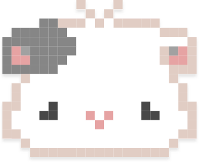
</p>

<h1 align="center">HUWARI</h1>
<p align="center"><strong>패션 코디 분석 모델 FashionHarmony 설계 및 웹 서비스 구현</strong></p>

**CNN 백본 전이학습(EfficientNet-B3)·객체 탐지(YOLOv8)·색 분석·Vision Foundation Model(CLIP)** 을 결합하고, 그 위에 **속성 헤드(재질·패턴·스타일)** 와 **Set Transformer**를 결합한 **FashionHarmony 모델**을 직접 설계·학습해 React + FastAPI 기반 웹 서비스로 옮긴 프로젝트이다. 조화 예측과 속성 예측을 **하나의 모델에서 공동 학습**하도록 설계했고, 최종적으로 베이스라인(MH-Attn) 대비 **AUC 0.7524 → 0.8801** (+0.13)을 달성했다.

## 목차

- [목차](#목차)
- [웹사이트 소개](#웹사이트-소개)
  - [사용하기 좋은 상황](#사용하기-좋은-상황)
  - [페이지 구성](#페이지-구성)
  - [사용자 흐름](#사용자-흐름)
  - [HUWARI가 주는 가치](#huwari가-주는-가치)
  - [주요 기능](#주요-기능)
  - [기술 스택](#기술-스택)
- [주요 결과](#주요-결과)
- [HUWARI 핵심 기여](#huwari-핵심-기여)
  - [1. 초기 버전의 한계](#1-초기-버전의-한계)
  - [2. 다시 설계한 모델 — FashionHarmony](#2-다시-설계한-모델--fashionharmony)
  - [3. 새로워진 점](#3-새로워진-점)
  - [4. 결과와 알게 된 점](#4-결과와-알게-된-점)
- [HUWARI 연구·개발 스토리 (베이스라인 → 선행연구 → 실험 → 현재 서비스)](#huwari-연구개발-스토리-베이스라인--선행연구--실험--현재-서비스)
  - [1. 베이스라인: 예전 파이프라인 구조와 측정값](#1-베이스라인-예전-파이프라인-구조와-측정값)
    - [1.1 모듈 구성(개념)와 엔드포인트](#11-모듈-구성개념와-엔드포인트)
    - [1.2 평가 범위(베이스라인 실험에서 무엇을 봤는가)](#12-평가-범위베이스라인-실험에서-무엇을-봤는가)
    - [1.3 Harmony Ranker (MH-Attn) 성능](#13-harmony-ranker-mh-attn-성능)
    - [1.4 Fashion MTL 분류 성능 (예전 체크포인트 기준)](#14-fashion-mtl-분류-성능-예전-체크포인트-기준)
  - [2. 베이스라인이 드러낸 한계와 개선 원칙](#2-베이스라인이-드러낸-한계와-개선-원칙)
  - [3. 학문적 배경과 선행연구](#3-학문적-배경과-선행연구)
  - [4. 개선 실험: FashionHarmony와 데이터 재정렬](#4-개선-실험-fashionharmony와-데이터-재정렬)
    - [데이터 전처리](#데이터-전처리)
      - [K-Fashion (속성 분류)](#k-fashion-속성-분류)
        - [기존 방식의 한계 (`FashionMTLModel`)](#기존-방식의-한계-fashionmtlmodel)
        - [최종 방식 (`FashionHarmonyModel`)](#최종-방식-fashionharmonymodel)
      - [Polyvore-U (세트 조화)](#polyvore-u-세트-조화)
      - [1단계 — 데이터 수집](#1단계--데이터-수집)
      - [2단계 — Outfit 그룹핑](#2단계--outfit-그룹핑)
      - [3단계 — Positive / Negative 쌍 생성](#3단계--positive--negative-쌍-생성)
      - [4단계 — 패딩 처리](#4단계--패딩-처리)
    - [FashionHarmony Architecture](#fashionharmony-architecture)
      - [설계 목표](#설계-목표)
      - [전체 구조](#전체-구조)
      - [모듈별 역할](#모듈별-역할)
      - [왜 Set Transformer인가](#왜-set-transformer인가)
      - [Ablation 결과 연결](#ablation-결과-연결)
    - [4.1 Polyvore-U로 통합 조화 모델 학습 (FashionHarmonyModel)](#41-polyvore-u로-통합-조화-모델-학습-fashionharmonymodel)
    - [4.2 K-Fashion으로 속성 체계 재정의·재학습](#42-k-fashion으로-속성-체계-재정의재학습)
    - [4.3 Set Transformer 재학습 (속성·라벨 정렬 후)](#43-set-transformer-재학습-속성라벨-정렬-후)
    - [4.4 Ablation Study](#44-ablation-study)
    - [4.5 성과 요약](#45-성과-요약)
  - [5. 현재 서비스: 구현 개요](#5-현재-서비스-구현-개요)
    - [5.0 전체 흐름](#50-전체-흐름)
    - [5.1 설계 목표](#51-설계-목표)
    - [5.1.1 비전·이미지가 맡는 역할](#511-비전이미지가-맡는-역할)
    - [5.1.2 과정과 산출물](#512-과정과-산출물)
    - [5.2 런타임 흐름 (UI·서버)](#52-런타임-흐름-ui서버)
    - [5.3 조화 점수 계산 흐름](#53-조화-점수-계산-흐름)
    - [5.4 운용 시 유의사항](#54-운용-시-유의사항)
    - [5.5 히스토리·부가 기능](#55-히스토리부가-기능)
    - [5.6 모델별 역할 요약](#56-모델별-역할-요약)
- [웹캠](#웹캠)
  - [웹캠이 하는 일](#웹캠이-하는-일)
  - [실시간 vs 캡처](#실시간-vs-캡처)
  - [웹캠 프레임 처리 단계](#웹캠-프레임-처리-단계)
  - [캔버스 조화와의 차이](#캔버스-조화와의-차이)
- [XAI (설명 가능 AI)](#xai-설명-가능-ai)
  - [XAI가 답하는 질문](#xai가-답하는-질문)
  - [피드백 생성 파이프라인](#피드백-생성-파이프라인)
  - [1. Attention 기반 설명 (모델 내부 XAI)](#1-attention-기반-설명-모델-내부-xai)
  - [2. 속성·색 규칙 템플릿 (해석 가능 규칙 XAI)](#2-속성색-규칙-템플릿-해석-가능-규칙-xai)
  - [3. 룰북 설명 (`harmony.py`)](#3-룰북-설명-harmonypy)
  - [4. FashionCLIP 멀티모달 설명](#4-fashionclip-멀티모달-설명)
  - [5. 총점 구간 요약 (캘리브레이션된 narrative XAI)](#5-총점-구간-요약-캘리브레이션된-narrative-xai)
  - [6. 피드백 문장 카탈로그](#6-피드백-문장-카탈로그)
    - [6.1 종합 점수 요약](#61-종합-점수-요약)
    - [6.2 Attention 기반 코디 핵심](#62-attention-기반-코디-핵심)
    - [6.3 색상](#63-색상)
    - [6.4 재질](#64-재질)
    - [6.5 패턴](#65-패턴)
    - [6.6 스타일](#66-스타일)
    - [6.7 룰북](#67-룰북)
    - [6.8 FashionCLIP 부정 피드백](#68-fashionclip-부정-피드백)
    - [6.9 점수별 출력 규칙 요약](#69-점수별-출력-규칙-요약)
    - [6.10 개인화 피드백](#610-개인화-피드백)
- [한계점](#한계점)
  - [참고문헌](#참고문헌)
- [프로젝트 구조](#프로젝트-구조)
- [모델 구성 메모](#모델-구성-메모)
- [이미지 저작권 안내](#이미지-저작권-안내)

---

## 웹사이트 소개

HUWARI는 "이 코디가 잘 어울리는지" 를 빠르게 확인할 수 있는 코디 분석 웹사이트다.

옷을 사거나 매일 코디를 고를 때, 이 조합이 잘 어울리는지 애매한 경우가 많다. 온라인 쇼핑에서는 옷장 속 옷이랑 어울릴지 미리 알기 어렵고, 거울 앞에서 고른 코디도 막상 나가 보면 어색하게 느껴질 때가 있다. 이런 상황에서 한 번에 점수와 분석을 보여 줄 수 있는 도구가 있으면 좋겠다는 생각으로 만들었다.

옷 사진을 올리거나 [웹캠](#webcam)을 켜면, 한 코디에 대해 조화 점수(0~100)와 재질·패턴·스타일·색 분석을 같이 보여 준다. 새 옷이 옷장 속 옷과 어울릴지, 오늘 코디 후보 중 어느 쪽이 더 자연스러운지, 지금 입은 옷의 균형이 괜찮은지 같은 상황을 점수와 한국어 피드백으로 확인할 수 있다. 마음에 드는 코디는 히스토리에 저장해서, 새 옷을 올렸을 때 점수가 어떻게 달라지는지 비교해 볼 수도 있다.

<!-- 📸 SCREENSHOT: 서비스 전체 첫인상 -->


### 사용하기 좋은 상황

- 온라인에서 옷을 사기 전에, 옷장 속 옷이랑 어울릴지 미리 확인하고 싶을 때
- 오늘 입을 코디 후보가 여러 개 있어서, 어떤 게 더 나은지 비교하고 싶을 때
- 거울 앞에서 막상 입어 보고 애매할 때, 웹캠으로 한 번 더 점수를 보고 싶을 때
- 자켓이나 신발을 하나만 바꿨을 때 전체 분위기가 어떻게 달라지는지 보고 싶을 때
- 색은 괜찮은데 패턴·재질 조합이 어색한 건 아닌지 확인하고 싶을 때
- 그동안 어떤 스타일을 자주 입었는지 한 번에 보고 싶을 때

### 페이지 구성

서비스는 Home, History, Info 세 페이지로 되어 있다.

**Home**은 메인 작업 공간이다. 옷 이미지를 올리거나 웹캠을 켜서 한 코디를 만들고, 캔버스에 아이템을 올리면 조화 점수·색 분석·피드백 말풍선이 같이 갱신된다. 분석 패널에서 재질·패턴·스타일을 직접 고치면 점수가 다시 계산되고, 마음에 드는 코디는 그대로 히스토리에 저장할 수 있다.

**History**는 저장한 코디를 12장(2행 × 6열) 단위로 모아 보는 페이지다. 상단에는 「내 스타일 리포트」 카드가 있어서, 그동안 저장한 코디 기준으로 자주 입는 스타일·색·평균 점수·최고 점수를 요약해 준다. 코디 카드를 누르면 Home으로 다시 불러와 지금 코디와 비교할 수 있다.

<!-- 📸 SCREENSHOT: History 페이지(저장된 코디가 있을 때 + 비어 있을 때) -->
저장된 코디가 쌓이면 「내 스타일 리포트」가 평균 점수·자주 입는 스타일·자주 쓰는 색을 함께 보여 주고, 그 아래에는 점수가 매겨진 코디 카드가 나열된다.

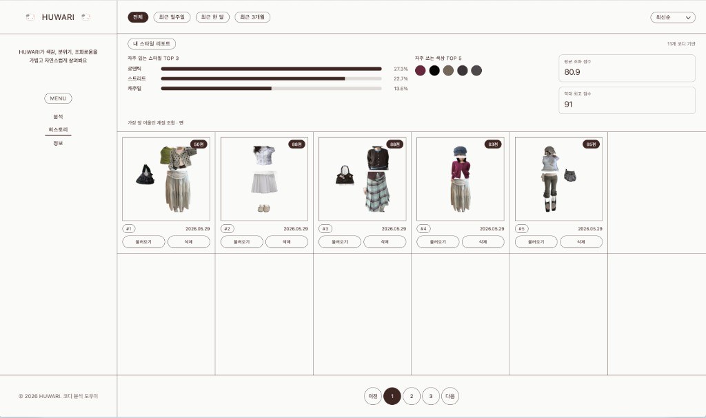

저장한 코디가 한 장도 없을 때는 같은 자리에 "비어 있다"는 안내가 표시되고, 저장 직후부터 카드가 채워지기 시작한다.

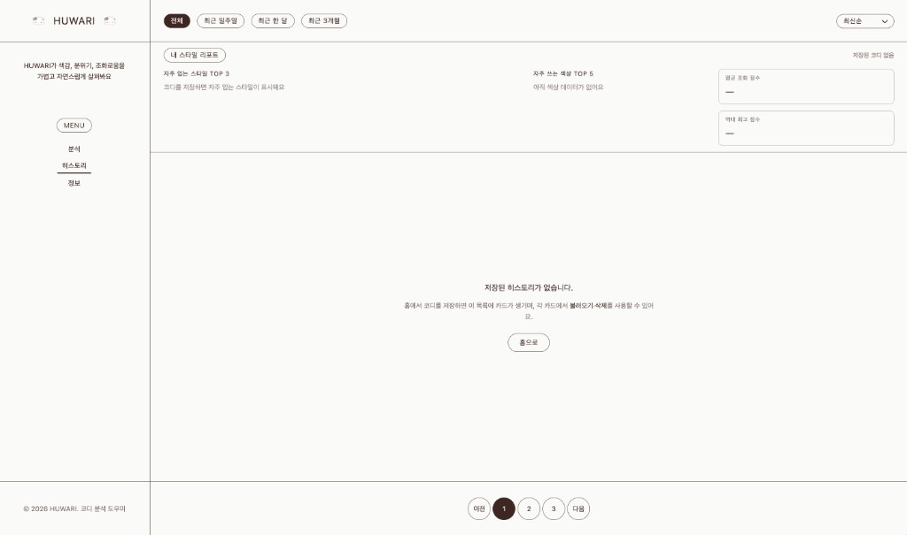

History 상단의 **「내 스타일 리포트」** 카드는 저장된 코디를 기반으로 자주 입는 스타일 TOP 3, 자주 쓰는 색 TOP 5, 가장 잘 어울린 재질 조합, 그리고 평균 조화 점수·역대 최고 점수를 한 번에 요약해 준다. 같은 데이터는 Home의 [개인화 피드백 한 줄](#personalization-line)을 만드는 데에도 그대로 쓰인다.

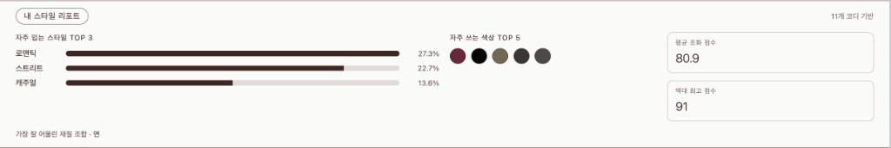

**Info**는 서비스 설명과 사용 가이드를 모아 둔 페이지다. HUWARI 이름 유래·서비스를 만든 이유·주요 기능·웹캠·캔버스·사용 방법·XAI·점수 안내·기술 스택 같은 항목이 한 페이지에 정리되어 있다.

<!-- 📸 SCREENSHOT: Info 페이지 상단(소개·서비스 동기·주요 기능 카드) -->
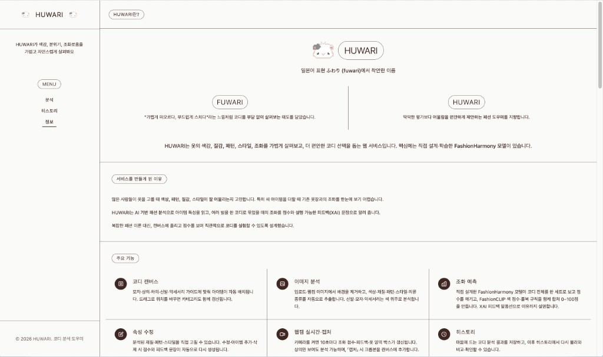

### 사용자 흐름

1. **코디 업로드**로 이미지를 올리거나, **웹캠**으로 카메라를 켠다(실시간 조화·피드백 또는 캡처).
2. (업로드·캡처 시) 아이템의 색상/속성 정보를 추출하고 캔버스에 배치한다.
3. 조화 점수(총점·색)를 계산하고 **XAI 피드백 말풍선**으로 결과를 해석한다.
4. 마음에 드는 결과는 히스토리에 저장해 재사용한다.

### HUWARI가 주는 가치

- 감각에 의존하던 코디 선택을 **점수 지표로 한 번 더 확인**할 수 있다
- 색·질감·패턴·스타일 등 **여러 관점**에서 피드백을 제공한다 ([XAI 설명](#xai-explainability) 참고)
- 아이템을 교체할 때마다 **점수가 즉시 갱신**되어, 다양한 조합을 빠르게 실험할 수 있다

### 주요 기능

| 기능 | 한 줄 설명 |
|------|------------|
| 이미지 업로드·전처리 | 옷 이미지를 올리면 리사이즈·정규화·배경 제거를 거쳐 분석하기 좋은 형태로 만든다 |
| 대표 색상 추출 | 옷에서 주요 색을 뽑아 색칩으로 보여 주고, 색 조화 점수에도 활용한다 |
| **조화 점수 예측(핵심)** | 여러 아이템을 한 코디로 보고 0~100점 조화 점수와 이유 문장을 제공한다 |
| 패션 속성 분류 + UI 수정 | 재질·패턴·스타일·종류를 한글 라벨로 보여 주고, 사용자가 직접 수정할 수 있다 |
| 의류 타입 분류(슬롯) | 상의·하의·모자·신발·악세서리 등으로 분류해 캔버스 배치에 활용한다 |
| 웹캠 실시간·캡처 | 카메라 화면에서 옷 영역을 찾아 실시간 조화 점수를 보여 주고, 캡처 후 캔버스에 추가할 수 있다 |
| 히스토리 저장·비교 | 분석 결과를 저장해 이전 코디를 다시 보고, 현재 조합과 비교할 수 있다 |
| **개인화 피드백·스타일 리포트** | 누적된 코디 기록으로 자주 입는 스타일·색·평균 점수를 요약하고, Gini 말풍선에 개인화 한 줄을 추가한다 |
| UX 보강 | 작업 상태 복원, 상태 안내, 말풍선 피드백 등으로 분석 흐름을 끊기지 않게 한다 |

### 기술 스택

- **Frontend**: React, Vite, TypeScript, Tailwind CSS, React Router
- **Backend**: FastAPI, Uvicorn
- **ML/CV**: PyTorch, torchvision, timm(EfficientNet 백본·전이학습), transformers, **open-clip-torch**(OpenAI CLIP·FashionCLIP), **ultralytics YOLOv8**, **rembg**, **MediaPipe** Pose, scikit-learn(색 군집)

역할별 정리는 [§5.1.1 비전·이미지가 맡는 역할](#vision-pipeline-roles)을 본다.

---

<a id="key-results"></a>
## 주요 결과

직접 설계한 **FashionHarmony 모델**의 조화 판별 AUC(높을수록 좋음).

| 모델 | AUC |
|------|------|
| MLP | 0.6957 |
| MH-Attn (베이스라인) | 0.7524 |
| **FashionHarmony** | **0.8710** |

베이스라인 MH-Attn 대비 약 **+0.12 AUC** 향상. 설계 의도와 Ablation 인사이트는 [HUWARI 핵심 기여](#key-contribution), 실험 과정은 [§4 개선 실험](#4-개선-실험-fashionharmony와-데이터-재정렬) 참고.

---

<a id="key-contribution"></a>
## HUWARI 핵심 기여

HUWARI는 여러 모델을 단순히 연결해 둔 서비스가 아니다. **패션 조화도 예측 모델 FashionHarmony를 직접 설계·학습**하고, 그 결과를 그대로 웹에 옮긴 프로젝트다. 같은 옷이라도 어떤 조합으로 입느냐에 따라 분위기가 달라진다는 점을 그대로 **하나의 모델 안에서 조화·속성을 공동 학습**하도록 반영한 점이 핵심이다.

### 1. 초기 버전의 한계

초기 HUWARI는 의류 종류 분류(CLIP), 재질·패턴·스타일 분류(MTL), 조화 예측(MH-Attention Ranker)을 **각각 따로 학습·추론하는 구조**였다. 직접 돌려 보니 코디 전체를 같은 표현 공간에서 다루기 어렵고, 속성 클래스가 너무 잘게 나뉘어 희귀 클래스가 흔들린다는 문제가 보였다. 이 한계를 해결하기 위해 모델 자체를 다시 설계한 게 이번 작업이다.

### 2. 다시 설계한 모델 — FashionHarmony

이번 작업의 중심은 **FashionHarmony**라는 통합 조화 모델을 직접 설계·학습한 것이다. **EfficientNet-B3 백본** 위에 **속성 헤드(재질·패턴·스타일·종류)** 와 **Set Transformer**를 결합한 **멀티태스크 기반 세트 조화 모델**로, 단일 아이템 속성 예측과 세트 전체 조화 예측을 **하나의 모델에서 공동 학습**한다. Set Transformer는 기성 모듈을 단순 적용한 것이 아니라 **FashionHarmony 내부 구성요소**로 두어, 속성 표현과 조화 표현이 같은 백본 위에서 함께 학습되도록 설계했다. 학습 데이터는 **K-Fashion**으로 속성 라벨을 정리하고 **Polyvore-U**로 세트 단위 positive/negative 쌍을 구성했다.

### 3. 새로워진 점

- **FashionHarmony 모델 직접 설계** — EfficientNet-B3 + 속성 헤드 + Set Transformer를 결합한 멀티태스크 세트 조화 모델로, 조화 예측과 속성 예측을 **공동 학습**한다
- **세트(Set) 단위 조화 모델링** — 쌍 단위(pairwise)가 아니라 코디 전체를 한 번에 본다. Set Transformer는 FashionHarmony 내부에서 아이템 사이 attention을 직접 모델링하는 모듈로 사용했다
- **K-Fashion 라벨 체계 재정의** — 과다 클래스(재질 97·패턴 70)를 실용 단위(재질 8·패턴 9·스타일 10)로 정리해 학습 안정성과 라벨 품질을 함께 끌어올렸다
- **도메인 사전학습 적용** — K-Fashion으로 백본·속성 헤드를 충분히 사전학습한 뒤 Polyvore-U에서 조화 학습을 이어, 단순 구조 변경 이상으로 성능을 끌어올렸다([§4.4 Ablation Study](#44-ablation-study) 참고)
- **XAI 통합** — Set Transformer attention 가중치와 속성 규칙을 묶어 한국어 피드백 문장을 자동으로 만든다
- **실제 서비스 적용** — 모델을 FastAPI + React 웹 서비스로 옮기고, 사용자가 속성을 직접 수정하면 점수가 다시 계산되는 인터랙티브 흐름까지 구현했다

### 4. 결과와 알게 된 점

이전 베이스라인(MH-Attn)은 AUC가 **0.7524** 였다. FashionHarmony는 같은 지표에서 **0.871** 까지 올라갔다(+0.12). 모델별 비교는 위 [주요 결과](#key-results)·[§4.3](#43-set-transformer-재학습-속성라벨-정렬-후)에 있다.

더 인상 깊었던 건 [Ablation Study](#44-ablation-study) 결과다. **Set Transformer 같은 새 구조를 끼워 넣는 것만으로는 점수가 거의 안 올랐고**(베이스라인 0.7878 → Set Transformer 추가 0.7920, +0.0043), **K-Fashion으로 백본을 미리 학습시키고 속성 라벨을 정리한 효과가 훨씬 컸다**(최종 모델 0.8726, +0.0848). 결국 점수가 오른 진짜 이유는 "새 구조 하나"가 아니라, **모델 구조와 데이터·라벨 정리를 같이 가져간 것**에 있었다.

---

<a id="research-journey"></a>
## HUWARI 연구·개발 스토리 (베이스라인 → 선행연구 → 실험 → 현재 서비스)

먼저 **당시 HUWARI 예전 버전(모듈이 나뉜) 파이프라인**을 구조·수치로 정리해 **어디가 병목인지** 짚고, 그 다음에 **같은 문제를 다른 사람들은 어떻게 풀었는지** 선행연구를 살펴봤다. 거기서 잡은 **개선 원칙**을 **FashionHarmony·K-Fashion 실험**으로 옮긴 뒤, 마지막에 **지금 저장소의 서비스**로 옮긴 과정까지 한 번에 적었다.

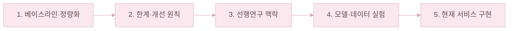
```mermaid
%%{init: {'theme': 'base', 'themeVariables': {'primaryColor':'#F4D4DC','primaryTextColor':'#5C4A52','primaryBorderColor':'#E5B8C4','lineColor':'#D4A8B6','secondaryColor':'#FFF6EC','tertiaryColor':'#FFFBF6','background':'#FFFBF7','mainBkg':'#FAE8EE','clusterBkg':'#FFF5EB','clusterBorder':'#EBC4CF','edgeLabelBackground':'#FFFBF7','fontFamily':'inherit'}}}%%
flowchart LR
  S1["1. 베이스라인·정량화"] --> S2["2. 한계·개선 원칙"]
  S2 --> S3["3. 선행연구 맥락"]
  S3 --> S4["4. 모델·데이터 실험"]
  S4 --> S5["5. 현재 서비스 구현"]
```

---

<a id="baseline-eval"></a>
### 1. 베이스라인: 예전 파이프라인 구조와 측정값

개선 실험에 들어가기 전에 **기존 파이프라인을 그대로 두고** 성능을 한 번 측정해 두었다. 이후 변경 작업의 **기준선(Baseline)** 으로 삼기 위해서다.

#### 1.1 모듈 구성(개념)와 엔드포인트

예전 시스템은 하나의 큰 파이프라인이라기보다, **요청 목적별로 모델이 따로 도는 API 구조**였다. 조화·속성·의류 타입·전처리가 다 분리되어 있어서, **같은 임베딩 공간을 공유하지 못했다**.

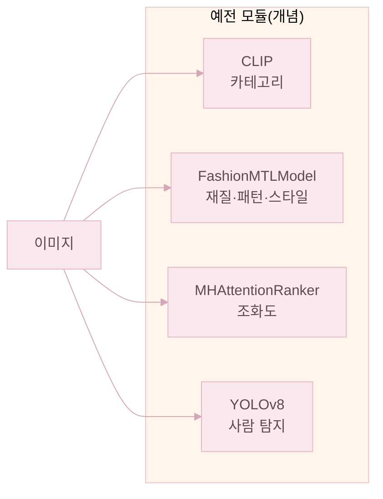
```mermaid
%%{init: {'theme': 'base', 'themeVariables': {'primaryColor':'#F4D4DC','primaryTextColor':'#5C4A52','primaryBorderColor':'#E5B8C4','lineColor':'#D4A8B6','secondaryColor':'#FFF6EC','tertiaryColor':'#FFFBF6','background':'#FFFBF7','mainBkg':'#FAE8EE','clusterBkg':'#FFF5EB','clusterBorder':'#EBC4CF','edgeLabelBackground':'#FFFBF7','fontFamily':'inherit'}}}%%
flowchart LR
  subgraph legacy ["예전 모듈(개념)"]
    CLIP1[CLIP<br/>카테고리]
    MTL[FashionMTLModel<br/>재질·패턴·스타일]
    MH[MHAttentionRanker<br/>조화도]
    YO[YOLOv8<br/>사람 탐지]
  end
  IN[이미지] --> CLIP1
  IN --> MTL
  IN --> MH
  IN --> YO
```

`main.py` 기준으로 당시 운용은 대략 다음과 같다.

- **조화**: `POST /api/predict-harmony`·`POST /api/harmony-score` → `harmony_score(...)`(MH-Attn ranker), 일부 조건에서 `calculate_harmony_score(...)` 규칙 폴백
- **속성**: `POST /api/classify-fashion-attributes` → EfficientNet-B3 **Fashion MTL**
- **의류 타입**: `POST /api/classify-clothing-type` → YOLO 보조 + CLIP 우선, 실패 시 ImageNet 계열 폴백
- **전처리**: `POST /api/remove-background`, `POST /api/extract-colors`

엔드포인트별 호출 흐름은 아래와 같이 정리할 수 있다.

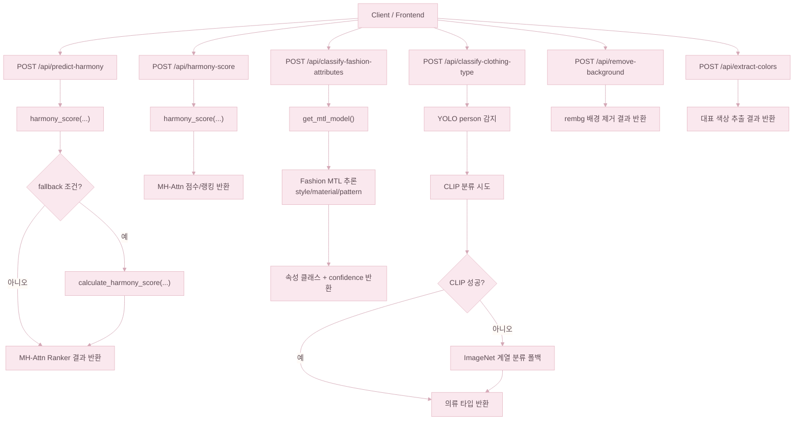
```mermaid
%%{init: {'theme': 'base', 'themeVariables': {'primaryColor':'#F4D4DC','primaryTextColor':'#5C4A52','primaryBorderColor':'#E5B8C4','lineColor':'#D4A8B6','secondaryColor':'#FFF6EC','tertiaryColor':'#FFFBF6','background':'#FFFBF7','mainBkg':'#FAE8EE','clusterBkg':'#FFF5EB','clusterBorder':'#EBC4CF','edgeLabelBackground':'#FFFBF7','fontFamily':'inherit'}}}%%
flowchart TB
    U["Client / Frontend"] --> A1["POST /api/predict-harmony"]
    U --> A2["POST /api/harmony-score"]
    U --> A3["POST /api/classify-fashion-attributes"]
    U --> A4["POST /api/classify-clothing-type"]
    U --> A5["POST /api/remove-background"]
    U --> A6["POST /api/extract-colors"]

    A1 --> B1["harmony_score(...)"]
    B1 --> C1{"fallback 조건?"}
    C1 -->|아니오| D1["MH-Attn Ranker 결과 반환"]
    C1 -->|예| E1["calculate_harmony_score(...)"]
    E1 --> D1

    A2 --> B2["harmony_score(...)"]
    B2 --> D2["MH-Attn 점수/랭킹 반환"]

    A3 --> B3["get_mtl_model()"]
    B3 --> C3["Fashion MTL 추론<br/>style/material/pattern"]
    C3 --> D3["속성 클래스 + confidence 반환"]

    A4 --> B4["YOLO person 감지"]
    B4 --> C4["CLIP 분류 시도"]
    C4 --> D4{"CLIP 성공?"}
    D4 -->|예| E4["의류 타입 반환"]
    D4 -->|아니오| F4["ImageNet 계열 분류 폴백"]
    F4 --> E4

    A5 --> R1["rembg 배경 제거 결과 반환"]
    A6 --> R2["대표 색상 추출 결과 반환"]
```

#### 1.2 평가 범위(베이스라인 실험에서 무엇을 봤는가)

| 측면 | 지표(예) |
|------|----------|
| **아이템 속성 (Fashion MTL)** | Accuracy, Macro F1, Weighted F1, Top-3 Accuracy |
| **조화 랭킹 (Harmony Ranker)** | AUC(잘 맞는 조합 vs 섞은 조합 판별) |

“아이템 자체를 얼마나 잘 읽는지”와 “여러 아이템이 모였을 때 잘 어울리는지”, 두 가지를 같이 봤다.

#### 1.3 Harmony Ranker (MH-Attn) 성능

조화 랭킹 베이스라인은 구조가 단순한 **MLP**(AUC **0.6957**)에서 **MHAttentionRanker**(AUC **0.7524**)까지 올라온 상태였다. 이후 FashionHarmony 실험과 비교할 때 이 두 수치를 출발점으로 잡는다(평가 설정·분할이 완전히 같지 않을 수 있다는 점은 감안한다).

#### 1.4 Fashion MTL 분류 성능 (예전 체크포인트 기준)

| Task     | Accuracy | Macro F1 | Weighted F1 | Top-3 Accuracy |
| -------- | -------- | -------- | ----------- | -------------- |
| Style    | 0.635833 | 0.634632 | 0.634632    | 0.899671       |
| Material | 0.666075 | 0.125872 | 0.631835    | 0.856772       |
| Pattern  | 0.844358 | 0.186979 | 0.821423    | 0.935371       |

`Pattern`은 Top-3 안에 정답이 잘 들어 있고, `Material`·`Pattern`의 Macro F1이 낮은 건 **클래스 불균형** 영향이 크다. 이 수치를 보고 이후 **클래스 수를 줄이고 라벨을 정리하는 작업**(K-Fashion)으로 넘어갔다.

---

### 2. 베이스라인이 드러낸 한계와 개선 원칙

사람이 코디를 볼 땐 색 점수 + 재질 점수…처럼 따로따로 계산해서 합치지 않는다. 상의·하의·신발이 한 장면에 있을 때 **톤·실루엣·질감·패턴 충돌**을 한 번에 읽고 "어울린다"고 느낀다. 예전 방식은 그 감각과 거리가 멀고, **모듈을 차곡차곡 쌓아 점수를 더하는 구조**에 가까웠다.

| 한계 | 설명 |
|------|------|
| **표현 공간 분리** | CLIP·MTL·랭커가 각자 학습·추론해, **세트 맥락을 같은 임베딩에서 일관되게** 쓰기 어렵다 |
| **모듈식 점수** | 조화·속성·타입이 분리돼 **코디 전체를 한 번에** 보기 어렵다 |
| **랭커 상한** | MH-Attn은 베이스라인에서 쓸 만했지만 AUC **0.7524** 정도여서, **세트 전체를 한 번에 학습하는 모델**로 더 끌어올릴 여지가 있었다 |
| **속성 과다 클래스** | 재질·패턴이 너무 잘게 나뉘고 라벨 노이즈까지 겹쳐 **희귀 클래스 예측이 흔들렸다** |

그래서 개선 원칙을 다음과 같이 잡았다.

- **공유 백본·통합 표현**: 속성 로짓과 조화 판단이 같은 특징 흐름을 같이 쓰게
- **데이터 기반 정렬**: contrastive / ranking으로 "맞는 조합·틀린 조합"을 표현 공간에서 갈라 두게
- **세트 단위 구조**: attention으로 **아웃핏 전체의 상호작용**을 직접 보게
- **설명 보강**: **총점·색·말풍선(XAI)** 로 점수만이 아니라 이유까지 같이 보여 주게 (현재 서비스에 반영)

---

### 3. 학문적 배경과 선행연구

위의 한계를 어떻게 풀어야 할지 감을 잡으려고, 패션 조화·호환성을 **학계에서는 어떻게 다뤄 왔는지** 흐름을 짧게 정리했다. 큰 그림으로 보면 **pairwise**(아이템 쌍 단위) 모델에서 **세트 단위(set-level)** 모델로 옮겨 가는 흐름이고, HUWARI가 Set Transformer를 고른 이유도 같은 맥락이다.

| 연구 | 핵심 아이디어 | 본 프로젝트와의 관계 |
|------|---------------|----------------------|
| **Type-Aware Embedding** (Vasileva et al., 2018) | 카테고리 쌍별 임베딩으로 궁합 학습, Polyvore 벤치 정착 | **pairwise의 한계를 인식**: A-B, B-C가 맞아도 A-B-C 전체가 조화롭다고 보기 어렵다는 구조적 문제 → **세트 전체를 한 번에 보는 Set Transformer를 채택한 동기** |
| **VICTOR** (Papadopoulos et al., 2022) | Transformer로 아웃핏 내 여러 아이템 동시 처리, 텍스트·이미지 활용, Polyvore-Disjoint **AUC ~0.92** 보고 | **Transformer로 세트 동시 모델링하는 방향**을 확인. 다만 사용자 텍스트 의존은 실서비스 UX와 맞지 않아, **텍스트 입력 없이 이미지만으로 동작하는 방식**을 선택 |
| **CLIP 하이브리드 멀티모달** (Kalashi & Teimourpour, 2024) | CLIP 기반 고성능 경향 | **CLIP의 패션 이해 능력**을 확인. 다만 조화 판단의 메인은 **FashionHarmony(Set Transformer)** 로 두고, **CLIP은 색 조화 보조(총점 15%)·말풍선 문구 매칭**에만 활용 |

**HUWARI는** 이 흐름을 참고해서 세 가지 방향을 잡았다. (1) **Set Transformer로 세트 전체를 한 번에** 보게 하고, (2) 사용자가 별도 텍스트를 입력하지 않아도 되는 **이미지 중심 경로**로 가고(초기 Polyvore-U 실험에서는 AUC 약 **0.912**까지 나왔고, 재학습·라벨 정렬 후 서비스 기준은 AUC **0.8801**), (3) 그 결과를 **FastAPI + React·웹캠**까지 붙여 실제로 쓰는 서비스로 만든다.

---

### 4. 개선 실험: FashionHarmony와 데이터 재정렬

앞에서 잡은 원칙을 실제 코드와 실험으로 옮긴 순서다. 학습용 데이터 파이프라인은 [데이터 전처리](#data-preprocessing) 절에 따로 정리했다.

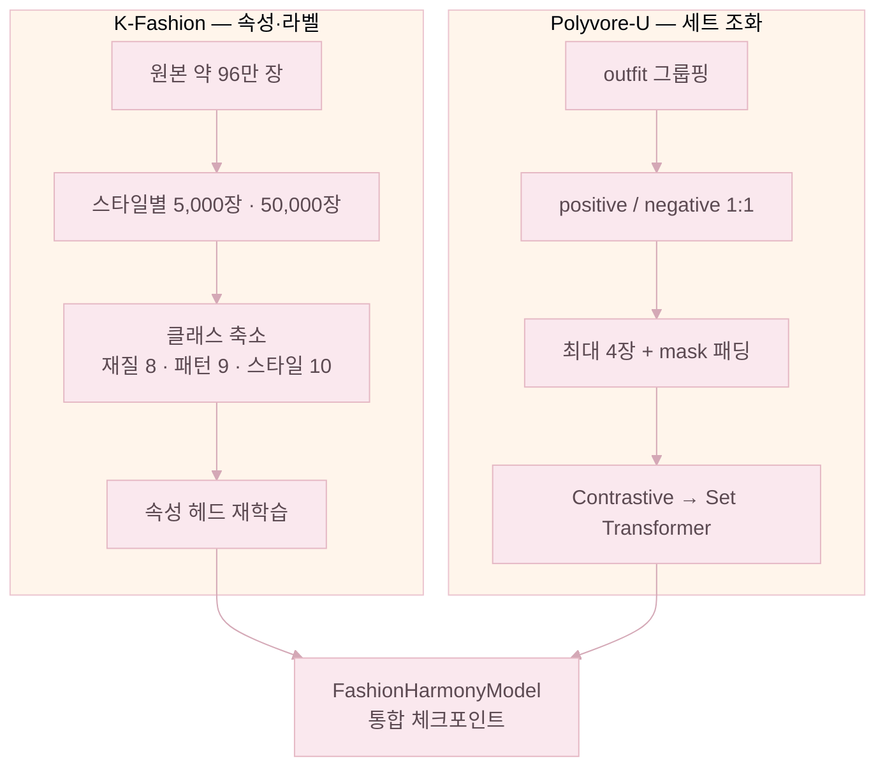
```mermaid
%%{init: {'theme': 'base', 'themeVariables': {'primaryColor':'#F4D4DC','primaryTextColor':'#5C4A52','primaryBorderColor':'#E5B8C4','lineColor':'#D4A8B6','secondaryColor':'#FFF6EC','tertiaryColor':'#FFFBF6','background':'#FFFBF7','mainBkg':'#FAE8EE','clusterBkg':'#FFF5EB','clusterBorder':'#EBC4CF','edgeLabelBackground':'#FFFBF7','fontFamily':'inherit'}}}%%
flowchart TB
  subgraph kf ["K-Fashion — 속성·라벨"]
    K1["원본 약 96만 장"]
    K2["스타일별 5,000장 · 50,000장"]
    K3["클래스 축소<br/>재질 8 · 패턴 9 · 스타일 10"]
    K4["속성 헤드 재학습"]
    K1 --> K2 --> K3 --> K4
  end
  subgraph pv ["Polyvore-U — 세트 조화"]
    P1["outfit 그룹핑"]
    P2["positive / negative 1:1"]
    P3["최대 4장 + mask 패딩"]
    P4["Contrastive → Set Transformer"]
    P1 --> P2 --> P3 --> P4
  end
  FH["FashionHarmonyModel<br/>통합 체크포인트"]
  K4 --> FH
  P4 --> FH
```

<a id="data-preprocessing"></a>
#### 데이터 전처리

학습 파이프라인은 **K-Fashion**(속성·라벨, `FashionMTLModel` → `FashionHarmonyModel`)과 **Polyvore-U**(세트 조화)로 나뉜다. K-Fashion은 **기존 방식의 한계**와 **최종 전처리**를 대조해 정리한다.

<a id="k-fashion-preprocessing"></a>
##### K-Fashion (속성 분류)

**데이터**: AI Hub K-Fashion (라벨 JSON — 스타일·재질·패턴)

###### 기존 방식의 한계 (`FashionMTLModel`)

| 항목 | 내용 |
|------|------|
| 클래스 수 | 재질 **97**, 패턴 **70** — 과도한 세분화 |
| 불균형 | **무지** 패턴이 전체 **60% 이상** |
| 샘플링 | 균등 샘플링 없이 원본 분포 그대로 사용 |
| 정규화 | **Normalize 미적용** |
| 결과 | 희귀 클래스 예측 실패 — Macro F1 **0.12~0.18** |

###### 최종 방식 (`FashionHarmonyModel`)

**1. 클래스 통합** — 실용 수준으로 축소. 서비스 속성 헤드와 동일(**재질 8 · 패턴 9 · 스타일 10**).

| 항목 | 기존 | 최종 |
|------|------|------|
| 재질 | 97개 | **8개** — 데님, 니트, 실크, 가죽, 울, 면, 패딩, 기타 |
| 패턴 | 70개 | **9개** — 무지, 스트라이프, 체크, 도트, 플로럴, 그래픽, 호피·뱀피, 카무플라쥬, 기타 |
| 스타일 | 24개 | **10개** — 캐주얼, 고프코어, 미니멀, 긱시크, 로맨틱, 빈티지, 포멀, Y2K, 스트리트, 스포티 |

**2. 데이터 수집**

- 원본 **967,806**장(zip 3개)
- 스타일별 **5,000**장 샘플링 → 학습 **50,000**장
- 스타일 라벨 **24 → 10** 매핑 후 사용

**3. 클래스 불균형 처리**

| 시도 | 내용 | 결과 |
|------|------|------|
| 균등 샘플링 | 무지 **30,000 → 2,000** 등으로 다운샘플링 | **전체 정확도 하락** — 채택 안 함 |
| **최종** | 전체 **50,000**장 유지 + **Class Weight** | 희귀 클래스에 높은 가중치 → 학습 시 보완 ([§4.2](#k-fashion-retrain)) |

**4. 데이터 증강**

공통: RandomCrop(256→224), RandomHorizontalFlip(p=0.5), ColorJitter.

**기존 대비 추가·변경**:

| 기법 | 설정 | 목적 |
|------|------|------|
| RandomRotation | ±20° | 스트라이프 **방향** 다양화 |
| RandomPerspective | p=0.3 | 원근 변환 |
| RandomGrayscale | p=0.1 | 색이 아닌 **패턴** 자체 학습 |
| **Normalize** | mean `[0.485, 0.456, 0.406]`, std `[0.229, 0.224, 0.225]` | **기존에 없던** ImageNet 정규화 |

<a id="polyvore-preprocessing"></a>
##### Polyvore-U (세트 조화)

##### 1단계 — 데이터 수집

- Hugging Face **`Marqo/polyvore`**
- 이미지 **84,686**장, outfit 세트 **20,062**개

##### 2단계 — Outfit 그룹핑

- `item_ID.rsplit('_', 1)[0]`로 **outfit 단위** 그룹핑
- 아이템 **2개 이상**인 outfit만 사용

##### 3단계 — Positive / Negative 쌍 생성

| 유형 | 정의 |
|------|------|
| **Positive** | 같은 outfit 내 아이템(전문가 코디) |
| **Negative** | 다른 outfit 아이템 절반 + 현재 outfit 아이템 절반을 섞어 구성 |
| **비율** | Positive : Negative = **1 : 1** |

**Negative를 절반만 섞는 이유**: 완전히 다른 outfit으로만 negative를 만들면 **카테고리 구성·색감이 한눈에 달라져 모델이 쉽게 구분**한다. **현재 outfit 아이템 절반을 남겨 두면** 카테고리·전체 톤이 비슷한 상태에서 **한두 아이템만 어색**해지므로, 모델이 "세트의 상호작용"을 보고 판단하도록 강제하는 **hard negative**가 된다.

##### 4단계 — 패딩 처리

- outfit당 아이템 **최대 4개**
- 4개 미만이면 **zero tensor** 패딩
- **mask**로 실제 아이템과 패딩 구분 — `mask=1` 실제, `mask=0` 패딩(서비스 Set 입력과 동일)

<a id="fashionharmony-architecture"></a>
#### FashionHarmony Architecture

##### 설계 목표

사람은 옷을 하나씩 따로 평가하지 않는다. 상의·하의·아우터가 서로 어떻게 어울리는지 같이 보고 코디의 조화를 판단한다. FashionHarmony는 이 과정을 모델로 옮기기 위해 설계한 통합 조화 모델이다. 한 코디 안의 메인 의류 아이템들을 **하나의 세트(Set)** 로 묶어 백본·속성 헤드·Set Transformer에 같이 흘려보내, 개별 분류와 전체 조화 점수를 같은 표현 공간에서 만들어 낸다. 신발·모자·악세서리는 세트 조화 모델의 입력에는 포함되지 않고, 색 점수와 피드백 문장에만 반영된다.

##### 전체 구조

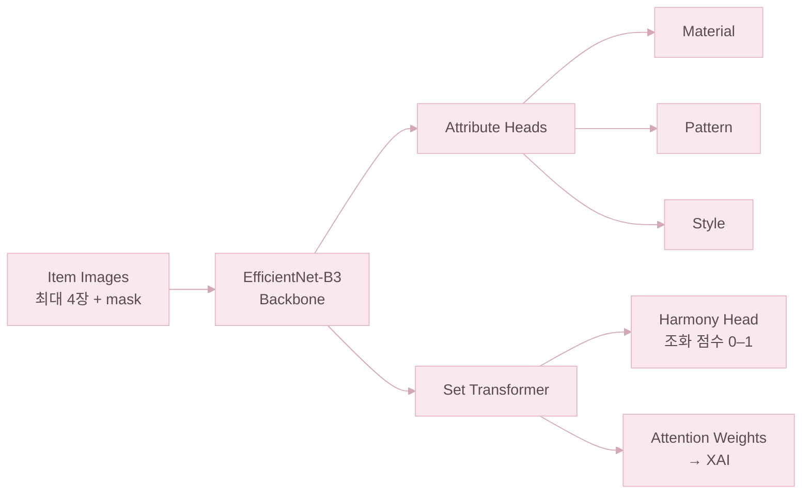
```mermaid
%%{init: {'theme': 'base', 'themeVariables': {'primaryColor':'#F4D4DC','primaryTextColor':'#5C4A52','primaryBorderColor':'#E5B8C4','lineColor':'#D4A8B6','secondaryColor':'#FFF6EC','tertiaryColor':'#FFFBF6','background':'#FFFBF7','mainBkg':'#FAE8EE','clusterBkg':'#FFF5EB','clusterBorder':'#EBC4CF','edgeLabelBackground':'#FFFBF7','fontFamily':'inherit'}}}%%
flowchart LR
  IN["Item Images<br/>최대 4장 + mask"]
  BB["EfficientNet-B3<br/>Backbone"]
  AH["Attribute Heads"]
  ST["Set Transformer"]
  MAT["Material"]
  PAT["Pattern"]
  STY["Style"]
  HH["Harmony Head<br/>조화 점수 0–1"]
  ATT["Attention Weights<br/>→ XAI"]

  IN --> BB
  BB --> AH
  BB --> ST
  AH --> MAT
  AH --> PAT
  AH --> STY
  ST --> HH
  ST --> ATT
```

##### 모듈별 역할

| 모듈 | 역할 |
|------|------|
| EfficientNet-B3 | ImageNet에서 사전학습된 백본. K-Fashion·Polyvore-U로 파인튜닝해 패션 특징을 뽑는다 |
| Attribute Heads | 아이템별로 재질·패턴·스타일·종류를 분류한다 |
| Set Transformer | 한 코디 안의 아이템들을 함께 보고, attention으로 아이템 간 관계를 학습한다 |
| Harmony Head | Set Transformer 출력을 받아 최종 조화 점수(0–1)를 만든다 |
| Attention Weights | 어떤 아이템 쌍이 점수에 크게 작용했는지 보여 주는 XAI 신호 |

##### 왜 Set Transformer인가

MLP를 쓰면 아이템들을 각각 따로 처리한 뒤 평균을 내거나 단순하게 합치게 된다. 이 방식으로는 "상의와 하의의 조합이 어색하다" 같은 **아이템 사이 관계**를 모델이 직접 보지 못한다.

Set Transformer는 self-attention으로 **상의–하의, 상의–아우터, 하의–아우터** 같은 메인 의류 간 쌍별 관계를 동시에 학습한다. 그래서 코디 전체의 조화를 따로 후처리하지 않고 한 번에 모델링할 수 있고, 학습된 attention 가중치가 그대로 XAI 설명에도 쓰인다.

##### Ablation 결과 연결

실제로 [§4.4 Ablation Study](#44-ablation-study)에서, **Backbone + MLP** 베이스라인이 AUC **0.7878**이었던 것이, K-Fashion 사전학습·속성 정렬·20 epoch 학습을 더한 **최종 모델(D)** 에서 **0.8726**까지 올라갔다. 이 차이는 모델 규모가 커진 결과가 아니라, **도메인 사전학습 + 속성 정렬 + 세트 기반 Attention 구조**가 함께 작용한 결과로 볼 수 있다.

#### 4.1 Polyvore-U로 통합 조화 모델 학습 (FashionHarmonyModel)

**모델 골격**: **ImageNet** 사전학습 **EfficientNet-B3**를 패션 데이터에 **전이학습**한 뒤, 특징 → **AttributeHeads**(카테고리·재질·패턴·스타일 등) → **Set Transformer**(패딩 마스크와 함께 세트 전체 조화 점수 0–1). 서비스 구현 요약은 [§5](#improved-pipeline)·[§5.1.1](#vision-pipeline-roles), 코드·차원은 `models/fashion_harmony.py`를 본다.

**데이터 (Hugging Face `Marqo/polyvore`)** — 전처리는 [Polyvore-U](#polyvore-preprocessing) 절.

| 항목 | 규모 |
|------|------|
| 이미지 | 약 84,686장 |
| 아웃핏 세트 | 약 20,062개 |

**학습 과정 요약 (예: Colab Pro, T4)**

| 단계 | 내용 | 비고 |
|------|------|------|
| Contrastive | 백본 표현 학습 | 중간 분류 acc 약 **0.630** |
| 속성 헤드 | SigLIP 자동 라벨 (예: 7,715장) | 노이즈가 많아 이후 K-Fashion으로 갈아탐 |
| Set Transformer | Polyvore-U 세트 단위 | acc 약 **0.707** |
| 파인튜닝 | 전체 미세조정 | acc 약 **0.729** |
| 평가 | 세트 호환성 | **AUC 약 0.912** (SigLIP 라벨 초기 실험 기준 — 이후 K-Fashion으로 대체) |

**그 과정에서 잡은 버그·이슈**: 임베딩에서 **L2 정규화를 빼고**, `OutfitDataset`의 **positive / negative 짝 버그**를 잡았으며, contrastive 학습의 **temperature** 값을 다시 맞췄다.

<a id="k-fashion-retrain"></a>
#### 4.2 K-Fashion으로 속성 체계 재정의·재학습

**문제**: `FashionMTLModel` 계열은 클래스가 너무 많고 자동 라벨 노이즈까지 섞여 있어, 희귀 클래스가 잘 안 잡혔다.

**대응**: **AI Hub K-Fashion**을 파싱하고, 스타일별로 샘플링한 다음, 클래스 수를 확 줄여서(**재질 8·패턴 9·스타일 10**) 다시 정의했다. 자세한 내용은 [K-Fashion 전처리(기존 vs 최종)](#k-fashion-preprocessing) 참고.

| 항목 | 규모 |
|------|------|
| 원본 이미지 | 약 967,806장 (zip 3개) |
| 스타일당 샘플 | 5,000장 |
| 실험 파싱 합 | 약 50,000장 |

**속성 분류만 본 지표 (K-Fashion)**

| 태스크 | Accuracy |
|--------|----------|
| style | **0.406** |
| material | **0.635** |
| pattern | **0.809** |
| 평균 | **0.617** |

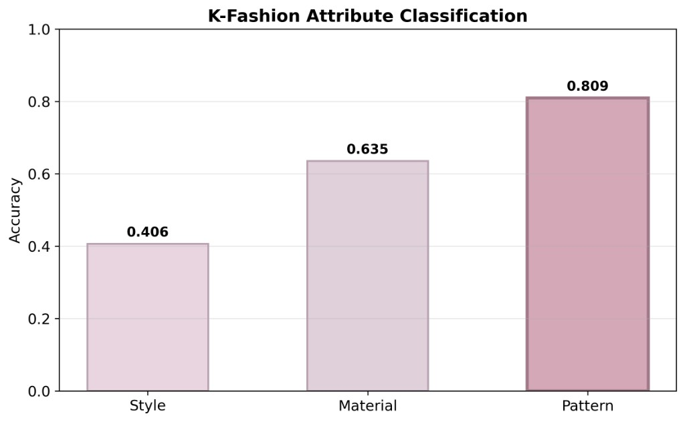

<a id="style-subjective-design"></a>

**스타일 분류: 한계 인식과 서비스 설계**

1. **스타일은 사람마다 기준이 다르다.** 「캐주얼」「스트리트」 같은 단어는 사람·상황마다 받아들이는 폭이 달라서, 같은 옷도 누구는 캐주얼로, 누구는 스트리트로 본다. 그래서 **하나의 정답 라벨로 묶기 어렵다.** 

2. **그래서 정확도에도 한계가 있다.** 위 표의 style **약 40%** 는 모델 탓이라기보다, **태스크 자체가 모호한** 영향이 크다. 여기에 **한 장 상품 컷으로 학습**한 점, **코디 전체 맥락이 빠진** 점, **10개 클래스가 일부 겹치는**(캐주얼↔스트리트 등) 점이 겹친다. 반면 재질·패턴은 상대적으로 잘 맞는다(위 표 참고).

3. **이 점을 고려해 사용자가 직접 수정할 수 있게 했다.** AI가 붙인 재질·패턴·스타일을 강제하지 않고, Home **분석 패널**에서 사용자가 본인 기준대로 고칠 수 있다. 수정·아이템 추가·삭제로 `beforeItems`가 변경되면 **`predict-harmony`가 다시 호출**된다.

4. **수정값은 서버에 실제로 반영된다.**
   - **XAI 피드백(`reasons`)**: UI 수정값이 `request_attrs_main`에 먼저 들어가, `generate_explanation`의 재질·패턴·스타일 문장에 그대로 쓰인다.
   - **조화 점수**: **FashionHarmony(이미지) 85% + FashionCLIP 색 15%** 자체는 이미지 기반이지만, 캔버스에 메인 아이템이 있으면 `harmony.py` **룰북 총점과 50% 병합**한다. 룰북·XAI 둘 다 사용자가 고친 **재질·패턴·스타일·색**을 읽으므로, 수정에 따라 **`score_total`·`reasons`** 가 같이 움직인다.

#### 4.3 Set Transformer 재학습 (속성·라벨 정렬 후)

| 모델 | AUC |
|------|-----|
| MLP (단순 구조) | **0.6957** |
| MH-Attn | **0.7524** |
| FashionHarmony (재학습 후) | **0.871** |

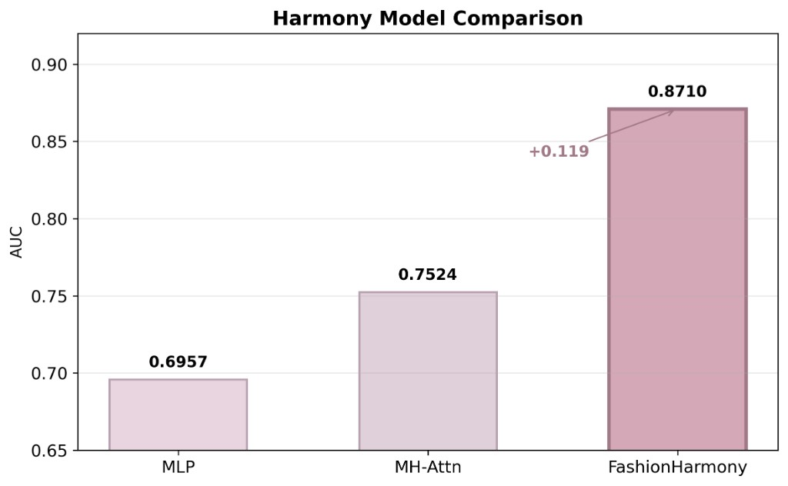

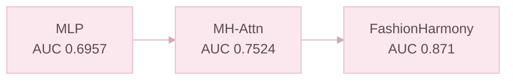
```mermaid
%%{init: {'theme': 'base', 'themeVariables': {'primaryColor':'#F4D4DC','primaryTextColor':'#5C4A52','primaryBorderColor':'#E5B8C4','lineColor':'#D4A8B6','secondaryColor':'#FFF6EC','tertiaryColor':'#FFFBF6','background':'#FFFBF7','mainBkg':'#FAE8EE','clusterBkg':'#FFF5EB','clusterBorder':'#EBC4CF','edgeLabelBackground':'#FFFBF7','fontFamily':'inherit'}}}%%
flowchart LR
  MLP["MLP<br/>AUC 0.6957"]
  MH["MH-Attn<br/>AUC 0.7524"]
  FH["FashionHarmony<br/>AUC 0.871"]
  MLP --> MH --> FH
```

**AUC 지표 읽는 법**

「잘 맞는 코디」와 「일부러 섞은 어색한 코디」를 모델이 봤을 때, **잘 맞는 쪽에 더 높은 점수를 매기는 비율**이다. **0.5**면 무작위 추측 수준, **1.0**에 가까울수록 두 쪽을 잘 구분한다는 뜻이다. 구조가 단순한 **MLP**(AUC **0.6957**)에서 **MH-Attn**(**0.7524**)으로 상승했고, **K-Fashion**으로 속성·라벨을 정리한 뒤 **Set Transformer**로 재학습한 **FashionHarmony**는 같은 지표에서 **0.871**까지 도달했다. 베이스라인 MH-Attn과 비교하면 **0.7524 → 0.871**, 약 **+0.12** 수준의 향상이다.

다만 실험마다 **데이터 분할·전처리**가 완전히 동일하지는 않다. 위 수치는 표·실험 로그 기준이며, **베이스라인 대비 조화 판별 AUC가 향상된 방향**으로 해석하면 된다.

#### 4.4 Ablation Study

각 컴포넌트가 실제로 점수에 얼마나 기여하는지 확인하기 위해, 동일한 데이터(Polyvore-U)와 조건에서 컴포넌트를 하나씩 더해 가며 AUC를 측정했다.

**실험 조건**: Polyvore-U 동일 데이터, 배치 64(누적 4), AdamW, CosineAnnealingLR, T4 GPU. A·B·C는 3 epoch, D는 저장된 최종 모델을 직접 평가했다.

| 모델 구성 | AUC |
|-----------|-----|
| A. Backbone + MLP (베이스라인) | **0.7878** |
| B. Backbone + Set Transformer | **0.7920** |
| C. Backbone + AttributeHeads + Set Transformer | **0.7822** |
| D. 최종 모델 (K-Fashion 사전학습 + 20 epoch) | **0.8726** |

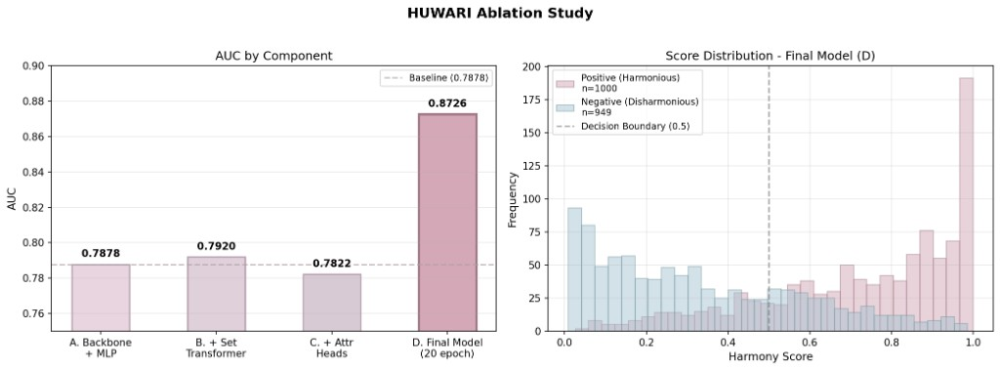

3 epoch만 학습한 조건에서는 컴포넌트를 추가해도 차이가 크지 않았다. Set Transformer를 붙이면 AUC가 **+0.0043** 상승했지만, AttributeHeads까지 추가하면 오히려 **-0.0099**로 하락했다. 학습량이 부족할 때는 속성 헤드가 도움보다 노이즈에 가깝게 작용한 셈이다.

반면 K-Fashion으로 백본·속성 헤드를 사전학습한 뒤 20 epoch까지 학습한 최종 모델(D)은 AUC **0.8726**으로, 베이스라인 대비 **+0.0848** 상승했다.

결과적으로 **모델 구조를 확장하는 것보다 도메인 데이터로 충분히 사전학습하는 편이 성능에 더 크게 작용했다.** 패션 조화처럼 라벨이 모호한 태스크에서는 도메인 사전학습의 비중이 그만큼 크다.

**점수 분포**: 최종 모델(D)의 출력 점수를 나눠 보면, 조화로운 코디(Positive)는 평균 **0.7308**, 일부러 섞은 어색한 코디(Negative)는 평균 **0.3310**으로, 두 분포가 약 **0.40** 차이로 명확히 떨어져 있다. 모델이 두 종류의 코디를 실제로 잘 구분하고 있다는 뜻이다.

#### 4.5 성과 요약

| 항목 | 개선 전 | 개선 후 |
|------|--------|---------|
| 조화 | MLP 0.6957 · MH-Attn 0.7524 | FashionHarmony + Set Transformer + FashionCLIP 색 (AUC 0.8801) |
| 속성 | 다세분류·노이즈 | K-Fashion·축소 클래스 방향 + 통합 모델 헤드 |
| 웹캠 | 없음 | MediaPipe·YOLO 의류 크롭 + `webcam-harmony` 실시간(변화 감지 + 10초 폴백)·캡처 + `predict-harmony`(캔버스) |
| 서비스 | API 단편 | FastAPI + React |

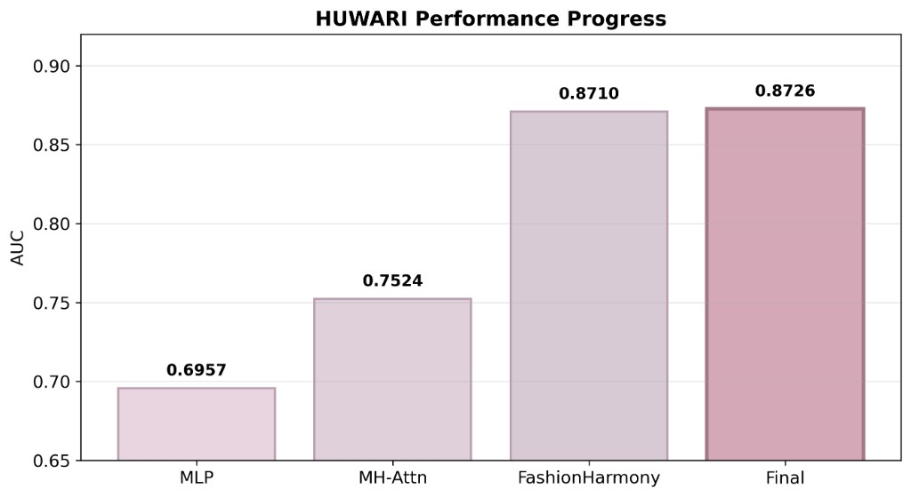

아직 남은 부분은 [한계점](#limitations) 절에 표로 따로 정리해 뒀다.

<a id="46-fashionharmony--fashionclip-비율-튜닝"></a>
#### 4.6 FashionHarmony / FashionCLIP 비율 튜닝

Polyvore-U 동일 데이터에서 비율을 50%~100% 구간으로 조정하며 AUC를 측정했다.

| FashionHarmony 비율 | FashionCLIP 색 비율 | AUC |
|---------------------|---------------------|-----|
| 50% | 50% | 0.8758 |
| 60% | 40% | 0.8632 |
| 65% | 35% | 0.8695 |
| 70% | 30% | 0.8746 |
| 75% | 25% | 0.8686 |
| 80% | 20% | 0.8698 |
| **85%** | **15%** | **0.8801 ← 최적** |
| 90% | 10% | 0.8727 |
| 100% | 0% | 0.8712 |

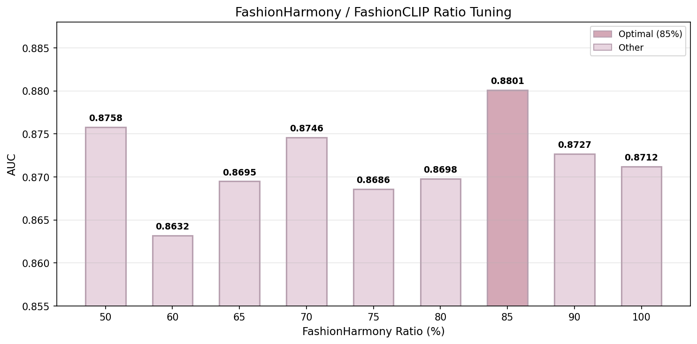

**85% / 15%** 가 AUC **0.8801**로 가장 높았다. 색 비율을 50%까지 높이면 오히려 성능이 떨어지고, 색을 완전히 제거(100% / 0%)해도 최적보다 낮았다. FashionHarmony가 조화 판단의 중심이되, FashionCLIP 색 신호를 소량 보조하는 구조가 AUC 기준으로 유효하다는 점을 확인했다.

---

<a id="improved-pipeline"></a>
### 5. 현재 서비스: 구현 개요

실험 모델을 **웹에서 쓰는 형태**로 옮긴 부분이다. 여기서는 **누가 무슨 역할을 하고 어떤 순서로 도는지**만 짧게 짚는다. 비전·이미지 기술이 어디에 쓰이는지는 [§5.1.1](#vision-pipeline-roles), **어떤 입력이 어떤 단계를 거쳐 어떤 결과가 나오는지**는 [§5.1.2 과정과 산출물](#model-flow-current)에 정리했다. 모델별 역할은 [§5.6](#section-511-rest)에, 더 자세한 구현은 소스 코드에서 볼 수 있다.

#### 5.0 전체 흐름

업로드부터 결과 화면까지 한눈에 보면 이렇게 이어진다.

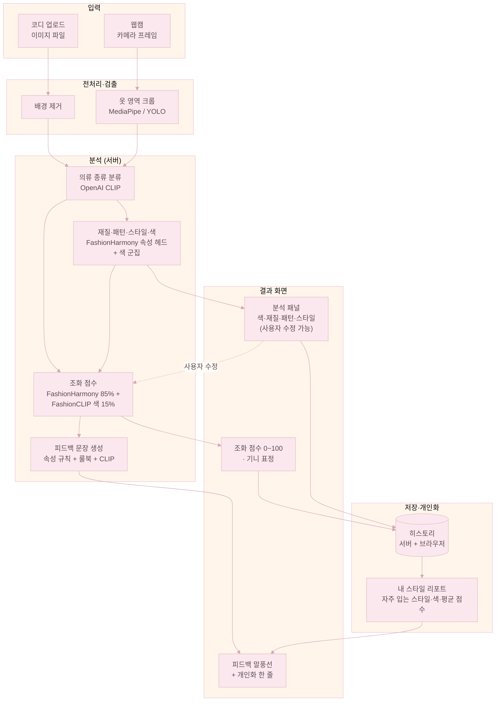
```mermaid
%%{init: {'theme': 'base', 'themeVariables': {'primaryColor':'#F4D4DC','primaryTextColor':'#5C4A52','primaryBorderColor':'#E5B8C4','lineColor':'#D4A8B6','secondaryColor':'#FFF6EC','tertiaryColor':'#FFFBF6','background':'#FFFBF7','mainBkg':'#FAE8EE','clusterBkg':'#FFF5EB','clusterBorder':'#EBC4CF','edgeLabelBackground':'#FFFBF7','fontFamily':'inherit'}}}%%
flowchart TB
  subgraph input ["입력"]
    UP["코디 업로드<br/>이미지 파일"]
    CAM["웹캠<br/>카메라 프레임"]
  end

  subgraph pre ["전처리·검출"]
    BG["배경 제거"]
    CROP["옷 영역 크롭<br/>MediaPipe / YOLO"]
  end

  subgraph analyze ["분석 (서버)"]
    CLIP["의류 종류 분류<br/>OpenAI CLIP"]
    ATTR["재질·패턴·스타일·색<br/>FashionHarmony 속성 헤드<br/>+ 색 군집"]
    HARMONY["조화 점수<br/>FashionHarmony 85% +<br/>FashionCLIP 색 15%"]
    XAI["피드백 문장 생성<br/>속성 규칙 + 룰북 + CLIP"]
  end

  subgraph result ["결과 화면"]
    SCORE["조화 점수 0~100<br/>· 기니 표정"]
    PANEL["분석 패널<br/>색·재질·패턴·스타일<br/>(사용자 수정 가능)"]
    BUBBLE["피드백 말풍선<br/>+ 개인화 한 줄"]
  end

  subgraph store ["저장·개인화"]
    HIST[("히스토리<br/>서버 + 브라우저")]
    REPORT["내 스타일 리포트<br/>자주 입는 스타일·색·평균 점수"]
  end

  UP --> BG
  CAM --> CROP
  BG --> CLIP
  CROP --> CLIP
  CLIP --> ATTR
  CLIP --> HARMONY
  ATTR --> HARMONY
  HARMONY --> XAI
  HARMONY --> SCORE
  ATTR --> PANEL
  XAI --> BUBBLE
  PANEL -. 사용자 수정 .-> HARMONY
  SCORE --> HIST
  PANEL --> HIST
  HIST --> REPORT
  REPORT --> BUBBLE
```

단계로 묶어 보면 다음과 같다.

1. 입력 — 코디 업로드 이미지나 웹캠 프레임으로 분석을 시작한다.
2. 전처리·검출 — 업로드 이미지는 배경을 제거하고, 웹캠 프레임은 MediaPipe / YOLO로 옷 영역을 잘라 낸다.
3. 분석 — 의류 종류·속성·색을 읽은 뒤, FashionHarmony 조화 점수와 FashionCLIP 색 점수를 합쳐 0~100점을 만들고, 그 결과를 한국어 피드백 문장으로 풀어 준다.
4. 결과·저장 — 점수, 분석 패널, 말풍선이 화면에 반영된다. 저장한 코디는 「내 스타일 리포트」와 개인화 피드백을 만들 때 다시 사용된다.

#### 5.1 설계 목표

1. 여러 아이템을 한 코디로 보고 **조화 점수(0~100)** 를 낸다. FashionHarmony가 만든 세트 점수에 FashionCLIP의 색 점수를 **85% / 15%** 로 합쳐 최종 점수를 만든다.
2. 같은 모델이 **재질·패턴·스타일·종류**까지 한국어 라벨로 함께 내놓아, 화면 카드와 히스토리에 그대로 쓰인다.
3. 의류 종류 분류는 **OpenAI CLIP**, 색 조화와 피드백 문장 매칭은 **FashionCLIP**이 따로 맡는다.
4. **속성은 사용자가 직접 고칠 수 있다.** 특히 스타일은 주관적이라 모델 예측을 강제하지 않고, 수정값이 점수와 피드백 문장에 곧바로 반영된다([§4.2](#style-subjective-design)).
5. **웹캠**으로 카메라 프레임에서 실시간 조화·피드백·옷 영역 표시와 캡처 후 캔버스 반영을 지원한다(상의만 있어도 분석 가능). 상세는 [웹캠](#webcam) 절.

스택은 **React·Vite + FastAPI**이며, 분석 결과는 **히스토리**에 저장해 다시 볼 수 있다.

<a id="vision-pipeline-roles"></a>
#### 5.1.1 비전·이미지가 맡는 역할

HUWARI는 조화 모델 하나만 돌리지 않는다. **입력 촬영 → 전처리·검출 → 분류·조화 추론** 순서로 여러 비전 모델이 함께 움직인다.

- **백본·전이학습** — FashionHarmony의 백본은 **EfficientNet-B3**이다. ImageNet에서 출발해 K-Fashion·Polyvore-U로 파인튜닝했고, 그 특징 맵 위에 속성 헤드와 Set Transformer가 붙는다.
- **검출·분할** — 업로드 이미지는 **rembg**로 배경을 떼어 옷 실루엣만 남기고, 웹캠은 **MediaPipe Pose** 관절 또는 **YOLOv8** 사람 bbox로 옷 영역을 잘라 낸다. 관절이 충분히 보이면 원근 왜곡을 직각으로 보정한 뒤 잘라 쓴다.
- **사전학습 멀티모달 모델** — 의류 종류 분류는 **OpenAI CLIP**, 색 조화 점수와 피드백 문장 매칭은 **FashionCLIP**이 맡는다. 둘 다 이미지와 텍스트를 같은 임베딩 공간에 두는 모델이라, 미리 정해 둔 문장 후보 중 코디와 가장 가까운 걸 골라낼 수 있다.
- **색 분석** — 아이템별 픽셀을 묶어 대표 색을 뽑고, UI 색칩과 룰북 색 점수에 함께 사용한다. 총점의 색 15%는 따로 FashionCLIP이 코디 이미지를 보고 계산한다.
- **카메라 입력** — 웹캠은 브라우저에서 들어온 프레임을 위 검출·분류·조화 경로에 그대로 흘려보낸다. 상세는 [웹캠](#webcam) 절.

<a id="model-flow-current"></a>
#### 5.1.2 과정과 산출물

사용자가 올린 **한 장**과 캔버스에 쌓인 **여러 장(한 코디)** 을 나누어 본다. 아래는 「무슨 일을 하면 → 화면에 무엇이 생기는지」만 정리한 것이다. 웹캠은 시작 단계에서 옷 영역을 잘라 내는 과정이 추가될 뿐, 그 이후는 **여러 장** 흐름과 같다.

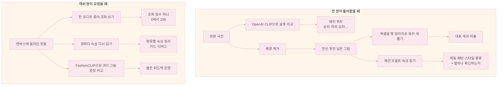
```mermaid
%%{init: {'theme': 'base', 'themeVariables': {'primaryColor':'#F4D4DC','primaryTextColor':'#5C4A52','primaryBorderColor':'#E5B8C4','lineColor':'#D4A8B6','secondaryColor':'#FFF6EC','tertiaryColor':'#FFFBF6','background':'#FFFBF7','mainBkg':'#FAE8EE','clusterBkg':'#FFF5EB','clusterBorder':'#EBC4CF','edgeLabelBackground':'#FFFBF7','fontFamily':'inherit'}}}%%
flowchart TB
  subgraph itemOne ["한 장이 들어왔을 때"]
    R["원본 사진"]
    R --> S1[OpenAI CLIP으로 슬롯 비교]
    S1 --> O1["배치 위치<br/>상의·하의·모자…"]
    R --> S2[배경 제거]
    S2 --> O2["전신 옷만 남은 그림"]
    O2 --> S3[픽셀을 몇 덩어리로 묶어 색 뽑기]
    S3 --> O3["대표 색과 비율"]
    O2 --> S4[패션 모델로 속성 읽기]
    S4 --> O4["재질·패턴·스타일·종류<br/>+ 얼마나 확신하는지"]
  end
  subgraph outfitMany ["여러 장이 모였을 때"]
    M["캔버스에 올라간 옷들"]
    M --> H1[한 코디로 묶어 조화 보기]
    H1 --> P1["조화 점수 하나<br/>0에서 100"]
    M --> H2[장마다 속성 다시 읽기]
    H2 --> P2["항목별 속성 정리<br/>카드·디버그"]
    M --> H3[FashionCLIP으로 코디 그림·문장 비교]
    H3 --> P3["짧은 피드백 문장"]
  end
```

**한 장**

- OpenAI CLIP으로 상·하의·모자 등 후보와 이미지를 맞춰 캔버스에 놓일 슬롯을 정한다.
- 배경을 제거해 옷만 남긴 이미지를 만든다.
- 픽셀을 묶어 대표 색과 비율을 뽑고, UI 색칩으로 보여 준다.
- FashionHarmony가 그 이미지를 읽어 재질·패턴·스타일·종류와 각각의 확률을 함께 내놓는다.

**여러 장(한 코디)**

- 여러 장을 한 세트로 묶어 0~100점 조화 점수를 계산한다. 세트 입력에는 메인 의류 이미지가 최대 4장까지 들어가고, 신발·모자·악세서리는 색 조화와 피드백 문장에만 함께 쓰인다.
- 각 아이템마다 속성을 다시 읽어 분석 패널과 디버그 정보에 채워 준다.
- FashionCLIP으로 코디 합성 이미지와 미리 정해 둔 문장 후보를 비교해, 짧은 피드백 한두 줄을 덧붙일 수 있다.

| 사용자 입장에서 생기는 것 | 한 줄 설명 |
|----------------------------|------------|
| 슬롯 | 어디 칸에 붙일지 |
| 전경 이미지 | 배경 없는 옷만 |
| 색 요약 | 대표 색·비율 |
| 속성 카드 | 재질·패턴·스타일·종류 |
| 조화 점수 | 코디 전체 한 점수 |
| 피드백 문장 | 이유·느낌 한두 줄 |

<a id="item-attribute-card"></a>
**아이템별 속성 파악**

캔버스에 올린 아이템에 마우스를 올리면 옆에 **속성 카드**가 펼쳐진다. 카드 한 장에는 그 아이템 한 벌에 대해서만 분석된 정보가 모여 있어서, 어떤 옷이 코디 점수를 어느 방향으로 끌고 있는지 한눈에 비교할 수 있다.

<!-- 📸 SCREENSHOT: 캔버스 아이템 호버 시 속성 카드 -->
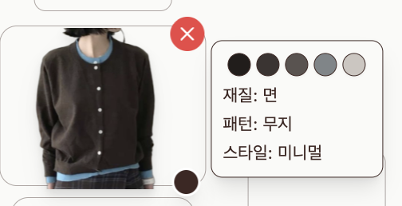

카드에 담기는 항목은 모두 **한 아이템 단위**로 따로 계산된 값이다.

| 항목 | 어디서 오는가 | 비고 |
|------|----------------|------|
| 대표 색 팔레트 | 배경 제거된 옷 픽셀을 KMeans로 묶어 비율 순으로 정렬 | 좌측이 가장 큰 비중, 코디 전체 색 점수와 별개 |
| 재질 | FashionHarmony 속성 헤드 (8-class) | 데님·니트·실크·가죽·울·면·패딩·기타 |
| 패턴 | FashionHarmony 속성 헤드 (9-class) | 무지·스트라이프·체크·도트·플로럴·그래픽·호피·뱀피·카무플라쥬·기타 |
| 스타일 | FashionHarmony 속성 헤드 (10-class) | 캐주얼·고프코어·미니멀·긱시크·로맨틱·빈티지·포멀·Y2K·스트리트·스포티 |
| 종류 (배치 슬롯) | OpenAI CLIP — 상·하의·모자·신발·악세서리 후보와의 유사도 | 카드보다 먼저 결정되어 슬롯 위치를 정함 |

색 팔레트와 종류 분류는 **이미지 픽셀과 사전학습 CLIP**에서 바로 얻고, 재질·패턴·스타일은 **FashionHarmony 속성 헤드**가 같은 백본 위에서 함께 예측한다. 즉 코디 점수를 내는 모델과 카드에 뜨는 라벨이 **같은 모델**에서 나오는 값이다.

다만 **모델이 붙인 라벨은 어디까지나 초안**이다. 카드 아래 분석 패널의 드롭다운에서 재질·패턴·스타일을 **사용자가 직접 고칠 수 있고**, 특히 스타일은 사람마다 기준이 달라 모델 예측을 강제하지 않도록 설계했다([§4.2 설계 결정](#style-subjective-design)). 사용자가 값을 바꾸면 즉시 [§5.2 런타임 흐름](#52-런타임-흐름-ui서버)의 「속성 수정 → 재계산 루프」로 흘러들어 조화 점수와 피드백 말풍선이 다시 계산된다.

<a id="analysis-result-overview"></a>
**분석 결과 한눈에**

위에서 정리한 단계가 모두 끝나면 화면 한 장에 **점수 + 피드백 말풍선 + 색·재질·패턴·스타일**이 함께 정리된다. 캔버스에는 슬롯에 맞게 정렬된 아이템들이, 오른쪽엔 「코디 평가」 말풍선이, 아래쪽엔 분석 결과(색칩·재질·패턴·스타일)와 최종 점수·캐릭터 표정이 동시에 보인다.

<!-- 📸 SCREENSHOT: 분석 완료 화면 전체 데모 -->
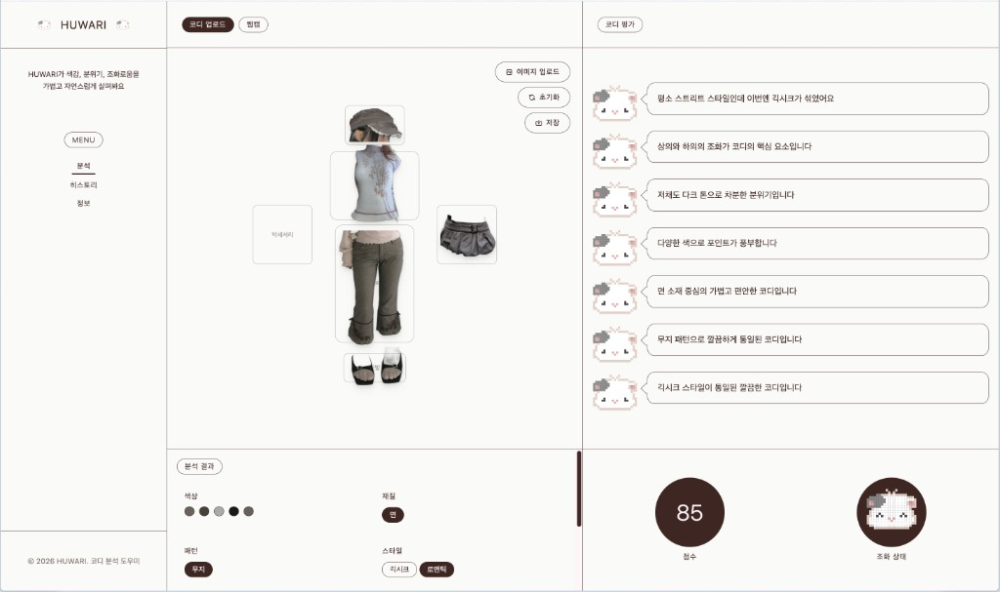

<a id="gini-score-mood"></a>
**점수별 기니 표정**

오른쪽 아래 조화 상태 영역의 기니는 최종 조화 점수에 따라 표정이 달라진다. 말풍선 옆에 붙는 작은 기니는 피드백 안내용이라 항상 기본 표정을 쓰고, 점수 원형 옆의 큰 기니만 점수 구간에 맞춰 바뀐다.

| 점수 구간 | 조화 상태 | 기니 |
|-----------|-----------|------|
| 0~39점 | 낮음 | 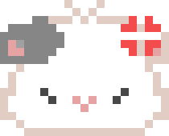 |
| 40~69점 | 보통 |  |
| 70~100점 | 좋음 | 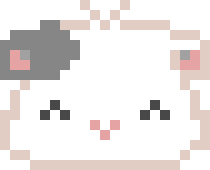 |

#### 5.2 런타임 흐름 (UI·서버)

Home 화면은 왼쪽에 **코디 작업 영역**, 오른쪽에 **조화 점수·피드백**을 둔다. 상단에서 「코디 업로드」와 「웹캠」 입력 방식을 바꿀 수 있고, 선택한 모드는 다음 방문 시에도 유지된다. 웹캠 동작은 [웹캠](#webcam) 절을 본다.

캔버스에 올라간 아이템이 바뀌면 서버에 조화 분석을 자동으로 다시 요청한다. 사용자가 잠깐 멈췄을 때만 호출하도록 짧게 묶어 두었고, 같은 구성에 대한 결과는 브라우저에 캐시해 둔다. 결과로 받은 점수·피드백은 오른쪽 패널의 점수·캐릭터 표정·말풍선에 그대로 반영된다.

**코디 업로드** — 사용자가 파일을 고르면 의류 종류 분류와 배경 제거가 동시에 진행되어, 종류에 맞는 슬롯에 배경이 빠진 이미지가 놓인다. 이어서 대표 색과 재질·패턴·스타일이 비동기로 채워지고, 드래그·리사이즈로 배치를 바꿔도 아이템이 갱신되면 같은 규칙으로 조화가 다시 계산된다.

<!-- 📸 SCREENSHOT: 코디 업로드 모드 + 점수 패널 전체 -->
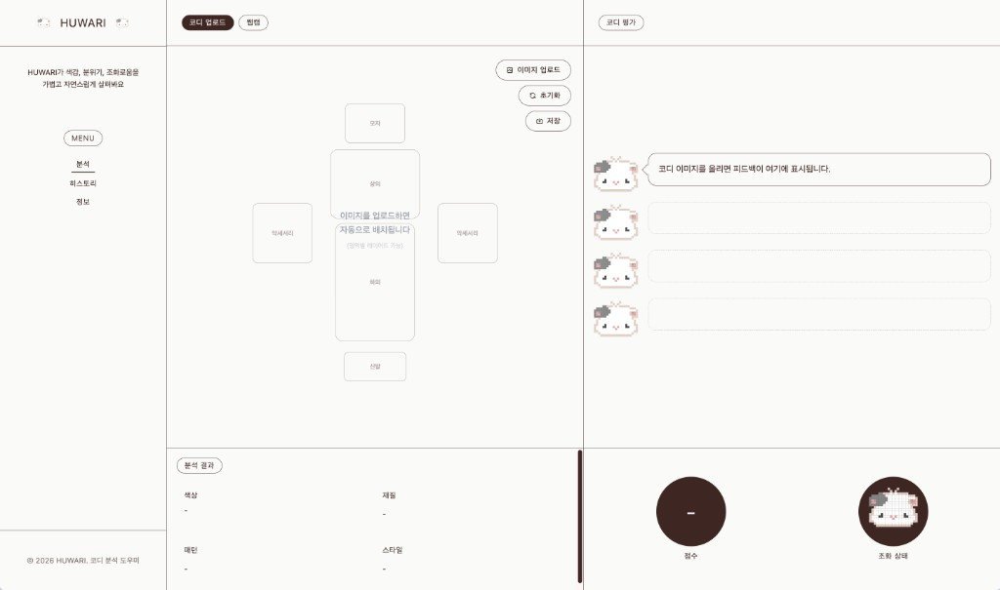

이미지를 올리면 의류 종류 분류·배경 제거·속성 분석이 백그라운드에서 동시에 진행된다. 그 동안 캔버스 슬롯에는 "처리 중" 안내가 잠깐 표시되고, 분석이 끝나면 색·재질·패턴·스타일이 차례로 채워진다.

<!-- 📸 SCREENSHOT: 업로드 직후 처리 중 상태 -->
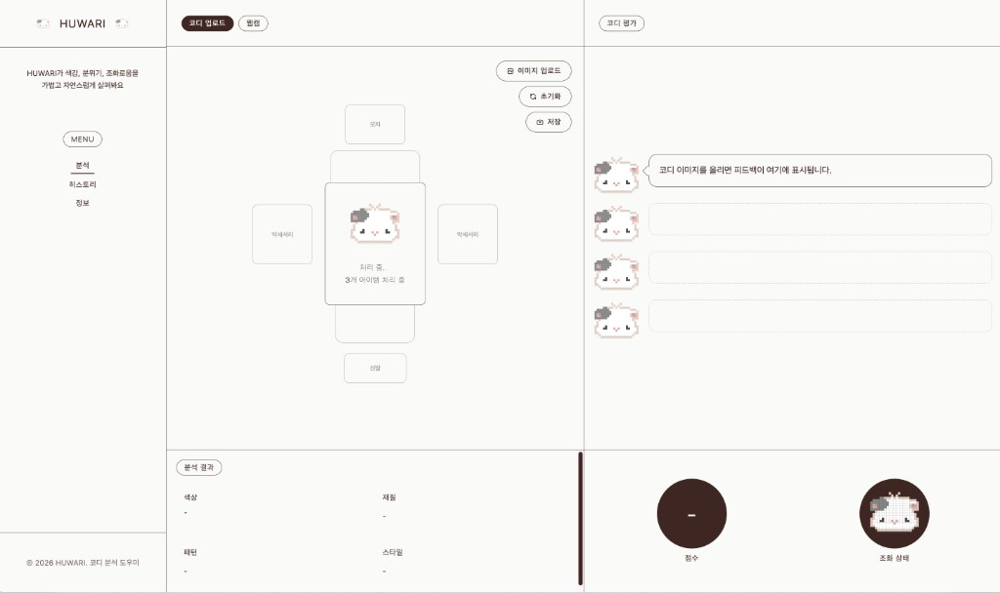

**속성 수정 → 재계산 루프**

분석 패널의 재질·패턴·스타일 드롭다운은 단순 표시가 아니라, **사용자가 선택한 값을 다시 서버로 넘겨 조화 점수와 피드백을 갱신**한다. 모델 예측을 기본값으로 두되, 주관적 라벨은 사용자가 자기 기준으로 고칠 수 있게 한 [§4.2 설계 결정](#style-subjective-design)의 직접적인 결과다.

<!-- 📸 SCREENSHOT: 속성 수정 드롭다운 펼친 상태 -->
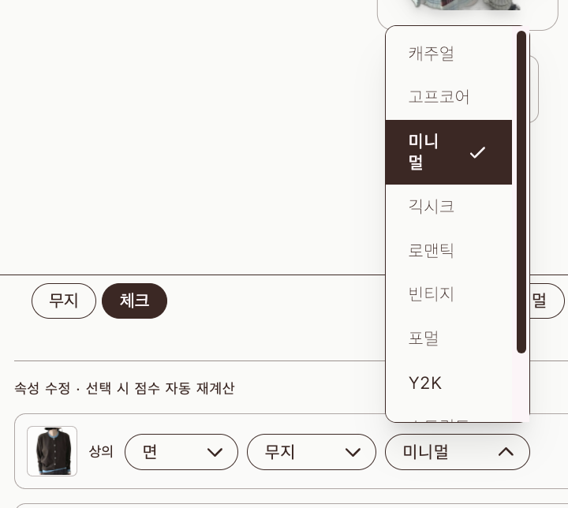

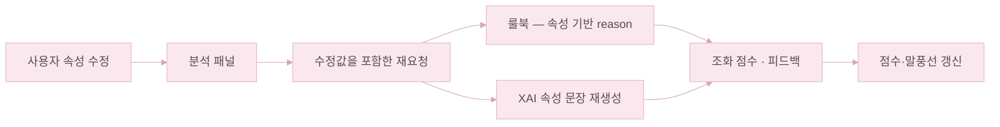
```mermaid
%%{init: {'theme': 'base', 'themeVariables': {'primaryColor':'#F4D4DC','primaryTextColor':'#5C4A52','primaryBorderColor':'#E5B8C4','lineColor':'#D4A8B6','secondaryColor':'#FFF6EC','tertiaryColor':'#FFFBF6','background':'#FFFBF7','mainBkg':'#FAE8EE','clusterBkg':'#FFF5EB','clusterBorder':'#EBC4CF','edgeLabelBackground':'#FFFBF7','fontFamily':'inherit'}}}%%
flowchart LR
  U["사용자 속성 수정"] --> UI["분석 패널"]
  UI --> REQ["수정값을 포함한 재요청"]
  REQ --> RULE["룰북 — 속성 기반 reason"]
  REQ --> XAI["XAI 속성 문장 재생성"]
  RULE --> OUT["조화 점수 · 피드백"]
  XAI --> OUT
  OUT --> RENDER["점수·말풍선 갱신"]
```

<a id="predict-harmony-api"></a>
#### 5.3 조화 점수 계산 흐름

캔버스의 아이템이 한 번 정해지면, 조화 점수는 아래 흐름으로 만들어진다.

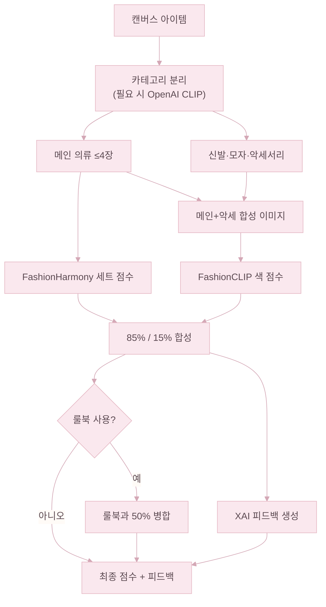
```mermaid
%%{init: {'theme': 'base', 'themeVariables': {'primaryColor':'#F4D4DC','primaryTextColor':'#5C4A52','primaryBorderColor':'#E5B8C4','lineColor':'#D4A8B6','secondaryColor':'#FFF6EC','tertiaryColor':'#FFFBF6','background':'#FFFBF7','mainBkg':'#FAE8EE','clusterBkg':'#FFF5EB','clusterBorder':'#EBC4CF','edgeLabelBackground':'#FFFBF7','fontFamily':'inherit'}}}%%
flowchart TD
  IN["캔버스 아이템"] --> SPLIT["카테고리 분리<br/>(필요 시 OpenAI CLIP)"]
  SPLIT --> MAIN["메인 의류 ≤4장"]
  SPLIT --> ACC["신발·모자·악세서리"]
  MAIN --> FH["FashionHarmony 세트 점수"]
  MAIN --> IMG["메인+악세 합성 이미지"]
  ACC --> IMG
  IMG --> FC["FashionCLIP 색 점수"]
  FH --> SUM["85% / 15% 합성"]
  FC --> SUM
  SUM --> RB{"룰북 사용?"}
  RB -->|예| HY["룰북과 50% 병합"]
  RB -->|아니오| OUT["최종 점수 + 피드백"]
  HY --> OUT
  SUM --> XAI["XAI 피드백 생성"]
  XAI --> OUT
```

- **카테고리 분리** — 신발·모자·악세서리는 색 조화와 피드백 문장에만 들어가고, 세트 조화 모델의 입력에는 **메인 의류만 최대 4장**이 들어간다(설계 한계는 [한계점](#limitations) 2번 참고).
- **점수 합성** — 메인 의류에 대한 FashionHarmony 세트 점수와, 코디 전체에 대한 FashionCLIP 색 점수를 **85% / 15%** 로 합쳐 0~100으로 환산한다.
- **85% / 15% 비율을 정한 이유** — FashionHarmony를 조화 판단의 주 모델로 두고, FashionCLIP 색 점수는 보조 신호로만 반영하기 위해서다. 비율은 Polyvore-U 기준 AUC를 지표로 50%부터 100%까지 구간별로 튜닝 실험을 진행한 결과, **85% / 15% 조합이 AUC 0.8801로 최적**임을 확인하고 적용했다([§4.6 비율 튜닝 실험](#46-fashionharmony--fashionclip-비율-튜닝) 참고).
- **룰북 병합** — 사용자가 속성을 입력한 경우, 모델 점수와 색상환·재질 조합표 기반 룰북 점수를 **50:50** 으로 섞는다(데이터 기반·규칙 기반을 한쪽으로 치우치지 않게 둔 초기 설정).
- **피드백 문장** — 재질·패턴·스타일·색·attention 신호를 한국어 문장으로 풀어 낸다. 자세한 생성 규칙은 [XAI](#xai-explainability) 절에 정리했다.

#### 5.4 운용 시 유의사항

- **기준 코디가 비어 있으면** 중립 점수(50점대)와 고정 안내 문구만 돌려준다.
- 웹캠 미리보기는 점수 없이 옷 영역 검출 정보만 보여 준다.
- **재질·패턴·스타일** 라벨은 AI가 우선 붙인 **초안**이다. 특히 **스타일**은 [사람마다 기준이 다른 속성](#style-subjective-design)이라, 직접 고친 뒤 점수·말풍선·색이 어떻게 달라지는지 보면 된다.

UI 속성 라벨과 조화 모델 내부 헤드의 클래스 구성이 완전히 일치하지 않을 수 있다. K-Fashion 쪽 맥락은 [4.2절](#k-fashion-retrain)에 정리해 두었다.

#### 5.5 히스토리·부가 기능

배경 제거, 대표 색 추출, 히스토리는 필요할 때만 따로 호출되는 보조 기능이다. 사용자가 저장 버튼을 누르면 현재 코디의 썸네일과 결과가 함께 기록되고, **History 페이지에서 같은 코디를 다시 불러와 지금 코디와 비교**할 수 있다. 같은 기록은 「내 스타일 리포트」와 [개인화 피드백](#personalization-line)을 만드는 데에도 사용된다.

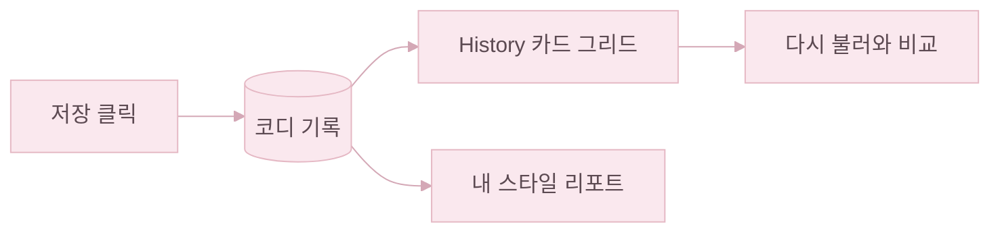
```mermaid
%%{init: {'theme': 'base', 'themeVariables': {'primaryColor':'#F4D4DC','primaryTextColor':'#5C4A52','primaryBorderColor':'#E5B8C4','lineColor':'#D4A8B6','secondaryColor':'#FFF6EC','tertiaryColor':'#FFFBF6','background':'#FFFBF7','mainBkg':'#FAE8EE','clusterBkg':'#FFF5EB','clusterBorder':'#EBC4CF','edgeLabelBackground':'#FFFBF7','fontFamily':'inherit'}}}%%
flowchart LR
  SAVE["저장 클릭"] --> STORE[("코디 기록")]
  STORE --> CARDS["History 카드 그리드"]
  STORE --> REPORT["내 스타일 리포트"]
  CARDS --> LOAD["다시 불러와 비교"]
```


<a id="section-511-rest"></a>
#### 5.6 모델별 역할 요약

- **FashionHarmonyModel** — 메인 의류 세트의 조화 점수와 한국어 속성(재질·패턴·스타일·종류)을 담당한다.
- **OpenAI CLIP** (`clip-vit-base-patch32`) — 의류 종류 분류(상의·하의·모자·신발·악세서리)에 쓰인다.
- **FashionCLIP** (`Marqo/marqo-fashionCLIP`) — 색 조화 점수와 피드백 문장 매칭에 쓰인다.
- **MediaPipe Pose / YOLOv8** — 웹캠 프레임에서 옷 영역을 잡아 주는 데 쓰인다.

---

<a id="webcam"></a>
## 웹캠

Home 상단 「웹캠」 탭에서 브라우저 카메라로 실시간 영상을 받는다. 프레임은 서버에서 **MediaPipe Pose** 관절(또는 **YOLOv8** 사람 bbox)로 상·하의·신발 영역을 잘라, 같은 조화·피드백 경로에 흘려보낸다. 캡처를 누르면 잘라낸 옷이 캔버스로 옮겨져 일반 업로드와 같은 흐름을 탄다. **상의만 보여도 분석한다.**

<!-- 📸 SCREENSHOT: 웹캠 실시간 모드(상·하의·신발 점선 박스 + 라벨) -->
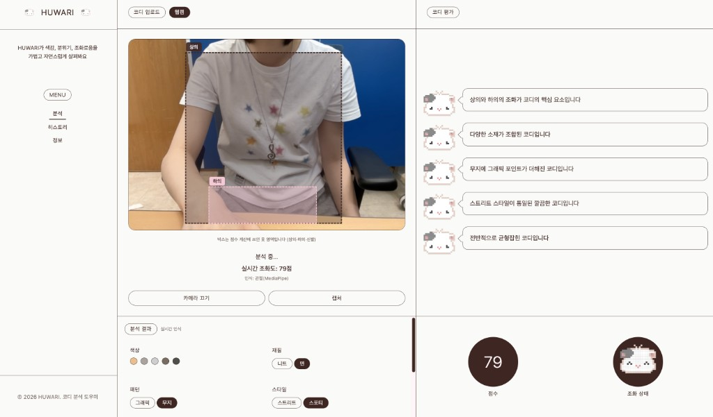

### 웹캠이 하는 일

| 동작 | 사용자 목적 |
|------|-------------|
| **실시간 분석** | 지금 입고 있는 옷의 조화를 주기적으로 확인한다 |
| **캡처** | 인식된 상·하의·신발을 그대로 코디 캔버스에 추가한다 |

### 실시간 vs 캡처

| 동작 | 화면에서 보이는 것 |
|------|--------------------|
| **실시간 분석** | 카메라를 켜면 0.5초마다 색상 히스토그램을 비교해 화면 변화가 클 때 즉시 분석하고, 변화가 없어도 10초마다 한 번씩 갱신한다. 영상 위에 옷 영역 박스를 그리고 조화 점수·피드백을 갱신한다. 캔버스에는 아이템이 추가되지 않는다. |
| **캡처** | 한 프레임을 분석해 인식된 옷을 배경 제거 후 캔버스 슬롯에 배치한다. 이후엔 일반 업로드와 같은 경로로 조화가 다시 계산된다. |

첫 호출에서는 YOLO·MediaPipe·FashionHarmony 모델을 메모리에 처음 올리는 시간이 필요하다. 서버 기동 시 워밍업을 한 번 돌려 두어, 사용자 입장에서 첫 응답을 줄이려고 했다.

**변화 감지 트리거**: 프론트엔드에서 0.5초마다 160×90으로 줄인 프레임의 RGB 히스토그램(16 bin × 3채널)을 계산해, 직전 분석 시점 히스토그램과 정규화 L1 거리를 비교한다. 차이가 15%를 초과하면 서버 요청을 즉시 보내고, 연속 재호출 방지를 위해 3초 쿨다운을 건다. 10초 인터벌은 변화가 없을 때의 폴백으로 유지된다.

### 웹캠 프레임 처리 단계

1. 한 프레임을 적당히 줄이고 좌우 반전해 서버로 보낸다.
2. 서버는 **MediaPipe Pose** 관절로 상·하의·신발 영역을 잘라 낸다. 상반신만 보이면 상의만 사용한다.
3. **원근 왜곡 보정** — 어깨·허리 4관절(좌·우 어깨, 좌·우 허리)이 충분히 보이면 그 네 점을 기준으로 **Homography**를 추정해 `cv2.warpPerspective`로 상체를 직각에 가깝게 펴 준다. 보정된 이미지에서 관절을 한 번 더 잡아 의류 영역을 다시 크롭하기 때문에, 카메라 각도가 비스듬하거나 옆에서 잡혀 옷이 한쪽으로 기울어진 상황에서도 분류·점수가 더 안정적으로 나온다. (관절이 부족하거나 cv2가 없으면 보정을 건너뛰고 원본을 그대로 쓴다.) 자세한 알고리즘은 바로 아래 [원근 왜곡 보정 알고리즘](#perspective-correction-algorithm) 절을 본다.
4. 관절이 안 잡히면 **YOLOv8** 사람 영역으로 비율을 추정해 옷을 잘라 낸다. 옷이 전혀 잡히지 않으면 안내 문구만 돌려준다.
5. 잘라낸 의류 이미지를 [§5.3](#predict-harmony-api)와 같은 방식으로 FashionHarmony·FashionCLIP에 넣어 0~100점을 만든다.
6. 크롭별 색·속성을 모아 분석 패널에 채우고, 피드백 문장은 [XAI](#xai-explainability) 절의 규칙대로 만든다.

<a id="perspective-correction-algorithm"></a>
#### 원근 왜곡 보정 알고리즘

웹캠은 카메라 각도와 거리가 매번 달라서, 같은 옷도 한쪽으로 기울어 보이거나 어깨·허리 폭이 비대칭으로 잡힐 수 있다. HUWARI는 컴퓨터비전 수업에서 다룬 **Homography 기반 원근 보정**을 웹캠 전처리에 적용했다. `main.py`의 `correct_perspective()`는 MediaPipe BlazePose 33-point 중 상체를 정의하는 4관절을 기준으로, 비스듬한 상체 영역을 정면에 가까운 형태로 펴 준다.

**1) 입력 — 4관절 픽셀 좌표**

좌어깨 `11`, 우어깨 `12`, 좌허리 `23`, 우허리 `24`를 가져온 뒤, MediaPipe의 정규화 좌표 `(x, y)`를 프레임 크기 `(w, h)`로 곱해 픽셀 좌표 4쌍 `src`를 만든다. 네 점 중 하나라도 `visibility`가 낮으면 잘못된 행렬이 계산될 수 있으므로 보정을 건너뛴다.

**2) 목표 좌표 설계 — 어깨·허리 비율을 보존한 `dst`**

핵심은 원본 4점을 단순한 직사각형으로 강제로 펴지 않는 것이다. 옷이 정면에 가깝게 보이도록 하되, 사람마다 다른 어깨·허리 폭 비율은 남겨야 한다. 그래서 목표 좌표 `dst`는 화면 중앙을 기준으로 한 **정렬된 상체 사다리꼴**로 잡는다.

- `shoulder_w = |rs.x − ls.x| · w` (어깨 폭, px)
- `hip_w     = |rh.x − lh.x| · w` (허리 폭, px)
- `body_h    = |lh.y − ls.y| · h` (어깨~허리 세로 길이, px)
- 화면 중심 `(cx, cy) = (w/2, h/2)`

이 값으로 목표 네 점을 만든다.

```text
좌어깨 : (cx − shoulder_w/2, cy − body_h/2)
우어깨 : (cx + shoulder_w/2, cy − body_h/2)
좌허리 : (cx − hip_w/2,      cy + body_h/2)
우허리 : (cx + hip_w/2,      cy + body_h/2)
```

즉, 어깨선과 허리선을 수평에 가깝게 정렬하면서도 `shoulder_w`와 `hip_w`를 따로 사용해 체형 비율을 유지한다. 이 덕분에 보정은 사람의 몸을 임의로 늘리는 것이 아니라, **촬영 각도 때문에 생긴 기울어짐과 원근 왜곡을 줄이는 전처리**에 가깝다. `shoulder_w`, `hip_w`, `body_h` 중 하나라도 1px 미만이면 사람이 충분히 보이지 않는 프레임으로 보고 보정을 포기한다.

**3) 행렬 풀이 — `findHomography`**

`src → dst`의 4점 대응으로 `cv2.findHomography(src, dst)`를 호출해 사영 변환 행렬을 구한다. 이 행렬은 원본 상체 사각형을 목표 사다리꼴로 옮기는 변환이며, 계산에 실패하면 원본 프레임을 그대로 사용한다.

**4) 워핑 — `warpPerspective`**

`cv2.warpPerspective(img, M, (w, h))`로 프레임을 보정한다. 출력 크기는 입력과 동일하게 유지해 이후의 좌표계가 그대로 이어지도록 했다.

**5) 보정 후 관절 재추출 → 크롭**

보정 결과가 원본과 다르면 `_mediapipe_pose_crops()`에서 보정된 이미지로 Pose를 한 번 더 실행한다. 그 새 관절 좌표로 상의·하의·신발 bbox를 다시 계산하기 때문에, 최종 크롭은 보정된 프레임 기준으로 만들어진다. OpenCV가 없거나 관절 신뢰도가 낮거나 Homography 계산에 실패하면 원본을 그대로 사용하므로, 보정 실패가 전체 웹캠 분석 실패로 이어지지 않는다.

### 캔버스 조화와의 차이

| | 웹캠 실시간 | 코디 업로드·캔버스 |
|--|-------------|---------------------|
| 입력 | 웹캠 프레임 1장 | 사용자가 올린 여러 아이템 |
| 옷 영역 | MediaPipe 관절 우선, YOLO 비율 보조 | 사용자가 직접 배치한 슬롯 |
| 분석 패널 | 크롭된 옷에서 뽑은 색·속성 | 캔버스 아이템 정보 |
| 룰북 병합 | 없음 (모델 점수 직결) | 있음 (모델 + 룰북 하이브리드) |
| 캔버스 | 변경 없음 | 아이템 추가·편집 가능 |

웹캠에서 **캡처**를 누른 뒤에는 캔버스에 아이템이 쌓이므로, 그 이후는 일반 업로드와 같은 경로를 탄다.

---

<a id="xai-explainability"></a>
## XAI (설명 가능 AI)

HUWARI의 XAI는 **딥러닝 조화 판단(FashionHarmony)** 과 **규칙 기반 설명**을 함께 쓰는 구조다. 점수만 던지지 않고, **모델 내부 신호(Attention)**, **속성 분석(재질·패턴·스타일)**, **색 분석**을 모아 "왜 이 점수인지"를 한국어 문장으로 풀어 준다. 자유 생성형 문장이 아니라 **규칙 템플릿**을 쓰는 이유는, 모델이 만들어 내는 점수와 일관되는 표현을 보장하고 사용자에게 의미 없는 출력을 보여 주지 않기 위해서다.

### XAI가 답하는 질문

| 질문 | 설명 수단 |
|------|-----------|
| 어떤 아이템 관계가 중요한가? | Set Transformer **self-attention** |
| 색·재질·패턴·스타일은 어떤가? | 속성 분류 결과 + **규칙 템플릿** |
| 룰북 기준으로 어디가 어색한가? | `harmony.py` 색·재질·패턴·스타일 조합표 |
| 색 조화는 이미지 기준으로? | **FashionCLIP** 색 점수 + 저점수 시 부정 문장 |
| 전체적으로 괜찮은가 / 고칠 곳은? | **총점 구간 요약** + 저점수 시 개선·부정 톤 |

### 피드백 생성 파이프라인

조화 점수가 정해진 뒤, 최종 점수를 기준으로 피드백 문장을 다시 조립한다(사용자가 수정한 속성과 룰북 결과를 반영).

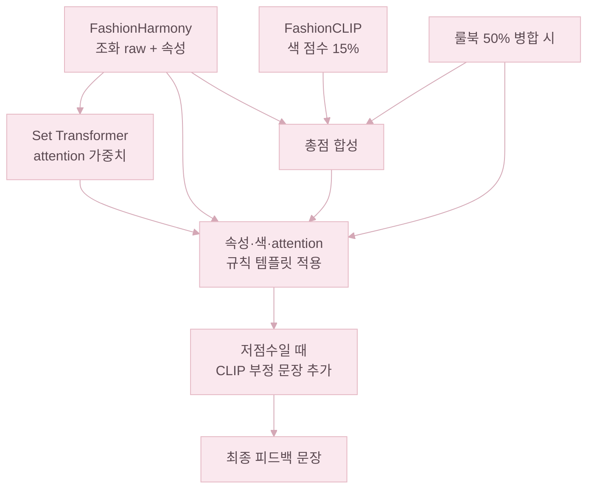
```mermaid
%%{init: {'theme': 'base', 'themeVariables': {'primaryColor':'#F4D4DC','primaryTextColor':'#5C4A52','primaryBorderColor':'#E5B8C4','lineColor':'#D4A8B6','secondaryColor':'#FFF6EC','tertiaryColor':'#FFFBF6','background':'#FFFBF7','mainBkg':'#FAE8EE','clusterBkg':'#FFF5EB','clusterBorder':'#EBC4CF','edgeLabelBackground':'#FFFBF7','fontFamily':'inherit'}}}%%
flowchart TB
  FH["FashionHarmony<br/>조화 raw + 속성"]
  ATN["Set Transformer<br/>attention 가중치"]
  FC["FashionCLIP<br/>색 점수 15%"]
  RB["룰북 50% 병합 시"]
  GE["속성·색·attention<br/>규칙 템플릿 적용"]
  CLIP_FB["저점수일 때<br/>CLIP 부정 문장 추가"]
  OUT["최종 피드백 문장"]

  FH --> ATN --> GE
  FH --> GE
  FC --> SC["총점 합성"]
  RB --> SC
  FH --> SC
  SC --> GE
  RB --> GE
  GE --> CLIP_FB --> OUT
```

### 1. Attention 기반 설명 (모델 내부 XAI)

Attention 가중치는 모델이 **어떤 아이템 관계를 중요하게 봤는지** 보여주는 내부 신호다. 예를 들어 상의–하의 attention이 높으면 모델이 이 두 아이템 관계를 중심으로 점수를 매겼다는 뜻이고, 상의–아우터가 높으면 레이어링 조합이 더 크게 작용했다는 뜻이다.

- **방식**: Set Transformer 첫 번째 레이어의 self-attention에서, 유효한 메인 아이템(최대 4장) 사이의 가장 강한 쌍을 찾아 한국어 문장으로 풀어 준다.
- **출력 예**: 「상의와 하의의 조화가 코디의 핵심 요소입니다」, 「아우터와 상의의 레이어링이 포인트입니다」.
- **조건**: 메인 아이템이 2장 이상이고 점수가 60 이상일 때만 긍정 문장을 생성한다. 60 미만이면 개선·부정 문장 비중을 높인다.
- **확장 여지**: 화면에는 문장만 보여 주지만, attention 행렬 자체를 N×N 히트맵으로 시각화하면 사용자가 모델 시선을 직접 확인할 수 있다(미구현).

### 2. 속성·색 규칙 템플릿 (해석 가능 규칙 XAI)

- **입력**: 아이템별 재질·패턴·스타일(모델 예측값 + 사용자 수정값을 우선 반영 — 스타일은 [주관적 속성](#style-subjective-design)이라 특히 중요), 코디 전체 대표색.
- **톤**:
  - 60점 이상: 중립~긍정 (예: 「미니멀 스타일이 통일된 깔끔한 코디입니다」)
  - 60점 미만: 개선·부정 (예: 「패턴이 겹쳐 시선이 분산됩니다」)
  - 40점 미만: 추가로 「코디 밸런스를 다시 맞춰 볼 필요」 같은 강한 안내가 붙는다.
- **문장 순서**: Attention(고점수만) → 색(최대 2줄) → 재질 → 패턴 → 스타일 → 총점 구간 요약(마지막 1줄). 한 번에 보여 주는 문장은 **최대 6줄**로 제한한다.

### 3. 룰북 설명 (`harmony.py`)

- **내용**: 색상환·채도·명도 차이, 재질·패턴·스타일 조합 점수표에 따른 문장 (예: 「재질: 면과 가죽 조합이 조화롭지 않음」, 「채도 차이가 커 조화가 어려움」).
- **병합**: 사용자가 속성을 입력한 경우, 모델 점수와 룰북 점수를 **50:50** 으로 섞는다. 이 비율은 데이터 기반(모델)과 규칙 기반(룰북) 중 한쪽으로 치우치지 않도록 두 값을 동등하게 둔 초기 설정이다. 사용자 평가나 그리드 서치를 거치면 더 적합한 값을 찾을 수 있다.
- **필터**: 「중립으로 계산」 같은 내부 안내 문장은 사용자 말풍선에서 제외한다.

### 4. FashionCLIP 멀티모달 설명

- **색 점수**: 코디 합성 이미지와 "조화로운 색 / 충돌하는 색" 문장의 유사도를 비교해 0~100점을 만든다. 총점에 **15%** 로 반영된다.
- **부정 피드백 문장**: 60점 미만일 때만, 사전에 정해 둔 부정 문장(예: 「색상 톤이 맞지 않습니다」)을 최대 2줄까지 앞쪽에 추가한다.

### 5. 총점 구간 요약 (캘리브레이션된 narrative XAI)

| 점수 구간 | 마지막 요약 문장 성격 |
|---------|------------------------|
| ≥ 80 | 완성도 높음 |
| ≥ 60 | 균형 잡힘 |
| ≥ 40 | 일부 교체·조정 제안 |
| &lt; 40 | 색·스타일 통일감 개선 제안 |

<a id="feedback-catalog"></a>
### 6. 피드백 문장 카탈로그

말풍선에 들어가는 한국어 문장은 모두 **규칙 템플릿**이다. 자유 생성형이 아니라, 점수 구간(60·40 두 단계)과 입력 속성·룰북·FashionCLIP 결과를 보고 아래 문장 중 일부를 골라 **최대 6줄**로 묶는다. 자유 문장 대신 카탈로그를 쓴 이유는 출력 일관성과 안전성을 보장하기 위해서다.

#### 6.1 종합 점수 요약

항상 마지막에 한 줄 붙는다.

| 점수 구간 | 문장 |
|-----------|------|
| ≥ 80 | 전체적으로 완성도 높은 코디입니다 |
| ≥ 60 | 전반적으로 균형잡힌 코디입니다 |
| ≥ 40 | 일부 아이템 교체로 조화도를 높일 수 있습니다 |
| &lt; 40 | 색상 또는 스타일 통일감을 높이면 더 좋아집니다 |

40점 미만이면 맨 앞에 「전체적으로 코디 밸런스를 다시 맞춰 볼 필요가 있습니다」가 한 줄 더 붙는다.

#### 6.2 Attention 기반 코디 핵심

60점 이상일 때만, Set Transformer 1레이어 self-attention에서 가장 강한 두 아이템 쌍을 짚는다.

| 조건 | 문장 |
|------|------|
| 상의·하의 쌍 | 상의와 하의의 조화가 코디의 핵심 요소입니다 |
| 상의·아우터 쌍 | 아우터와 상의의 레이어링이 포인트입니다 |
| 상의·아우터·모자 중 두 개 | `{a}와 {b}의 레이어링이 포인트입니다` |
| 그 외 두 카테고리 | `{a}와 {b}의 조화가 코디의 핵심 요소입니다` |

#### 6.3 색상

점수가 낮으면 개선이 필요한 쪽으로 말하고, 그 외에는 분위기를 설명한다.

**저점수(60 미만)**

| 조건 | 문장 |
|------|------|
| 우세색 4개 이상 | 색이 많아 전체 톤이 산만해 보일 수 있습니다 |
| 우세색 3개 | 색상 수가 많아 통일감을 줄일 여지가 있습니다 |
| 밝기 차이 큼 | 아이템마다 밝기 차이가 커 색 조화가 어렵게 느껴질 수 있습니다 |
| 그 외 | 상·하의 색감을 한 톤으로 맞추면 더 안정적으로 보입니다 |
| 추가(40 미만) | 포인트 색을 하나로 줄이면 조화도가 올라갑니다 |

**평이/고점수(60 이상)**

| 조건 | 문장 |
|------|------|
| 평균 밝기 낮음 | 저채도 다크 톤으로 차분한 분위기입니다 |
| 평균 밝기 높음 | 밝은 톤으로 경쾌한 분위기입니다 |
| 중간 밝기 | 중간 밝기로 균형 잡힌 색감입니다 |
| 우세색 적음 | 색 수가 적어 통일감 있는 코디입니다 |
| 우세색 많음 | 다양한 색으로 포인트가 풍부합니다 |

#### 6.4 재질

| 조건 | 문장 |
|------|------|
| 재질 2종 이상 + 저점수 | 서로 다른 재질이 많아 질감 대비를 줄이면 더 자연스럽습니다 |
| 데님 단일 | 데님 소재 중심의 캐주얼한 코디입니다 |
| 니트 단일 | 니트 소재 중심의 포근하고 따뜻한 분위기입니다 |
| 실크 단일 | 실크 소재 중심의 고급스러운 분위기입니다 |
| 가죽 단일 | 가죽 소재 중심의 엣지 있는 코디입니다 |
| 울 단일 | 울 소재 중심의 클래식한 분위기입니다 |
| 면 단일 | 면 소재 중심의 가볍고 편안한 코디입니다 |
| 패딩 단일 | 패딩 소재 중심의 실용적인 아우터 코디입니다 |
| 혼합 | 다양한 소재가 조합된 코디입니다 |

#### 6.5 패턴

충돌 쌍: 스트라이프·체크, 스트라이프·호피, 체크·호피, 스트라이프·플로럴, 체크·그래픽.

| 조건 | 문장 |
|------|------|
| 충돌쌍 + 저점수 | `{a}과 {b} 패턴이 겹쳐 시선이 분산됩니다` |
| 충돌쌍 + 평이/고점수 | 다양한 패턴이 혼재하여 과감한 스타일링입니다 |
| 무지 단일 | 무지 패턴으로 깔끔하게 통일된 코디입니다 |
| 단일(무지 아님) | `{패턴} 패턴이 돋보이는 코디입니다` |
| 무지 + 다른 패턴 1개 | `무지에 {패턴} 포인트가 더해진 코디입니다` |
| 2종 이상 + 저점수 | `{a}과 {b} 패턴 조합이 어수선해 보일 수 있습니다` |
| 2종 이상 + 평이/고점수 | `{a}과 {b} 패턴이 조합되어 풍성한 코디입니다` |

#### 6.6 스타일

반대 쌍: 로맨틱·스트리트, 포멀·캐주얼, 미니멀·Y2K.

| 조건 | 문장 |
|------|------|
| 반대쌍 + 저점수 | `{a}와 {b} 스타일이 부딪혀 전체 톤이 일관되지 않습니다` |
| 반대쌍 + 평이/고점수 | `{a}와 {b}가 혼재하여 개성 있는 코디입니다` |
| 1종 | `{스타일} 스타일이 통일된 깔끔한 코디입니다` |
| 다수 중 한쪽이 우세 | `{top} 스타일이 통일된 깔끔한 코디입니다` |
| 저점수 + 산만 | 스타일 방향이 여러 갈래로 나뉘어 정리가 필요해 보입니다 |

#### 6.7 룰북

사용자가 속성을 입력해 룰북이 함께 돌면, 아래 문장들이 같이 섞인다. 점수가 낮을 때는 부정형 문장을 앞쪽에 먼저 배치한다.

| 카테고리 | 문장 패턴 |
|----------|-----------|
| 재질 | `재질: {A}와(과) {B} 조합이 조화롭지 않음` / `… 잘 어울림` / `… 조합` |
| 패턴 | `패턴: {A}와(과) {B} 조합이 조화롭지 않음` / `… 잘 어울림` / `… 조합` |
| 스타일 | `스타일: {A}와(과) {B} 조합이 조화롭지 않음` / `… 잘 어울림` / `… 조합` |
| 종합 | 전반적으로 조화로운 조합 |
| 색상 (긍정) | 유사한 색상으로 조화로운 조합 / 비슷한 색상 톤으로 자연스러운 조합 / 보색 조합으로 생동감 있는 조합 |
| 색상 (부정) | 과도한 채도로 인한 시각적 충돌 / 채도 차이가 커 조화가 어려움 / 명도 차이가 커 조화가 어려움 |

「Before 아이템이 없어 중립으로 계산」·「아이템이 1개뿐이어서 비교할 수 없음」·「… 정보가 부족해 중립으로 계산」 같은 내부 안내 문장은 별도 필터로 걸러, 사용자 말풍선에는 보이지 않게 했다.

#### 6.8 FashionCLIP 부정 피드백

60점 미만일 때만, 사전에 정해 둔 부정 문장을 최대 2줄까지 앞쪽에 끼워 넣는다.

| 분류 | 문장 |
|------|------|
| 색 | 색상 톤이 맞지 않습니다 |
| 패턴 | 패턴이 충돌합니다 |
| 스타일 | 스타일이 혼재합니다 |
| 재질 | 재질 조합이 어색합니다 |

긍정 문장은 60점 이상일 때만 후보가 된다.

#### 6.9 점수별 출력 규칙 요약

- **60점 이상**: Attention 1줄 + 색상 한두 줄 + 재질·패턴·스타일 각 0–1줄 + 종합 요약 1줄 (긍정·중립 톤)
- **60점 미만**: 색상·재질·패턴·스타일 부정 톤 + (저점수면 CLIP 부정 최대 2줄 + 룰북 부정 최대 2줄) + 종합 요약
- **출력 한도**: 최대 6줄

<a id="personalization-line"></a>
#### 6.10 개인화 피드백

HUWARI는 저장된 코디 기록을 바탕으로 **사용자에게 맞춘 짧은 피드백**을 하나 더 보여 준다. 기본 피드백이 "이 코디가 왜 어울리는지"를 설명한다면, 개인화 피드백은 **평소 사용자의 코디와 비교했을 때 어떤지**를 알려 주는 역할이다.

예를 들어 평소보다 점수가 높거나 낮은지, 자주 입던 스타일과 다른 스타일이 섞였는지, 평소보다 색을 많이 썼는지를 보고 Gini 말풍선 맨 앞에 한 줄을 추가한다. 저장된 코디가 없거나 조건에 맞는 내용이 없으면 개인화 문장은 표시하지 않는다.

History 페이지의 **「내 스타일 리포트」** 카드도 같은 기록을 사용한다. 저장된 코디를 기준으로 자주 입는 스타일·색·재질, 평균 점수, 최고 점수 등을 요약해 보여 준다.

| 우선순위 | 조건 | 문장 |
|---|---|---|
| 1 | 현재 점수 ≥ 프로필 역대 최고 | `최고 점수예요!` |
| 2 | 평균보다 **5점 이상 낮음** | `평소 코디보다 N점 낮아요` |
| 3 | 평균보다 **5점 이상 높음** | `평소보다 N점 높은 코디예요` |
| 4 | 평소 1순위 스타일과 다른 스타일 사용 | `평소 {top} 스타일인데 이번엔 {mixed}가 섞였어요` |
| 5 | 평균보다 색상 종류 ≥ 1.5 많음 | `평소보다 색상 수가 많아요` |
| 6 | 평균보다 색상 종류 ≥ 1.5 적음 | `평소보다 색상 수가 적어요` |


아래는 실제로 Gini 말풍선이 채워진 모습이다. 맨 위 첫 줄("평소보다 8점 높은 코디예요")이 위 표 우선순위 규칙으로 만들어진 **개인화 한 줄**이고, 그 아래는 attention·룰북·FashionCLIP에서 나온 일반 피드백 문장들이다.

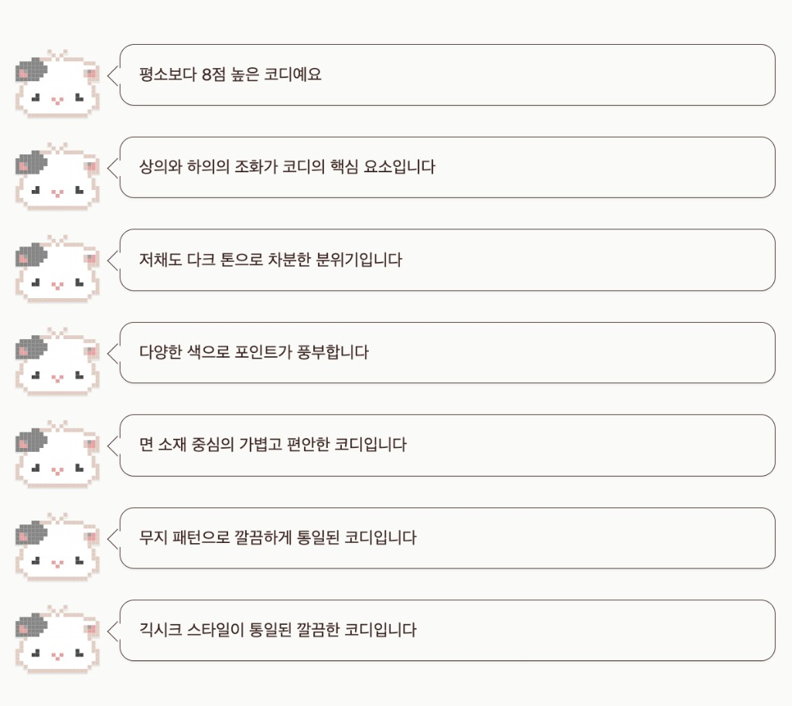

「내 스타일 리포트」 카드의 시각적 모습은 [페이지 구성 — History](#페이지-구성)의 클로즈업 컷에서 같이 볼 수 있다.

---

<a id="limitations"></a>
## 한계점

| # | 한계 | 요약 |
|---|------|------|
| 1 | **스타일 분류 약 40%** | 스타일은 [사람마다 기준이 다른 속성](#style-subjective-design)이라 라벨러끼리도 의견이 갈리는 경우가 많다. 분석 패널에서 직접 수정할 수 있게 보완했지만, **모델 예측만 단독으로 신뢰하기는 어렵다**. |
| 2 | **세트 입력 최대 4장 캡** | Set Transformer는 메인 의류 **최대 4장 + mask 패딩** 구조다. 5장 이상이면 앞쪽 4장만 보고, 신발·모자·악세서리는 색·CLIP 피드백에만 들어간다. |
| 3 | **학습 분포 편향 (Polyvore)** | 조화 학습은 **서양·여성 의류 중심** Polyvore에 크게 기대고 있다. 한국식 코디(오버사이즈 셋업·아메카지·K-스트리트 등)에서는 사용자 감각과 다르게 나올 수 있다. 속성 헤드는 K-Fashion으로 맞췄지만, 조화 판단 데이터는 여전히 Polyvore 영향이 크다. |
| 4 | **규칙 템플릿 피드백** | 피드백 문장은 모두 [정해 둔 문장 목록](#feedback-catalog)에서 고른다. 비슷한 입력에는 같은 말이 반복될 수 있고, **"이 가죽 자켓 대신 니트로 바꾸세요"** 같은 **구체적인 대체 아이템 추천**은 아직 하지 않는다. |
| 5 | **사용자 평가 부재** | 현재는 오프라인 지표(AUC·F1)만 측정했고 **실제 사용자 만족도·태스크 평가는 진행하지 못했다.** 따라서 "사용성이 향상됐다"고 단정하기는 어렵고, A/B 테스트와 설문은 향후 과제로 남아 있다. |

---

### 참고문헌

1. Vasileva, M., Plummer, B. A., Dusad, K., Rajpal, S., Kumar, R., & Forsyth, D. (2018). **Learning Type-Aware Embeddings for Fashion Compatibility**. *ECCV 2018*. [https://arxiv.org/pdf/1803.09196](https://arxiv.org/pdf/1803.09196)
2. Papadopoulos et al. (2022). **VICTOR** (Transformer 기반 outfit compatibility). [https://arxiv.org/pdf/2207.13458](https://arxiv.org/pdf/2207.13458)
3. Kalashi and Teimourpour (2024). **CLIP 기반 하이브리드 멀티모달 접근**. [https://arxiv.org/pdf/2511.07573](https://arxiv.org/pdf/2511.07573)


## 프로젝트 구조

```text
huwari/
├─ src/                    # 프론트엔드(React + Vite)
│  ├─ main.tsx             # React 진입점
│  ├─ App.tsx              # 라우팅(Home / History / Info)
│  ├─ index.css            # Tailwind 및 전역 스타일
│  ├─ components/
│  │  ├─ Layout.tsx
│  │  ├─ Header.tsx
│  │  ├─ Footer.tsx
│  │  ├─ MouseStarTrail.tsx
│  │  ├─ ItemPlacementArea.tsx
│  │  └─ CustomSelect.tsx
│  ├─ pages/
│  │  ├─ Home.tsx
│  │  ├─ History.tsx
│  │  └─ Info.tsx
│  ├─ hooks/
│  │  └─ useStyleProfile.ts
│  ├─ lib/
│  │  └─ styleHistory.ts
│  └─ constants/
│     ├─ fashionClassOptions.ts
│     └─ outfitGuide.ts
├─ public/
│  └─ assets/
│     ├─ normal_gini.svg
│     ├─ happy_gini.svg
│     └─ angry_gini.svg
├─ main.py                 # FastAPI 서버 및 API 엔드포인트
├─ harmony.py              # 규칙 기반 조화 점수·피드백 보조 로직
├─ harmony_label_bridge.py # UI/모델 한글 라벨 → rulebook 입력 변환
├─ label_maps.py           # 과거 라벨 맵 참고용
├─ models/
│  ├─ fashion_harmony.py    # FashionHarmonyModel (백본+속성헤드+Set Transformer)
│  ├─ pose_landmarker_lite.task
│  ├─ harmony_ranker.py     # MHAttentionRanker + EfficientNet-B0 임베딩(예전)
│  └─ fashion_mtl.py        # 재질/패턴/스타일 MTL(과거 실험·참고용, 현재 속성 API는 FashionHarmony)
├─ requirements.txt        # Python 의존성
├─ package.json            # Node 의존성 및 스크립트
├─ tailwind.config.js      # Tailwind 설정
├─ postcss.config.js       # PostCSS 설정
├─ index.html              # Vite HTML 진입점
├─ start-api.sh            # FastAPI 실행 보조 스크립트
└─ vite.config.ts          # 프론트 dev 서버(3000) + /api 프록시(8001)
```

## 모델 구성 메모

- **FashionHarmonyModel** (`models/fashion_harmony.py`) — ImageNet에서 사전학습한 EfficientNet-B3에 속성 헤드와 Set Transformer를 붙인 통합 조화 모델. 서비스의 조화 점수·속성을 모두 담당한다. 실험·재학습 과정은 [HUWARI 연구·개발 스토리](#research-journey) 참고.
- **MHAttentionRanker** (`models/harmony_ranker.py`) — 초기 버전의 조화 랭커. 베이스라인 비교용으로만 남아 있다.
- **FashionMTLModel** (`models/fashion_mtl.py`) — 재질·패턴·스타일을 따로 학습하던 초기 분류 모델. 현재 서비스에서는 로드하지 않고, K-Fashion 라벨 정리 이전의 비교군으로만 의미가 있다.
- **OpenAI CLIP** (`clip-vit-base-patch32`) — 의류 종류 분류(상의·하의·신발 등).
- **FashionCLIP** (`Marqo/marqo-fashionCLIP`) — 색 조화 점수 계산과 피드백 문장 매칭.

<a id="image-credits"></a>
## 이미지 저작권 안내

※ 본 README에 첨부된 예시 이미지(스크린샷·데모 화면 등)에 포함된 의류 컷은 각 브랜드 및 쇼핑몰의 상품 이미지를 사용하였으며, **모든 저작권은 원저작자에게 있습니다**. HUWARI는 비상업적 연구·교육·포트폴리오 목적의 시연 자료로만 해당 이미지를 인용하며, 저작권자의 요청이 있을 경우 즉시 교체·삭제합니다.
