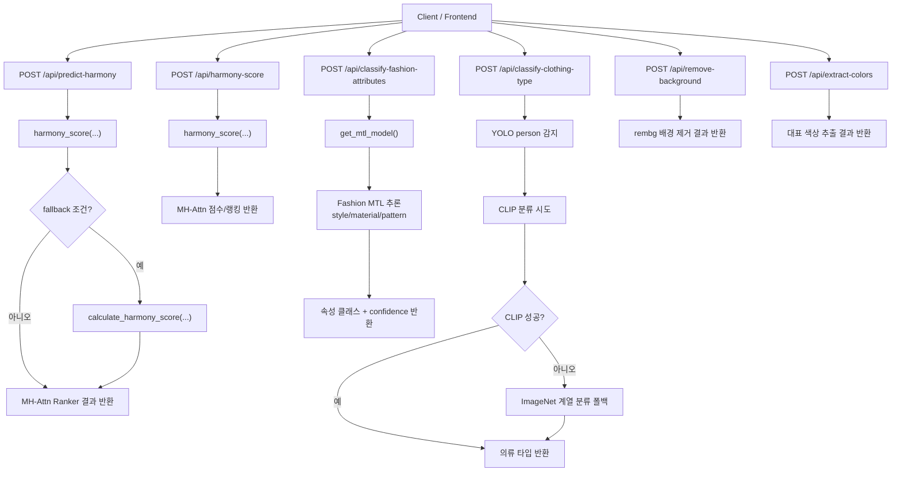
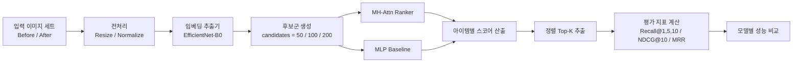
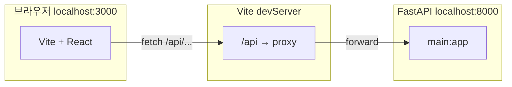
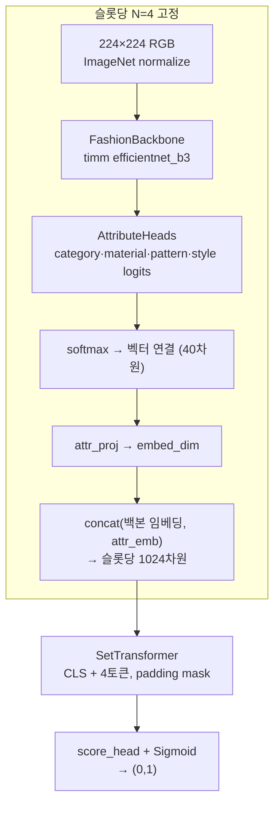
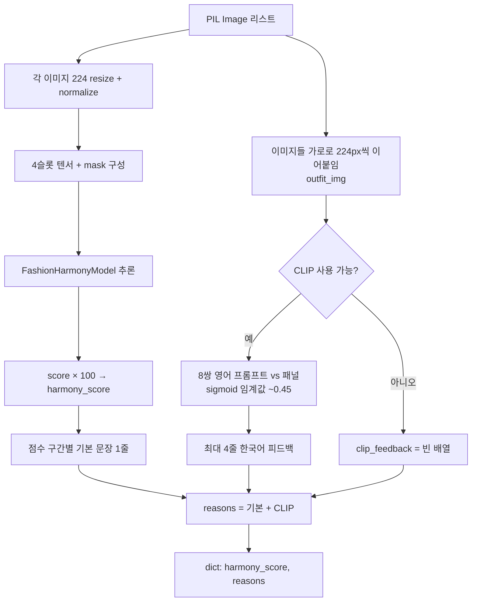
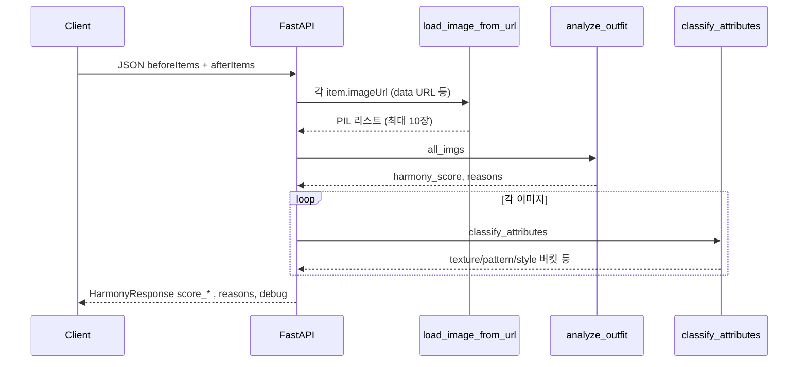
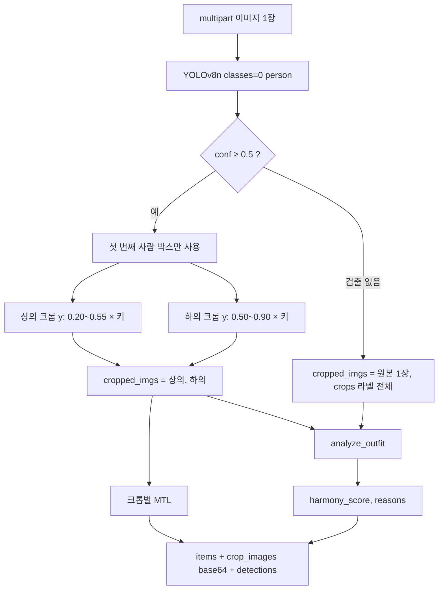

# HUWARI

패션 아이템 조합의 조화도를 분석하는 웹 애플리케이션이다.  

## 웹사이트 소개

HUWARI는 "지금 가진 옷 조합이 잘 어울리는지"를 빠르게 확인할 수 있도록 만든 코디 분석 웹사이트이다.
사용자는 이미지 업로드와 간단한 배치만으로 조화 점수와 속성 분석 결과를 받아볼 수 있으며, 결과를 히스토리에 저장해 이전 코디와 비교할 수 있다.

### 유용한 활용 상황

- 오늘 입을 코디 후보 중 어떤 조합이 더 안정적인지 판단하고 싶을 때
- 특정 아이템(예: 자켓, 신발)을 바꿨을 때 전체 스타일 균형이 어떻게 달라지는지 보고 싶을 때
- 색감은 괜찮은데 패턴/질감 조합이 어색한지 빠르게 점검하고 싶을 때

### 페이지 구성

- `Home`
  - 메인 작업 공간이다.
  - before/after 아이템을 올리고 분석을 실행하면 점수와 해석 결과를 확인할 수 있다.
- `History`
  - 저장된 분석 결과를 시간순으로 조회한다.
  - 과거 코디를 다시 불러와 현재 조합과 비교할 수 있다.
- `Info`
  - 서비스 설명 및 사용 가이드를 제공한다.

### 사용자 흐름

1. 이미지를 업로드하고 필요 시 배경 제거를 적용한다.
2. 아이템의 색상/속성 정보를 추출한다.
3. 조화 점수(총점 + 세부 항목)를 계산하고 결과를 해석한다.
4. 마음에 드는 결과는 히스토리에 저장해 재사용한다.

### HUWARI가 제공하는 가치

- 주관적 감각에 의존하던 코디 선택을 정량 지표로 보조
- 색/질감/패턴/스타일 관점의 다각도 피드백 제공
- 코디 실험(아이템 교체)을 빠르게 반복할 수 있는 인터랙티브 UX 제공

## 주요 기능

- **이미지 업로드 및 전처리**
  - 단일 또는 다중 의류 이미지를 업로드하고 분석 파이프라인에 입력한다.
  - 업로드 이미지는 서버에서 포맷을 정규화하여 후속 모델 추론에 사용한다.
- **배경 제거(RemBG)**
  - 의류 객체를 중심으로 배경을 제거해 색상/속성 분석의 노이즈를 줄인다.
  - 결과는 PNG 형태로 반환되어 전/후 비교나 레이아웃 합성에 활용할 수 있다.
- **대표 색상 추출 및 시각화**
  - 각 아이템에서 주요 색상 팔레트를 추출하고 비율(percentage) 정보를 함께 제공한다.
  - 추출된 색상은 조화 점수 계산과 UI 상의 색상 요약 카드에 활용된다.
- **조화 점수 예측(핵심)**
  - before(기준 코디)와 after(추천/후보 아이템) 관계를 바탕으로 조화 점수를 계산한다.
  - 출력 항목:
    - 총점(`score_total`)
    - 세부 점수(`score_color`, `score_texture`, `score_pattern`, `score_style`)
    - 해석 문장(`reasons`) 및 디버그 정보(`debug`)
  - 상황에 따라 이미지 기반 ranker와 규칙 기반 스코어링 로직이 폴백 구조로 동작한다.
- **패션 속성 분류(MTL)**
  - Multi-Task Learning 모델로 아래 3개 태스크를 동시에 예측한다.
    - 재질(Material / Texture)
    - 패턴(Pattern)
    - 스타일(Style)
  - 학습용 세부 클래스를 사용자 표시용 카테고리로 매핑해 직관적으로 제공한다.
- **의류 타입 분류**
  - 상의/하의/모자/신발/악세서리 카테고리를 자동 분류한다.
  - CLIP 기반 분류를 우선 사용하고, 실패 시 ImageNet 계열 분류 모델로 자동 폴백한다.
- **사람 영역 감지 기반 보조 신호**
  - YOLO를 활용해 인물 포함 여부 및 박스 기반 비율 정보를 추출한다.
  - 분류 결과 보정 또는 후처리 조건 판단에 보조 신호로 사용된다.
- **히스토리 저장/조회/삭제**
  - 분석 결과(아이템 배치, 조화 점수, 생성 시각)를 히스토리로 저장한다.
  - 히스토리 페이지에서 정렬/필터 상태를 유지한 채 결과를 다시 불러올 수 있다.
- **사용자 경험(UX) 보강**
  - 페이지 이동 시 현재 작업 상태를 최대한 복원하도록 로컬/세션 스토리지를 활용한다.
  - 인터랙션 요소(버튼 상태, 안내 말풍선, 커서 트레일 등)를 통해 분석 흐름을 직관적으로 제공한다.

## 기술 스택

- Frontend: React, Vite, TypeScript, Tailwind CSS, React Router
- Backend: FastAPI, Uvicorn
- ML/CV: PyTorch, torchvision, timm, transformers, ultralytics(YOLO), rembg, scikit-learn

## 프로젝트 구조

```text
huwari/
├─ src/                    # 프론트엔드(React)
│  ├─ components/
│  └─ pages/
├─ main.py                 # FastAPI 서버 및 API 엔드포인트
├─ harmony.py              # 규칙 기반 조화 점수 계산 로직
├─ models/
│  ├─ harmony_ranker.py    # MHAttentionRanker + EfficientNet-B0 임베딩
│  └─ fashion_mtl.py       # 재질/패턴/스타일 MTL 모델
├─ requirements.txt        # Python 의존성
├─ package.json            # Node 의존성 및 스크립트
└─ vite.config.ts          # 프론트 dev 서버(3000) + /api 프록시(8000)
```

## 주요 API

- `GET /api/hello`
- `POST /api/remove-background`
- `POST /api/extract-colors`
- `POST /api/harmony-score`
- `POST /api/classify-fashion-attributes`
- `POST /api/classify-clothing-type`
- `POST /api/predict-harmony`
- `POST /api/save-history`
- `GET /api/get-history`
- `DELETE /api/delete-history/{history_id}`

## 모델 구성 메모

- `models/harmony_ranker.py`
  - `MHAttentionRanker`를 사용해 before 세트와 after 아이템의 관계를 점수화한다.
  - 입력 임베딩은 `EfficientNet-B0`(timm) 기반으로 추출한다.
- `models/fashion_mtl.py`
  - Multi-Task Learning으로 3개 태스크를 동시에 예측한다.
  - 태스크: 재질(Material), 패턴(Pattern), 스타일(Style)
- `main.py`
  - 의류 타입 분류 시 CLIP을 우선 시도하고 실패 시 ImageNet 기반 분류기로 폴백한다.

## Baseline Evaluation (기존 파이프라인 기준선)

모델 개선에 앞서, 기존 파이프라인의 성능을 먼저 측정하였다.  
아래 결과는 이후 파이프라인 변경 실험의 기준선(Baseline)으로 사용한다.

### 1) 기존 파이프라인 개요

`main.py` 기준으로 기존 시스템은 **목적별 API 파이프라인**으로 구성된다.
즉, 하나의 요청이 모든 모듈을 순차적으로 통과하는 구조가 아니라, 엔드포인트별로 필요한 모델이 호출된다.

- **조화 점수 파이프라인**
  - `POST /api/predict-harmony`: 기본적으로 `harmony_score(...)`(MH-Attn ranker) 사용
  - 일부 조건(예: before 이미지가 매우 제한적인 경우)에서 `calculate_harmony_score(...)` 규칙 기반 폴백
  - `POST /api/harmony-score`: 이미지 입력 기반 `harmony_score(...)` 전용 경로
- **속성 분류 파이프라인**
  - `POST /api/classify-fashion-attributes`
  - EfficientNet-B3 기반 Fashion MTL로 `style/material/pattern` 동시 예측
- **의류 타입 분류 파이프라인**
  - `POST /api/classify-clothing-type`
  - YOLO로 인물 감지 보조 신호 추출 후, CLIP 우선 분류 / 실패 시 ImageNet 계열 모델 폴백
- **전처리/보조 API**
  - `POST /api/remove-background`, `POST /api/extract-colors`

### 2) 기존 파이프라인 처리 흐름

요청 목적에 따라 아래 중 하나(또는 복수)를 호출하는 방식으로 운용한다.

1. **조화 점수 계산**
  - 입력: `before`/`after` 아이템(또는 이미지 파일)
  - 처리: MH-Attn ranker 중심 점수 계산, 일부 케이스 규칙 기반 폴백
  - 출력: 조화 점수 및 랭킹 관련 결과
2. **속성 분류**
  - 입력: 단일 의류 이미지
  - 처리: Fashion MTL 추론
  - 출력: `style/material/pattern` 클래스와 confidence
3. **의류 타입 분류**
  - 입력: 단일 의류 이미지
  - 처리: YOLO 보조 신호 + CLIP/ImageNet 분류
  - 출력: 상의/하의/모자/신발/악세서리 타입
4. **보조 전처리**
  - 배경 제거, 색상 추출 API는 필요 시 별도로 호출

### 2-1) 기존 파이프라인 시각화 (엔드포인트별)




### 3) 평가 범위

본 프로젝트는 두 가지 성능을 함께 측정한다.

- **아이템 속성 분류 성능 (Fashion MTL)**
  - 지표: `Accuracy`, `Macro F1`, `Weighted F1`, `Top-3 Accuracy`, `Classification Report`
- **조화 점수 랭킹 성능 (Harmony Ranker)**
  - 지표: `Pairwise Accuracy`, `Recall@1/5/10`, `NDCG@10`, `MRR` (오프라인 평가 프로토콜 기준)

한 줄 요약: 아이템 자체를 이해하는 분류 성능과, 아이템 조합 어울림을 판단하는 랭킹 성능을 함께 평가한다.

### 4) Harmony Ranker 베이스라인 결과

후보군(`candidates`) 크기를 달리해 `MLP`와 `MH-Attn`을 비교한 결과이다.


| model   | candidates | Recall@1 | Recall@5 | Recall@10 | NDCG@10  | MRR      |
| ------- | ---------- | -------- | -------- | --------- | -------- | -------- |
| MH-Attn | 50         | 0.054    | 0.211    | 0.401     | 0.192672 | 0.160095 |
| MH-Attn | 100        | 0.033    | 0.118    | 0.215     | 0.106912 | 0.101732 |
| MH-Attn | 200        | 0.011    | 0.071    | 0.116     | 0.056090 | 0.058059 |
| MLP     | 50         | 0.047    | 0.200    | 0.349     | 0.171474 | 0.149013 |
| MLP     | 100        | 0.026    | 0.112    | 0.193     | 0.093930 | 0.090119 |
| MLP     | 200        | 0.007    | 0.064    | 0.117     | 0.053244 | 0.052415 |


#### 지표 정의

- `Recall@K`: 정답이 상위 K개 안에 포함될 확률 (높을수록 좋음)
- `NDCG@10`: 상위 랭크일수록 높은 가중치를 주는 순위 품질 지표 (높을수록 좋음)
- `MRR`: 정답이 처음 등장한 순위의 역수 평균 (높을수록 좋음)

#### Baseline Pipeline (Mermaid)




#### 핵심 관찰

- 후보군이 커질수록 난이도가 올라가며 두 모델 모두 지표가 하락한다.
- 모든 후보군 설정에서 `MH-Attn`이 `MLP`보다 우세하다.
- 특히 `candidates=50`에서 격차가 가장 크다.

#### 모델 간 차이(절대값, MH-Attn - MLP)


| candidates | Delta Recall@1 | Delta Recall@5 | Delta Recall@10 | Delta NDCG@10 | Delta MRR |
| ---------- | -------------- | -------------- | --------------- | ------------- | --------- |
| 50         | +0.007         | +0.011         | +0.052          | +0.021198     | +0.011082 |
| 100        | +0.007         | +0.006         | +0.022          | +0.012982     | +0.011613 |
| 200        | +0.004         | +0.007         | -0.001          | +0.002846     | +0.005644 |


### 5) Fashion MTL 분류 성능 결과

기존 파이프라인의 아이템 속성 분류(Fashion MTL) 성능은 아래와 같다.


| Task     | Accuracy | Macro F1 | Weighted F1 | Top-3 Accuracy |
| -------- | -------- | -------- | ----------- | -------------- |
| Style    | 0.635833 | 0.634632 | 0.634632    | 0.899671       |
| Material | 0.666075 | 0.125872 | 0.631835    | 0.856772       |
| Pattern  | 0.844358 | 0.186979 | 0.821423    | 0.935371       |


간단 해석:

- `Pattern`은 Accuracy와 Top-3 Accuracy가 가장 높아 상위 후보 포착 성능이 우수하다.
- `Material`, `Pattern`의 Macro F1이 낮은 점은 클래스 불균형 영향 가능성을 시사한다.
- 향후 개선 실험에서는 클래스 재가중치, 리샘플링, focal loss 등 불균형 완화 기법을 함께 검토할 수 있다.

### 6) 왜 파이프라인을 고치게 되었는가

사람은 코디를 판단할 때 `색상 점수 -> 재질 점수 -> 패턴 점수`처럼 항목을 분리해 계산하지 않는다.  
상의, 하의, 신발이 함께 놓인 전체 착장을 한 번에 보고, 아이템 간 조합 맥락(톤의 조화, 실루엣 균형, 질감 대비, 패턴 충돌 여부)을 동시에 받아들여 "어울린다/안 어울린다"를 직관적으로 판단한다.  
즉 실제 판단은 개별 점수 합산이 아니라, 세트 전체 상호작용을 한 번에 읽는 과정에 가깝다.

기존 파이프라인의 한계는 다음과 같다.

1. **모듈 간 표현 공간 분리**
  - 카테고리/재질/패턴/조화 점수 모델이 각각 별도로 동작한다.
  - 각 모듈이 본 정보가 공동 표현으로 통합되지 않아, 세트 맥락을 일관되게 반영하기 어렵다.
2. **설명 신뢰도 문제**
  - 조화 점수와 세부 요인(색상/재질/패턴/스타일)의 연결이 약하면, 사용자에게 제공되는 근거 설명의 신뢰도가 낮아진다.
  - 즉, "왜 이 조합이 어울리는지"를 모델 내부 표현과 정합적으로 설명하기 어렵다.
3. **조합 단위 상호작용 모델링 부족**
  - 아이템을 독립적으로 분석한 뒤 후처리로 결합하면, 아이템 간 관계(예: 상의-하의-신발의 상호 맥락)를 충분히 반영하기 어렵다.

따라서 개선 방향은 다음과 같다.

- **공유 백본 기반 통합 표현**: 하나의 임베딩 공간에서 속성과 조화 판단을 함께 다룰 수 있도록 설계
- **데이터 기반 정렬 학습**: 어울리는 조합은 가깝게, 어울리지 않는 조합은 멀게 학습하는 방식(contrastive/ranking) 강화
- **세트 단위 판단 구조**: 개별 점수 합산이 아니라, 세트 전체 상호작용을 attention 기반으로 모델링
- **설명 가능성 개선**: 조화 점수와 속성 설명이 동일 표현에서 일관되게 나오도록 정렬

---

## 연구 배경 및 선행연구 한계

패션 조화도 예측 연구는 대체로 **pairwise 기반 접근**에서 **세트 단위(set-level) 상호작용 모델링**으로 확장되는 흐름을 보여 왔다.

### 1) Type-Aware Embedding (Vasileva et al., 2018)

Vasileva et al. (2018)은 **Type-Aware Embedding**을 통해 아이템 궁합을 pairwise로 학습하는 접근을 제시했다.  
핵심은 상의-하의, 하의-신발처럼 카테고리 쌍별 임베딩 관계를 학습하는 점이며, Polyvore 기반 벤치마크 정착에 기여한 연구로 자주 인용된다.

다만 pairwise 방식은 구조적으로 **세트 전체 맥락**을 직접 반영하기 어렵다.  
예를 들어 A-B, B-C가 각각 어울려도 A-B-C 전체 착장이 항상 조화롭다고 보긴 어렵다.

### 2) VICTOR (Papadopoulos et al., 2022)

Papadopoulos et al. (2022)의 **VICTOR**는 Transformer 구조를 사용해 outfit 내 여러 아이템을 동시에 다루는 방향을 제시했다.  
텍스트-이미지 기반 학습을 함께 활용해 성능을 높였다는 점이 강점으로 소개된다.

다만 텍스트 정보를 함께 쓰는 설정에 의존하는 편이라, 실제 서비스에서 항상 동일한 입력 조건을 맞추기 어렵다는 한계가 있다.

### 3) CLIP 하이브리드 멀티모달 (Kalashi and Teimourpour, 2024)

Kalashi and Teimourpour (2024)는 CLIP 기반 하이브리드 멀티모달 접근을 제안하며 높은 성능을 보고했다.  
하지만 이 계열도 텍스트 입력이 필요한 경우가 많아, 이미지 중심 사용자 흐름에서는 입력 부담이 생길 수 있다.

### 4) HUWARI의 문제 정의와 개선 방향

HUWARI는 위 흐름을 참고하되, 실제 서비스 사용성을 우선해 다음 방향으로 설계했다.

1. **세트 단위 판단 강화**: Set Transformer 기반으로 outfit 전체 상호작용을 함께 반영
2. **텍스트 의존 완화**: 이미지 중심으로 동작 가능한 조화 예측 경로 구성
3. **서비스 구현**: FastAPI + React 기반 웹 서비스와 웹캠 분석 기능까지 연결

요약하면, HUWARI는 연구 아이디어를 참고하되 **실사용 가능한 이미지 중심 조화 분석 서비스**로 구현하는 데 초점을 두었다.

### 참고문헌 (출처)

1. Vasileva, M., Plummer, B. A., Dusad, K., Rajpal, S., Kumar, R., & Forsyth, D. (2018).
  **Learning Type-Aware Embeddings for Fashion Compatibility**. *ECCV 2018*.  
   [https://arxiv.org/pdf/1803.09196](https://arxiv.org/pdf/1803.09196)
2. Papadopoulos et al. (2022).
  **VICTOR** (Transformer 기반 outfit compatibility 접근).  
   *(본 README에서는 핵심 아이디어 요약 중심으로 인용)*  
   [https://arxiv.org/pdf/2207.13458](https://arxiv.org/pdf/2207.13458)
3. Kalashi and Teimourpour (2024).
  **CLIP 기반 하이브리드 멀티모달 접근**.  
   *(본 README에서는 핵심 방향 및 한계 요약 중심으로 인용)*  
   [https://arxiv.org/pdf/2511.07573](https://arxiv.org/pdf/2511.07573)

---

## 개선 파이프라인 (현재 서비스)

### 설계 목표

1. **세트 단위 조화**: 여러 아이템을 같은 장면으로 보고 0~1(서비스에서는 ×100) 점수를 낸다.
2. **표시용 속성**: UI·히스토리용 재질·패턴·스타일은 학습된 **Fashion MTL**(`fashion_mtl_model.pt`)로 채운다.
3. **가벼운 자연어 피드백**: **CLIP**으로 코디 패널 이미지와 영어 프롬프트의 정합도를 보고, 한국어 라벨 몇 줄을 `reasons`에 덧붙인다.
4. **전신 입력**: **YOLOv8n**(클래스 0=person)으로 사람 박스를 잡고, 키 높이 비율로 상·하 크롭을 만든 뒤 같은 조화 함수를 태운다.

---

### 시스템 맥락 (개발 환경)




`vite.config.ts`: `server.port = 3000`, `proxy['/api'].target = 'http://localhost:8000'`.

---

### FashionHarmonyModel 내부 구조

체크포인트: `models/fashion_harmony_final.pt`. 로더: `load_harmony_model()` (`models/fashion_harmony.py`).




- `forward(outfit_imgs, mask)`: 배치 `B`, 슬롯 `N=4`. 패딩 슬롯은 제로 텐서로 채우고 `mask`로 무시한다.  
- **서비스 코드 주의**: `analyze_outfit`는 입력 리스트 전체에 대해 CLIP 패널을 만들지만, **위 모델에는 `torch.stack(tensors[:4])`만 넣는다**. 즉 **조화 점수는 최대 4장**이고, `predict-harmony`는 요청에서 이미지를 최대 10장까지 모은 뒤 **각 장마다 MTL**을 돌릴 수 있어, 5번째 이후 이미지는 조화 모델 점수에는 반영되지 않는다.

---

### `analyze_outfit(images)` 처리 순서

`main.py`의 공통 진입점. 웹캠·홈 조화 API 모두 여기로 수렴한다.




**기본 `reasons` 문장**(총점 구간): ≥80 / ≥60 / ≥40 / 그 미만 각각 한 줄.  
**CLIP 피드백**: 색·패턴·스타일·재질 네 축에 대해 긍정·부정 영어 설명 쌍을 두고, 승자 쪽 한국어 라벨을 고른다(`generate_clip_feedback`).

---

### `POST /api/predict-harmony`




- `beforeItems`가 비었으면 중립 점수(50대)와 고정 메시지를 반환한다.  
- 응답의 `score_color`·`score_texture`·`score_pattern`·`score_style`는 현재 구현에서 `**score_total`의 0.95배**로 채워진다(API 스키마 호환용). 실제 세부 축은 MTL·CLIP이 아니라 이 스칼라 파생값임을 코드 읽을 때 구분하면 된다.

---

### `POST /api/webcam-harmony` · `POST /api/detect-clothing`




- `detect-clothing`은 **조화 점수를 계산하지 않는다**. YOLO 박스·상·하 영역 메타와, 박스가 그려진 미리보기 PNG(`image` data URL)만 반환한다. 조화가 필요하면 같은 프레임으로 `webcam-harmony`를 호출하거나, 크롭을 아이템으로 올린 뒤 `predict-harmony`를 쓰면 된다.  
- `webcam-harmony`는 한 번에 `analyze_outfit`·크롭별 MTL·크롭 PNG data URL·`detections`까지 묶어 반환한다.

---

### CLIP의 두 가지 역할


| 용도         | 호출 경로                                                    | 입력                          | 출력                                                      |
| ---------- | -------------------------------------------------------- | --------------------------- | ------------------------------------------------------- |
| **카테고리**   | `classify_category` ← `POST /api/classify-clothing-type` | 단일 의류 이미지                   | 상의/하의/모자/신발/악세서리 + softmax, 실패 시 `model_type: fallback` |
| **코디 피드백** | `generate_clip_feedback` ← `analyze_outfit`              | 가로로 이은 코디 패널(슬롯 수 × 224 너비) | 최대 4개 한국어 짧은 문장                                         |


모델 가중치: `openai/clip-vit-base-patch32` (`transformers` 지연 로딩).

---

### MTL·라벨·표시 버킷

- `FashionMTLModel`: 재질 97·패턴 70·스타일 8 클래스 logits.  
- `label_maps.py`의 `MAT_ID2NAME`, `PAT_ID2NAME`으로 원시 이름 복원 후, `main.py`의 `map_material`·`map_pattern`으로 **표시용 버킷**(예: Denim, Solid)으로 줄인다.  
- 스타일 이름은 코드 내 고정 리스트(캐주얼, 미니멀 등)로 매핑한다.

---

### 기타 API (개선 파이프라인과 함께 쓰는 주변 기능)

- `POST /api/remove-background` — rembg  
- `POST /api/extract-colors` — RGB 픽셀 KMeans(k=5)  
- `POST /api/save-history` · `GET /api/get-history` · `DELETE /api/delete-history/{id}` — 서버 메모리 히스토리(프로세스 재시작 시 초기화)

---

### 프론트엔드 상태 (참고)


| 키                      | 용도                 |
| ---------------------- | ------------------ |
| `currentItems`         | 캔버스에 올린 아이템        |
| `huwari_harmony_cache` | 동일 구성 재요청 완화       |
| `huwari_input_mode`    | 업로드 vs 웹캠          |
| `loadHistoryItems`     | 히스토리 불러오기 직후 1회 복원 |


---

### 한 줄 요약

**개선 파이프라인**은 후보 랭킹이 아니라 **EfficientNet-B3 백본 + 슬롯별 속성 softmax + Set Transformer**로 세트 조화를 직접 예측하고, **별도 MTL**로 아이템 속성을 채우며, **CLIP**으로 카테고리·코디 패널 설명을 보강하는 구조다.