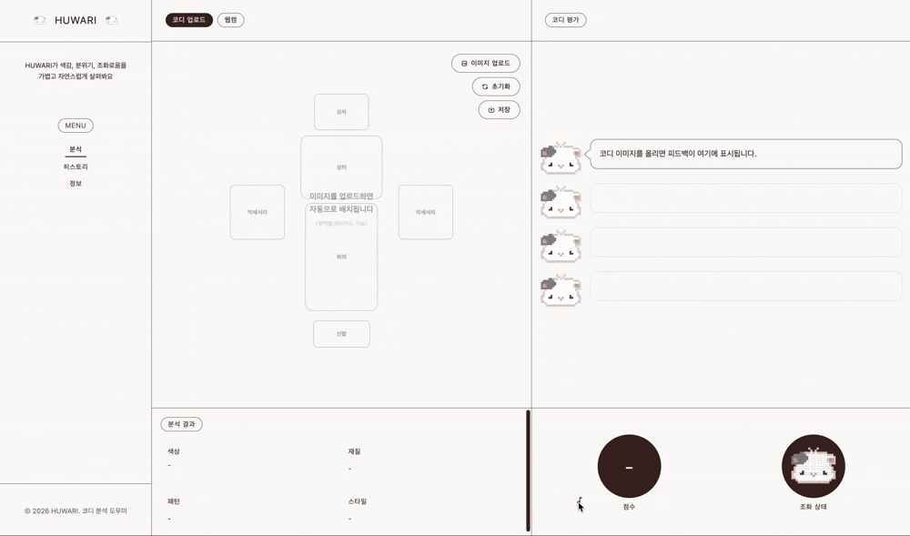
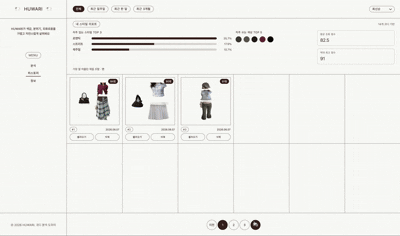
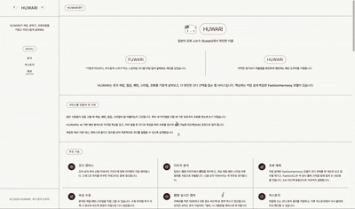

# 서비스 소개

HUWARI는 "이 코디가 잘 어울리는지" 를 빠르게 확인할 수 있는 코디 분석 웹사이트다.

옷을 사거나 매일 코디를 고를 때, 이 조합이 잘 어울리는지 애매한 경우가 많다. 온라인 쇼핑에서는 옷장 속 옷이랑 어울릴지 미리 알기 어렵고, 거울 앞에서 고른 코디도 막상 나가 보면 어색하게 느껴질 때가 있다. 이런 상황에서 한 번에 점수와 분석을 보여 줄 수 있는 도구가 있으면 좋겠다는 생각으로 만들었다.

옷 사진을 올리거나 웹캠을 켜면, 한 코디에 대해 조화 점수(0~100)와 재질·패턴·스타일·색 분석을 같이 보여 준다.

---

## 사용하기 좋은 상황

- 온라인에서 옷을 사기 전에, 옷장 속 옷이랑 어울릴지 미리 확인하고 싶을 때
- 오늘 입을 코디 후보가 여러 개 있어서, 어떤 게 더 나은지 비교하고 싶을 때
- 거울 앞에서 막상 입어 보고 애매할 때, 웹캠으로 한 번 더 점수를 보고 싶을 때
- 자켓이나 신발을 하나만 바꿨을 때 전체 분위기가 어떻게 달라지는지 보고 싶을 때
- 색은 괜찮은데 패턴·재질 조합이 어색한 건 아닌지 확인하고 싶을 때
- 그동안 어떤 스타일을 자주 입었는지 한 번에 보고 싶을 때

---

## 페이지 구성

서비스는 Home, History, Info 세 페이지로 되어 있다.

**Home**은 메인 작업 공간이다. 옷 이미지를 올리거나 웹캠을 켜서 한 코디를 만들고, 캔버스에 아이템을 올리면 조화 점수·색 분석·피드백 말풍선이 같이 갱신된다. 분석 패널에서 재질·패턴·스타일을 직접 고치면 점수가 다시 계산되고, 마음에 드는 코디는 그대로 히스토리에 저장할 수 있다.

**History**는 저장한 코디를 12장(2행 × 6열) 단위로 모아 보는 페이지다. 상단에는 「내 스타일 리포트」 카드가 있어서, 그동안 저장한 코디 기준으로 자주 입는 스타일·색·평균 점수·최고 점수를 요약해 준다. 코디 카드를 누르면 Home으로 다시 불러와 지금 코디와 비교할 수 있다.

저장된 코디가 쌓이면 「내 스타일 리포트」가 평균 점수·자주 입는 스타일·자주 쓰는 색을 함께 보여 주고, 그 아래에는 점수가 매겨진 코디 카드가 나열된다.

저장한 코디가 한 장도 없을 때는 같은 자리에 "비어 있다"는 안내가 표시되고, 저장 직후부터 카드가 채워지기 시작한다.

History 상단의 **「내 스타일 리포트」** 카드는 저장된 코디를 기반으로 자주 입는 스타일 TOP 3, 자주 쓰는 색 TOP 5, 가장 잘 어울린 재질 조합, 그리고 평균 조화 점수·역대 최고 점수를 한 번에 요약해 준다.

**Info**는 서비스 설명과 사용 가이드를 모아 둔 페이지다. HUWARI 이름 유래·서비스를 만든 이유·주요 기능·웹캠·캔버스·사용 방법·XAI·점수 안내·기술 스택 같은 항목이 한 페이지에 정리되어 있다.

---

## 사용자 흐름

1. **코디 업로드**로 이미지를 올리거나, **웹캠**으로 카메라를 켠다(실시간 조화·피드백 또는 캡처).
2. (업로드·캡처 시) 아이템의 색상/속성 정보를 추출하고 캔버스에 배치한다.
3. 조화 점수(총점·색)를 계산하고 **XAI 피드백 말풍선**으로 결과를 해석한다.
4. 마음에 드는 결과는 히스토리에 저장해 재사용한다.

---

## 주요 기능

| 기능 | 한 줄 설명 |
|------|------------|
| 이미지 업로드·전처리 | 옷 이미지를 올리면 리사이즈·정규화·배경 제거를 거쳐 분석하기 좋은 형태로 만든다 |
| 대표 색상 추출 | 옷에서 주요 색을 뽑아 색칩으로 보여 주고, 색 조화 점수에도 활용한다 |
| **조화 점수 예측(핵심)** | 여러 아이템을 한 코디로 보고 0~100점 조화 점수와 이유 문장을 제공한다 |
| 패션 속성 분류 + UI 수정 | 재질·패턴·스타일·종류를 한글 라벨로 보여 주고, 사용자가 직접 수정할 수 있다 |
| 의류 타입 분류(슬롯) | 상의·하의·모자·신발·악세서리 등으로 분류해 캔버스 배치에 활용한다 |
| 웹캠 실시간·캡처 | 카메라 화면에서 옷 영역을 찾아 실시간 조화 점수를 보여 주고, 캡처 후 캔버스에 추가할 수 있다 |
| 히스토리 저장·비교 | 분석 결과를 저장해 이전 코디를 다시 보고, 현재 조합과 비교할 수 있다 |
| **개인화 피드백·스타일 리포트** | 누적된 코디 기록으로 자주 입는 스타일·색·평균 점수를 요약하고, Gini 말풍선에 개인화 한 줄을 추가한다 |
| UX 보강 | 작업 상태 복원, 상태 안내, 말풍선 피드백 등으로 분석 흐름을 끊기지 않게 한다 |

---

## 기술 스택

- **Frontend**: React, Vite, TypeScript, Tailwind CSS, React Router
- **Backend**: FastAPI, Uvicorn
- **ML/CV**: PyTorch, torchvision, timm(EfficientNet 백본·전이학습), transformers, **open-clip-torch**(OpenAI CLIP·FashionCLIP), **ultralytics YOLOv8**, **rembg**, **MediaPipe** Pose, scikit-learn(색 군집)
