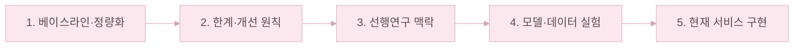
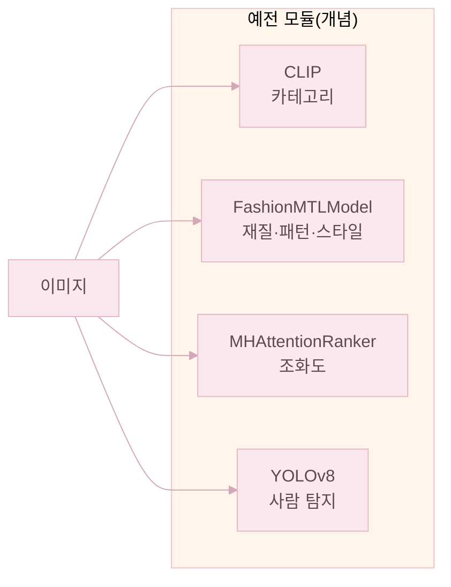
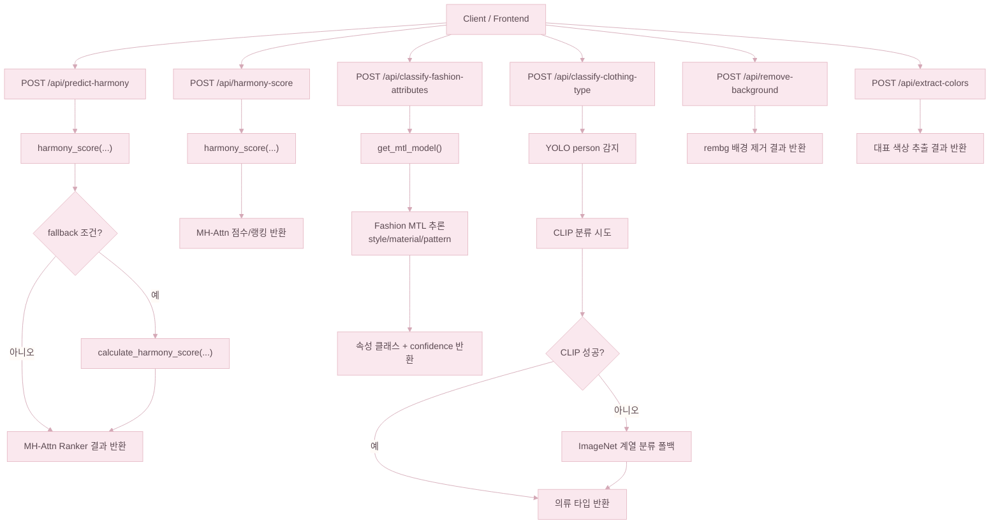

# 연구·개발 스토리

베이스라인 → 선행연구 → 실험 → 현재 서비스 순서로 흐름을 정리했다.

먼저 **직접 구현했던 HUWARI 초기 버전** 파이프라인을 구조·수치로 정리해 **어디가 병목인지** 짚고, 그 다음에 **같은 문제를 다른 사람들은 어떻게 풀었는지** 선행연구를 살펴봤다. 거기서 잡은 **개선 원칙**을 **FashionHarmony·K-Fashion 실험**으로 옮긴 뒤, 마지막에 **지금 저장소의 서비스**로 옮긴 과정까지 한 번에 적었다.

---

## 1. 베이스라인: 예전 파이프라인 구조와 측정값

개선 실험에 들어가기 전에, **직접 구현했던 HUWARI 초기 버전**을 그대로 두고 성능을 한 번 측정해 두었다. 이후 변경 작업의 **기준선(Baseline)** 으로 삼기 위해서다.

### 1.1 모듈 구성(개념)와 엔드포인트

직접 구현한 초기 시스템은 하나의 큰 파이프라인이라기보다, **요청 목적별로 모델이 따로 도는 API 구조**였다. 조화·속성·의류 타입·전처리가 다 분리되어 있어서, **같은 임베딩 공간을 공유하지 못했다**.

`main.py` 기준으로 당시 운용은 대략 다음과 같다.

- **조화**: `POST /api/predict-harmony`·`POST /api/harmony-score` → `harmony_score(...)`(MH-Attn ranker), 일부 조건에서 `calculate_harmony_score(...)` 규칙 폴백
- **속성**: `POST /api/classify-fashion-attributes` → EfficientNet-B3 **Fashion MTL**
- **의류 타입**: `POST /api/classify-clothing-type` → YOLO 보조 + CLIP 우선, 실패 시 ImageNet 계열 폴백
- **전처리**: `POST /api/remove-background`, `POST /api/extract-colors`

엔드포인트별 호출 흐름:

### 1.2 평가 범위

| 측면 | 지표(예) |
|------|----------|
| **아이템 속성 (Fashion MTL)** | Accuracy, Macro F1, Weighted F1, Top-3 Accuracy |
| **조화 랭킹 (Harmony Ranker)** | AUC(잘 맞는 조합 vs 섞은 조합 판별) |

"아이템 자체를 얼마나 잘 읽는지"와 "여러 아이템이 모였을 때 잘 어울리는지", 두 가지를 같이 봤다.

### 1.3 Harmony Ranker (MH-Attn) 성능

조화 랭킹 베이스라인은 구조가 단순한 **MLP**(AUC **0.6957**)에서 **MHAttentionRanker**(AUC **0.7524**)까지 올라온 상태였다. 이후 FashionHarmony 실험과 비교할 때 이 두 수치를 출발점으로 잡는다.

### 1.4 Fashion MTL 분류 성능 (예전 체크포인트 기준)

| Task     | Accuracy | Macro F1 | Weighted F1 | Top-3 Accuracy |
| -------- | -------- | -------- | ----------- | -------------- |
| Style    | 0.635833 | 0.634632 | 0.634632    | 0.899671       |
| Material | 0.666075 | 0.125872 | 0.631835    | 0.856772       |
| Pattern  | 0.844358 | 0.186979 | 0.821423    | 0.935371       |

`Pattern`은 Top-3 안에 정답이 잘 들어 있고, `Material`·`Pattern`의 Macro F1이 낮은 건 **클래스 불균형** 영향이 크다. 이 수치를 보고 이후 **클래스 수를 줄이고 라벨을 정리하는 작업**(K-Fashion)으로 넘어갔다.

---

## 2. 베이스라인이 드러낸 한계와 개선 원칙

사람이 코디를 볼 땐 색 점수 + 재질 점수…처럼 따로따로 계산해서 합치지 않는다. 상의·하의·신발이 한 장면에 있을 때 **톤·실루엣·질감·패턴 충돌**을 한 번에 읽고 "어울린다"고 느낀다.

| 한계 | 설명 |
|------|------|
| **표현 공간 분리** | CLIP·MTL·랭커가 각자 학습·추론해, **세트 맥락을 같은 임베딩에서 일관되게** 쓰기 어렵다 |
| **모듈식 점수** | 조화·속성·타입이 분리돼 **코디 전체를 한 번에** 보기 어렵다 |
| **랭커 상한** | MH-Attn은 베이스라인에서 쓸 만했지만 AUC **0.7524** 정도여서, **세트 전체를 한 번에 학습하는 모델**로 더 끌어올릴 여지가 있었다 |
| **속성 과다 클래스** | 재질·패턴이 너무 잘게 나뉘고 라벨 노이즈까지 겹쳐 **희귀 클래스 예측이 흔들렸다** |

그래서 개선 원칙을 다음과 같이 잡았다.

- **공유 백본·통합 표현**: 속성 로짓과 조화 판단이 같은 특징 흐름을 같이 쓰게
- **데이터 기반 정렬**: contrastive / ranking으로 "맞는 조합·틀린 조합"을 표현 공간에서 갈라 두게
- **세트 단위 구조**: attention으로 **아웃핏 전체의 상호작용**을 직접 보게
- **설명 보강**: **총점·색·말풍선(XAI)** 로 점수만이 아니라 이유까지 같이 보여 주게

---

## 3. 학문적 배경과 선행연구

위의 한계를 어떻게 풀어야 할지 감을 잡으려고, 패션 조화·호환성을 **학계에서는 어떻게 다뤄 왔는지** 흐름을 짧게 정리했다. 큰 그림으로 보면 **pairwise**(아이템 쌍 단위) 모델에서 **세트 단위(set-level)** 모델로 옮겨 가는 흐름이고, HUWARI가 Set Transformer를 고른 이유도 같은 맥락이다.

| 연구 | 핵심 아이디어 | 본 프로젝트와의 관계 |
|------|---------------|----------------------|
| **Type-Aware Embedding** (Vasileva et al., 2018) | 카테고리 쌍별 임베딩으로 궁합 학습, Polyvore 벤치 정착 | **pairwise의 한계를 인식**: A-B, B-C가 맞아도 A-B-C 전체가 조화롭다고 보기 어렵다는 구조적 문제 → **세트 전체를 한 번에 보는 Set Transformer를 채택한 동기** |
| **VICTOR** (Papadopoulos et al., 2022) | Transformer로 아웃핏 내 여러 아이템 동시 처리, 텍스트·이미지 활용, Polyvore-Disjoint **AUC ~0.92** 보고 | **Transformer로 세트 동시 모델링하는 방향**을 확인. 다만 사용자 텍스트 의존은 실서비스 UX와 맞지 않아, **텍스트 입력 없이 이미지만으로 동작하는 방식**을 선택 |
| **CLIP 하이브리드 멀티모달** (Kalashi & Teimourpour, 2024) | CLIP 기반 고성능 경향 | **CLIP의 패션 이해 능력**을 확인. 다만 조화 판단의 메인은 **FashionHarmony(Set Transformer)** 로 두고, **CLIP은 색 조화 보조(총점 15%)·말풍선 문구 매칭**에만 활용 |

**HUWARI는** 이 흐름을 참고해서 세 가지 방향을 잡았다.
1. **Set Transformer로 세트 전체를 한 번에** 보게 하고
2. 사용자가 별도 텍스트를 입력하지 않아도 되는 **이미지 중심 경로**로 가고
3. 그 결과를 **FastAPI + React·웹캠**까지 붙여 실제로 쓰는 서비스로 만든다.

---

## 참고문헌

1. Vasileva, M., Plummer, B. A., Dusad, K., Rajpal, S., Kumar, R., & Forsyth, D. (2018). **Learning Type-Aware Embeddings for Fashion Compatibility**. *ECCV 2018*. [https://arxiv.org/pdf/1803.09196](https://arxiv.org/pdf/1803.09196)
2. Papadopoulos et al. (2022). **VICTOR** (Transformer 기반 outfit compatibility). [https://arxiv.org/pdf/2207.13458](https://arxiv.org/pdf/2207.13458)
3. Kalashi and Teimourpour (2024). **CLIP 기반 하이브리드 멀티모달 접근**. [https://arxiv.org/pdf/2511.07573](https://arxiv.org/pdf/2511.07573)
