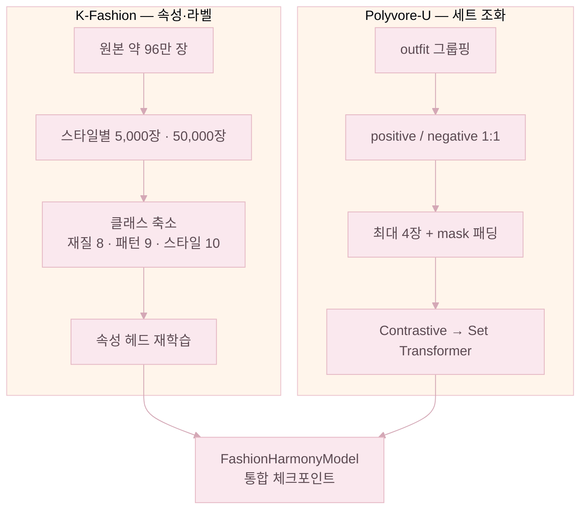
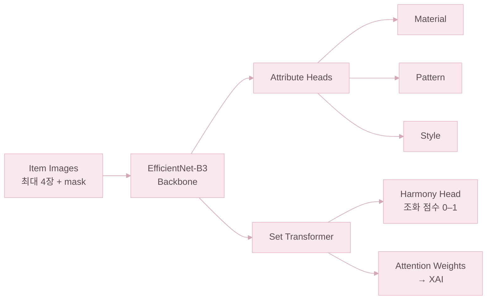
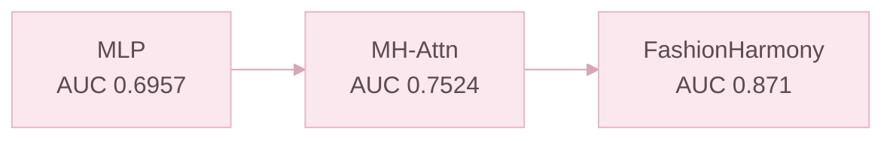

# FashionHarmony 모델 실험

앞에서 잡은 원칙을 실제 코드와 실험으로 옮긴 순서다. 세트 모델링은 Set Transformer, CLIP은 색 보조로 역할을 분리하는 방향을 잡았다. 학습용 데이터 파이프라인은 아래 [데이터 전처리](#데이터-전처리) 절에 정리했다.

---

## 데이터 전처리

학습 파이프라인은 **K-Fashion**(속성·라벨)과 **Polyvore-U**(세트 조화)로 나뉜다.

### K-Fashion (속성 분류)

**데이터**: AI Hub K-Fashion (라벨 JSON — 스타일·재질·패턴)

#### 기존 방식의 한계 (`FashionMTLModel`)

| 항목 | 내용 |
|------|------|
| 클래스 수 | 재질 **97**, 패턴 **70** — 과도한 세분화 |
| 불균형 | **무지** 패턴이 전체 **60% 이상** |
| 샘플링 | 균등 샘플링 없이 원본 분포 그대로 사용 |
| 정규화 | **Normalize 미적용** |
| 결과 | 희귀 클래스 예측 실패 — Macro F1 **0.12~0.18** |

#### 최종 방식 (`FashionHarmonyModel`)

**1. 클래스 통합** — 실용 수준으로 축소.

| 항목 | 기존 | 최종 |
|------|------|------|
| 재질 | 97개 | **8개** — 데님, 니트, 실크, 가죽, 울, 면, 패딩, 기타 |
| 패턴 | 70개 | **9개** — 무지, 스트라이프, 체크, 도트, 플로럴, 그래픽, 호피·뱀피, 카무플라쥬, 기타 |
| 스타일 | 24개 | **10개** — 캐주얼, 고프코어, 미니멀, 긱시크, 로맨틱, 빈티지, 포멀, Y2K, 스트리트, 스포티 |

**2. 데이터 수집**

- 원본 **967,806**장(zip 3개)
- 스타일별 **5,000**장 샘플링 → 학습 **50,000**장
- 스타일 라벨 **24 → 10** 매핑 후 사용

**3. 클래스 불균형 처리**

| 시도 | 내용 | 결과 |
|------|------|------|
| 균등 샘플링 | 무지 **30,000 → 2,000** 등으로 다운샘플링 | **전체 정확도 하락** — 채택 안 함 |
| **최종** | 전체 **50,000**장 유지 + **Class Weight** | 희귀 클래스에 높은 가중치 → 학습 시 보완 |

**4. 데이터 증강**

공통: RandomCrop(256→224), RandomHorizontalFlip(p=0.5), ColorJitter.

| 기법 | 설정 | 목적 |
|------|------|------|
| RandomRotation | ±20° | 스트라이프 **방향** 다양화 |
| RandomPerspective | p=0.3 | 원근 변환 |
| RandomGrayscale | p=0.1 | 색이 아닌 **패턴** 자체 학습 |
| **Normalize** | mean `[0.485, 0.456, 0.406]`, std `[0.229, 0.224, 0.225]` | **기존에 없던** ImageNet 정규화 |

### Polyvore-U (세트 조화)

**1단계 — 데이터 수집**

- Hugging Face **`Marqo/polyvore`**
- 이미지 **84,686**장, outfit 세트 **20,062**개

**2단계 — Outfit 그룹핑**

- `item_ID.rsplit('_', 1)[0]`로 **outfit 단위** 그룹핑
- 아이템 **2개 이상**인 outfit만 사용

**3단계 — Positive / Negative 쌍 생성**

| 유형 | 정의 |
|------|------|
| **Positive** | 같은 outfit 내 아이템(전문가 코디) |
| **Negative** | 다른 outfit 아이템 절반 + 현재 outfit 아이템 절반을 섞어 구성 |
| **비율** | Positive : Negative = **1 : 1** |

**Negative를 절반만 섞는 이유**: 완전히 다른 outfit으로만 negative를 만들면 **카테고리 구성·색감이 한눈에 달라져 모델이 쉽게 구분**한다. **현재 outfit 아이템 절반을 남겨 두면** 카테고리·전체 톤이 비슷한 상태에서 **한두 아이템만 어색**해지므로, 모델이 "세트의 상호작용"을 보고 판단하도록 강제하는 **hard negative**가 된다.

**4단계 — 패딩 처리**

- outfit당 아이템 **최대 4개**
- 4개 미만이면 **zero tensor** 패딩
- **mask**로 실제 아이템과 패딩 구분 — `mask=1` 실제, `mask=0` 패딩

---

## FashionHarmony 아키텍처

### 설계 목표

사람은 옷을 하나씩 따로 평가하지 않는다. 상의·하의·아우터가 서로 어떻게 어울리는지 같이 보고 코디의 조화를 판단한다. FashionHarmony는 이 과정을 모델로 옮기기 위해 설계한 통합 조화 모델이다. 한 코디 안의 메인 의류 아이템들을 **하나의 세트(Set)** 로 묶어 백본·속성 헤드·Set Transformer에 같이 흘려보내, 개별 분류와 전체 조화 점수를 같은 표현 공간에서 만들어 낸다. 신발·모자·악세서리는 세트 조화 모델의 입력에는 포함되지 않고, 색 점수와 피드백 문장에만 반영된다.

### 전체 구조

### 모듈별 역할

| 모듈 | 역할 |
|------|------|
| EfficientNet-B3 | ImageNet에서 사전학습된 백본. K-Fashion·Polyvore-U로 파인튜닝해 패션 특징을 뽑는다 |
| Attribute Heads | 아이템별로 재질·패턴·스타일·종류를 분류한다 |
| Set Transformer | 한 코디 안의 아이템들을 함께 보고, attention으로 아이템 간 관계를 학습한다 |
| Harmony Head | Set Transformer 출력을 받아 최종 조화 점수(0–1)를 만든다 |
| Attention Weights | 어떤 아이템 쌍이 점수에 크게 작용했는지 보여 주는 XAI 신호 |

### 왜 Set Transformer인가

MLP를 쓰면 아이템들을 각각 따로 처리한 뒤 평균을 내거나 단순하게 합치게 된다. 이 방식으로는 "상의와 하의의 조합이 어색하다" 같은 **아이템 사이 관계**를 모델이 직접 보지 못한다.

Set Transformer는 self-attention으로 **상의–하의, 상의–아우터, 하의–아우터** 같은 메인 의류 간 쌍별 관계를 동시에 학습한다. 그래서 코디 전체의 조화를 따로 후처리하지 않고 한 번에 모델링할 수 있고, 학습된 attention 가중치가 그대로 XAI 설명에도 쓰인다.

---

## 실험 순서

### 4.1 Polyvore-U로 통합 조화 모델 학습

**모델 골격**: **ImageNet** 사전학습 **EfficientNet-B3** → 특징 → **AttributeHeads** → **Set Transformer** (세트 전체 조화 점수 0–1).

**데이터 (Hugging Face `Marqo/polyvore`)**

| 항목 | 규모 |
|------|------|
| 이미지 | 약 84,686장 |
| 아웃핏 세트 | 약 20,062개 |

**학습 과정 요약 (예: Colab Pro, T4)**

| 단계 | 내용 | 비고 |
|------|------|------|
| Contrastive | 백본 표현 학습 | 중간 분류 acc 약 **0.630** |
| 속성 헤드 | SigLIP 자동 라벨 (예: 7,715장) | 노이즈가 많아 이후 K-Fashion으로 갈아탐 |
| Set Transformer | Polyvore-U 세트 단위 | acc 약 **0.707** |
| 파인튜닝 | 전체 미세조정 | acc 약 **0.729** |
| 평가 | 세트 호환성 | **AUC 약 0.912** (SigLIP 라벨 초기 실험 기준 — 이후 K-Fashion으로 대체) |

**그 과정에서 잡은 버그·이슈**: 임베딩에서 **L2 정규화를 빼고**, `OutfitDataset`의 **positive / negative 짝 버그**를 잡았으며, contrastive 학습의 **temperature** 값을 다시 맞췄다.

### 4.2 K-Fashion으로 속성 체계 재정의·재학습

**문제**: `FashionMTLModel` 계열은 클래스가 너무 많고 자동 라벨 노이즈까지 섞여 있어, 희귀 클래스가 잘 안 잡혔다.

**대응**: **AI Hub K-Fashion**을 파싱하고, 스타일별로 샘플링한 다음, 클래스 수를 확 줄여서(**재질 8·패턴 9·스타일 10**) 다시 정의했다.

| 항목 | 규모 |
|------|------|
| 원본 이미지 | 약 967,806장 (zip 3개) |
| 스타일당 샘플 | 5,000장 |
| 실험 파싱 합 | 약 50,000장 |

**속성 분류만 본 지표 (K-Fashion)**

| 태스크 | Accuracy |
|--------|----------|
| style | **0.406** |
| material | **0.635** |
| pattern | **0.809** |
| 평균 | **0.617** |

**스타일 분류: 한계 인식과 서비스 설계**

1. **스타일은 사람마다 기준이 다르다.** 「캐주얼」「스트리트」 같은 단어는 사람·상황마다 받아들이는 폭이 달라서, 같은 옷도 누구는 캐주얼로, 누구는 스트리트로 본다.

2. **그래서 정확도에도 한계가 있다.** 위 표의 style **약 40%** 는 모델 탓이라기보다, **태스크 자체가 모호한** 영향이 크다. 여기에 **한 장 상품 컷으로 학습**한 점, **코디 전체 맥락이 빠진** 점, **10개 클래스가 일부 겹치는**(캐주얼↔스트리트 등) 점이 겹친다.

3. **이 점을 고려해 사용자가 직접 수정할 수 있게 했다.** AI가 붙인 재질·패턴·스타일을 강제하지 않고, Home **분석 패널**에서 사용자가 본인 기준대로 고칠 수 있다.

4. **수정값은 서버에 실제로 반영된다.** XAI 피드백(`reasons`)과 룰북·총점 모두 수정값을 읽어 재계산한다.

### 4.3 Set Transformer 재학습 (속성·라벨 정렬 후)

| 모델 | AUC |
|------|-----|
| MLP (단순 구조) | **0.6957** |
| MH-Attn | **0.7524** |
| FashionHarmony (재학습 후) | **0.871** |

**AUC 지표 읽는 법**

「잘 맞는 코디」와 「일부러 섞은 어색한 코디」를 모델이 봤을 때, **잘 맞는 쪽에 더 높은 점수를 매기는 비율**이다. **0.5**면 무작위 추측 수준, **1.0**에 가까울수록 두 쪽을 잘 구분한다는 뜻이다.

### 4.4 Ablation Study

각 컴포넌트가 실제로 점수에 얼마나 기여하는지 확인하기 위해, 동일한 데이터(Polyvore-U)와 조건에서 컴포넌트를 하나씩 더해 가며 AUC를 측정했다.

**실험 조건**: Polyvore-U 동일 데이터, 배치 64(누적 4), AdamW, CosineAnnealingLR, T4 GPU. A·B·C는 3 epoch, D는 저장된 최종 모델을 직접 평가했다.

| 모델 구성 | AUC |
|-----------|-----|
| A. Backbone + MLP (베이스라인) | **0.7878** |
| B. Backbone + Set Transformer | **0.7920** |
| C. Backbone + AttributeHeads + Set Transformer | **0.7822** |
| D. 최종 모델 (K-Fashion 사전학습 + 20 epoch) | **0.8726** |

3 epoch만 학습한 조건에서는 컴포넌트를 추가해도 차이가 크지 않았다. Set Transformer를 붙이면 AUC가 **+0.0043** 상승했지만, AttributeHeads까지 추가하면 오히려 **-0.0099**로 하락했다. 학습량이 부족할 때는 속성 헤드가 도움보다 노이즈에 가깝게 작용한 셈이다.

반면 K-Fashion으로 백본·속성 헤드를 사전학습한 뒤 20 epoch까지 학습한 최종 모델(D)은 AUC **0.8726**으로, 베이스라인 대비 **+0.0848** 상승했다.

결과적으로 **모델 구조를 확장하는 것보다 도메인 데이터로 충분히 사전학습하는 편이 성능에 더 크게 작용했다.** 패션 조화처럼 라벨이 모호한 태스크에서는 도메인 사전학습의 비중이 그만큼 크다.

**점수 분포**: 최종 모델(D)의 출력 점수를 나눠 보면, 조화로운 코디(Positive)는 평균 **0.7308**, 일부러 섞은 어색한 코디(Negative)는 평균 **0.3310**으로, 두 분포가 약 **0.40** 차이로 명확히 떨어져 있다.

### 4.5 성과 요약

| 항목 | 개선 전 | 개선 후 |
|------|--------|---------|
| 조화 | MLP 0.6957 · MH-Attn 0.7524 | FashionHarmony + Set Transformer + FashionCLIP 색 (AUC 0.8801) |
| 속성 | 다세분류·노이즈 | K-Fashion·축소 클래스 방향 + 통합 모델 헤드 |
| 웹캠 | 없음 | MediaPipe·YOLO 의류 크롭 + 실시간·캡처 |
| 서비스 | API 단편 | FastAPI + React |

### 4.6 FashionHarmony / FashionCLIP 비율 튜닝

Polyvore-U 동일 데이터에서 비율을 50%~100% 구간으로 조정하며 AUC를 측정했다.

| FashionHarmony 비율 | FashionCLIP 색 비율 | AUC |
|---------------------|---------------------|-----|
| 50% | 50% | 0.8758 |
| 60% | 40% | 0.8632 |
| 65% | 35% | 0.8695 |
| 70% | 30% | 0.8746 |
| 75% | 25% | 0.8686 |
| 80% | 20% | 0.8698 |
| **85%** | **15%** | **0.8801 ← 최적** |
| 90% | 10% | 0.8727 |
| 100% | 0% | 0.8712 |

**85% / 15%** 가 AUC **0.8801**로 가장 높았다. 색 비율을 50%까지 높이면 오히려 성능이 떨어지고, 색을 완전히 제거(100% / 0%)해도 최적보다 낮았다. FashionHarmony가 조화 판단의 중심이되, FashionCLIP 색 신호를 소량 보조하는 구조가 AUC 기준으로 유효하다는 점을 확인했다.
