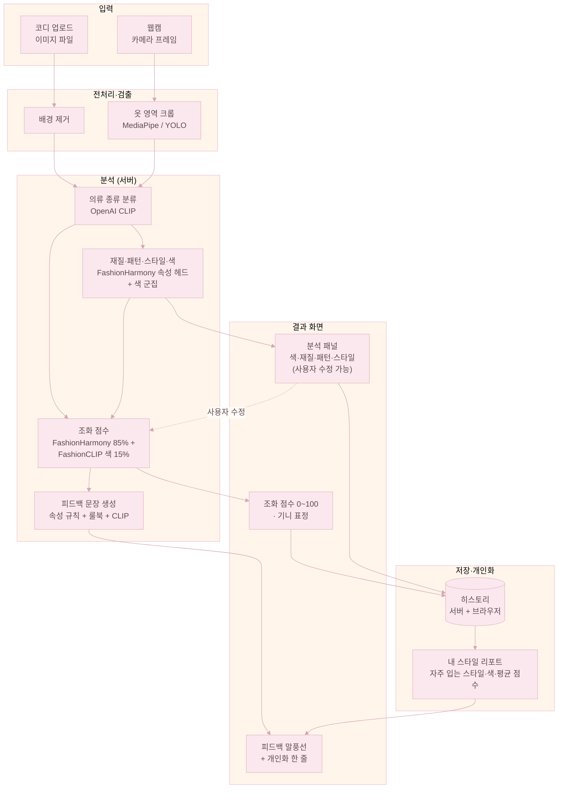
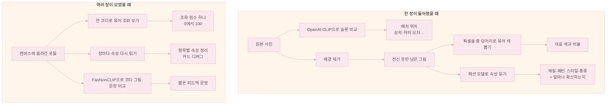
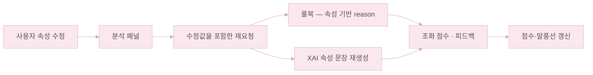
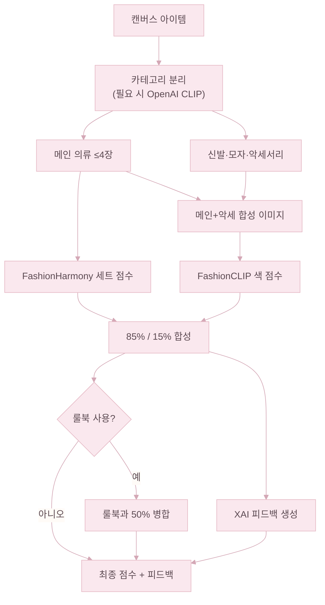
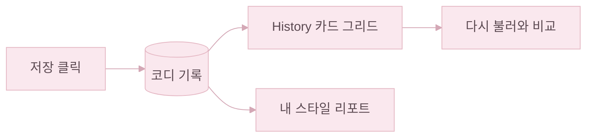

# 서비스 구현

실험 모델을 웹에서 쓰는 형태로 옮긴 부분이다.

---

## 전체 흐름

업로드부터 결과 화면까지 한눈에 보면 이렇게 이어진다.

단계로 묶어 보면 다음과 같다.

1. **입력** — 코디 업로드 이미지나 웹캠 프레임으로 분석을 시작한다.
2. **전처리·검출** — 업로드 이미지는 배경을 제거하고, 웹캠 프레임은 MediaPipe / YOLO로 옷 영역을 잘라 낸다.
3. **분석** — 의류 종류·속성·색을 읽은 뒤, FashionHarmony 조화 점수와 FashionCLIP 색 점수를 합쳐 0~100점을 만들고, 그 결과를 한국어 피드백 문장으로 풀어 준다.
4. **결과·저장** — 점수, 분석 패널, 말풍선이 화면에 반영된다. 저장한 코디는 「내 스타일 리포트」와 개인화 피드백을 만들 때 다시 사용된다.

---

## 설계 목표

1. 여러 아이템을 한 코디로 보고 조화 점수(0~100)를 낸다. FashionHarmony가 만든 세트 점수에 FashionCLIP의 색 점수를 85% / 15%로 합쳐 최종 점수를 만든다.
2. 같은 모델이 재질·패턴·스타일·종류까지 한국어 라벨로 함께 내놓아, 화면 카드와 히스토리에 그대로 쓰인다.
3. 의류 종류 분류는 OpenAI CLIP, 색 조화와 피드백 문장 매칭은 FashionCLIP이 따로 맡는다.
4. 속성은 사용자가 직접 고칠 수 있다. 특히 스타일은 주관적이라 모델 예측을 강제하지 않고, 수정값이 점수와 피드백 문장에 곧바로 반영된다.
5. 웹캠으로 카메라 프레임에서 실시간 조화·피드백·옷 영역 표시와 캡처 후 캔버스 반영을 지원한다.

---

## 비전·이미지가 맡는 역할

HUWARI는 조화 모델 하나만 돌리지 않는다. 입력 촬영 → 전처리·검출 → 분류·조화 추론 순서로 여러 비전 모델이 함께 움직인다.

- **백본·전이학습** — FashionHarmony의 백본은 EfficientNet-B3이다. ImageNet에서 출발해 K-Fashion·Polyvore-U로 파인튜닝했고, 그 특징 맵 위에 속성 헤드와 Set Transformer가 붙는다.
- **검출·분할** — 업로드 이미지는 rembg로 배경을 떼어 옷 실루엣만 남기고, 웹캠은 MediaPipe Pose 관절 또는 YOLOv8 사람 bbox로 옷 영역을 잘라 낸다.
- **사전학습 멀티모달 모델** — 의류 종류 분류는 OpenAI CLIP, 색 조화 점수와 피드백 문장 매칭은 FashionCLIP이 맡는다.
- **색 분석** — 아이템별 픽셀을 묶어 대표 색을 뽑고, UI 색칩과 룰북 색 점수에 함께 사용한다. 총점의 색 15%는 따로 FashionCLIP이 코디 이미지를 보고 계산한다.

---

## 과정과 산출물

사용자가 올린 **한 장**과 캔버스에 쌓인 **여러 장(한 코디)** 을 나누어 본다.

**한 장**

- OpenAI CLIP으로 상·하의·모자 등 후보와 이미지를 맞춰 캔버스에 놓일 슬롯을 정한다.
- 배경을 제거해 옷만 남긴 이미지를 만든다.
- 픽셀을 묶어 대표 색과 비율을 뽑고, UI 색칩으로 보여 준다.
- FashionHarmony가 그 이미지를 읽어 재질·패턴·스타일·종류와 각각의 확률을 함께 내놓는다.

**여러 장(한 코디)**

- 여러 장을 한 세트로 묶어 0~100점 조화 점수를 계산한다. 세트 입력에는 메인 의류 이미지가 최대 4장까지 들어가고, 신발·모자·악세서리는 색 조화와 피드백 문장에만 함께 쓰인다.
- 각 아이템마다 속성을 다시 읽어 분석 패널과 디버그 정보에 채워 준다.
- FashionCLIP으로 코디 합성 이미지와 미리 정해 둔 문장 후보를 비교해, 짧은 피드백 한두 줄을 덧붙일 수 있다.

| 사용자 입장에서 생기는 것 | 한 줄 설명 |
|----------------------------|------------|
| 슬롯 | 어디 칸에 붙일지 |
| 전경 이미지 | 배경 없는 옷만 |
| 색 요약 | 대표 색·비율 |
| 속성 카드 | 재질·패턴·스타일·종류 |
| 조화 점수 | 코디 전체 한 점수 |
| 피드백 문장 | 이유·느낌 한두 줄 |

**아이템별 속성 파악**

캔버스에 올린 아이템에 마우스를 올리면 옆에 **속성 카드**가 펼쳐진다.

| 항목 | 어디서 오는가 | 비고 |
|------|----------------|------|
| 대표 색 팔레트 | 배경 제거된 옷 픽셀을 KMeans로 묶어 비율 순으로 정렬 | 좌측이 가장 큰 비중 |
| 재질 | FashionHarmony 속성 헤드 (8-class) | 데님·니트·실크·가죽·울·면·패딩·기타 |
| 패턴 | FashionHarmony 속성 헤드 (9-class) | 무지·스트라이프·체크·도트·플로럴·그래픽·호피·뱀피·카무플라쥬·기타 |
| 스타일 | FashionHarmony 속성 헤드 (10-class) | 캐주얼·고프코어·미니멀·긱시크·로맨틱·빈티지·포멀·Y2K·스트리트·스포티 |
| 종류 (배치 슬롯) | OpenAI CLIP — 상·하의·모자·신발·악세서리 후보와의 유사도 | 카드보다 먼저 결정되어 슬롯 위치를 정함 |

**분석 결과 한눈에**

**점수별 기니 표정**

| 점수 구간 | 조화 상태 | 기니 |
|-----------|-----------|------|
| 0~39점 | 낮음 |  |
| 40~69점 | 보통 |  |
| 70~100점 | 좋음 |  |

---

## 런타임 흐름 (UI·서버)

Home 화면은 왼쪽에 코디 작업 영역, 오른쪽에 조화 점수·피드백을 둔다.

캔버스에 올라간 아이템이 바뀌면 서버에 조화 분석을 자동으로 다시 요청한다. 사용자가 잠깐 멈췄을 때만 호출하도록 짧게 묶어 두었고, 같은 구성에 대한 결과는 브라우저에 캐시해 둔다.

**코디 업로드** — 사용자가 파일을 고르면 의류 종류 분류와 배경 제거가 동시에 진행되어, 종류에 맞는 슬롯에 배경이 빠진 이미지가 놓인다.

이미지를 올리면 의류 종류 분류·배경 제거·속성 분석이 백그라운드에서 동시에 진행된다.

**속성 수정 → 재계산 루프**

분석 패널의 재질·패턴·스타일 드롭다운은 단순 표시가 아니라, 사용자가 선택한 값을 다시 서버로 넘겨 조화 점수와 피드백을 갱신한다.

---

## 조화 점수 계산 흐름

캔버스의 아이템이 한 번 정해지면, 조화 점수는 아래 흐름으로 만들어진다.

- **카테고리 분리** — 신발·모자·악세서리는 색 조화와 피드백 문장에만 들어가고, 세트 조화 모델의 입력에는 **메인 의류만 최대 4장**이 들어간다.
- **점수 합성** — FashionHarmony 세트 점수와 FashionCLIP 색 점수를 **85% / 15%** 로 합쳐 0~100으로 환산한다.
- **85% / 15% 비율을 정한 이유** — Polyvore-U 기준 AUC를 지표로 50%부터 100%까지 구간별로 튜닝 실험을 진행한 결과, **85% / 15% 조합이 AUC 0.8801로 최적**임을 확인하고 적용했다.
- **룰북 병합** — 사용자가 속성을 입력한 경우, 모델 점수와 색상환·재질 조합표 기반 룰북 점수를 **50:50** 으로 섞는다.
- **피드백 문장** — 재질·패턴·스타일·색·attention 신호를 한국어 문장으로 풀어 낸다.

---

## 운용 시 유의사항

- **기준 코디가 비어 있으면** 중립 점수(50점대)와 고정 안내 문구만 돌려준다.
- 웹캠 미리보기는 점수 없이 옷 영역 검출 정보만 보여 준다.
- **재질·패턴·스타일** 라벨은 AI가 우선 붙인 **초안**이다. 특히 **스타일**은 사람마다 기준이 다른 속성이라, 직접 고친 뒤 점수·말풍선·색이 어떻게 달라지는지 보면 된다.

---

## 히스토리·부가 기능

배경 제거, 대표 색 추출, 히스토리는 필요할 때만 따로 호출되는 보조 기능이다. 사용자가 저장 버튼을 누르면 현재 코디의 썸네일과 결과가 함께 기록되고, **History 페이지에서 같은 코디를 다시 불러와 지금 코디와 비교**할 수 있다.

---

## 모델별 역할 요약

- **FashionHarmonyModel** — 메인 의류 세트의 조화 점수와 한국어 속성(재질·패턴·스타일·종류)을 담당한다.
- **OpenAI CLIP** (`clip-vit-base-patch32`) — 의류 종류 분류(상의·하의·모자·신발·악세서리)에 쓰인다.
- **FashionCLIP** (`Marqo/marqo-fashionCLIP`) — 색 조화 점수와 피드백 문장 매칭에 쓰인다.
- **MediaPipe Pose / YOLOv8** — 웹캠 프레임에서 옷 영역을 잡아 주는 데 쓰인다.
