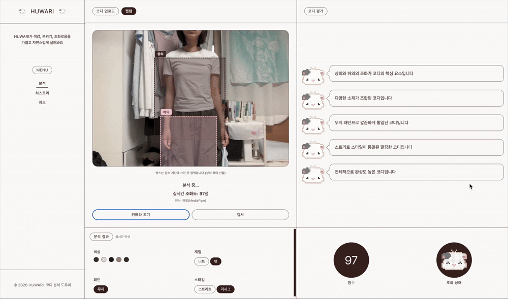
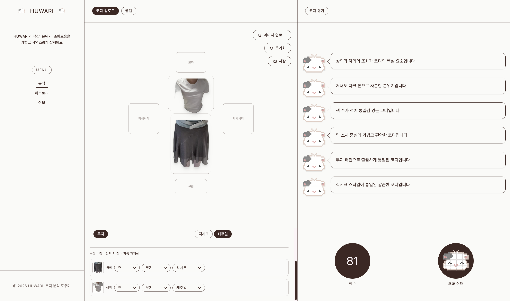
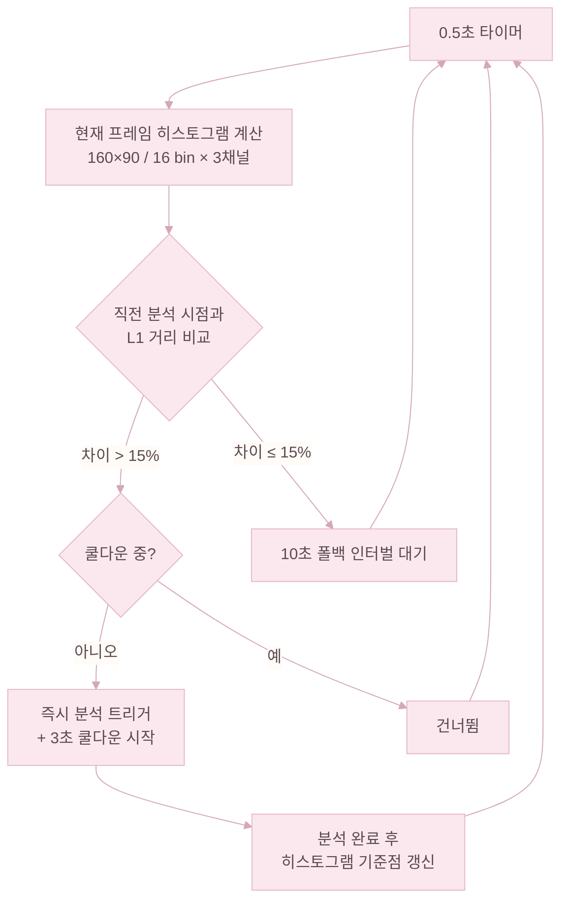

# 웹캠

Home 상단 「웹캠」 탭에서 브라우저 카메라로 실시간 영상을 받는다. 프레임은 서버에서 MediaPipe Pose 관절(또는 YOLOv8 사람 bbox)로 상·하의·신발 영역을 잘라, 같은 조화·피드백 경로에 흘려보낸다. 캡처를 누르면 잘라낸 옷이 캔버스로 옮겨져 일반 업로드와 같은 흐름을 탄다. 상의만 보여도 분석한다.




---

## 웹캠이 하는 일

| 동작 | 사용자 목적 |
|------|-------------|
| **실시간 분석** | 지금 입고 있는 옷의 조화를 주기적으로 확인한다 |
| **캡처** | 인식된 상·하의·신발을 그대로 코디 캔버스에 추가한다 |

---

## 실시간 vs 캡처

| 동작 | 화면에서 보이는 것 |
|------|--------------------|
| **실시간 분석** | 카메라를 켜면 0.5초마다 색상 히스토그램을 비교해 화면 변화가 클 때 즉시 분석하고, 변화가 없어도 10초마다 한 번씩 갱신한다. 영상 위에 옷 영역 박스를 그리고 조화 점수·피드백을 갱신한다. 캔버스에는 아이템이 추가되지 않는다. |
| **캡처** | 한 프레임을 분석해 인식된 옷을 배경 제거 후 캔버스 슬롯에 배치한다. 이후엔 일반 업로드와 같은 경로로 조화가 다시 계산된다. |



첫 호출에서는 YOLO·MediaPipe·FashionHarmony 모델을 메모리에 처음 올리는 시간이 필요하다. 서버 기동 시 워밍업을 한 번 돌려 두어, 사용자 입장에서 첫 응답을 줄이려고 했다.

---

## 변화 감지 트리거

프론트엔드에서 0.5초마다 160×90으로 줄인 프레임의 RGB 히스토그램(16 bin × 3채널)을 계산해, 직전 분석 시점 히스토그램과 정규화 L1 거리를 비교한다. 차이가 15%를 초과하면 서버 요청을 즉시 보내고, 연속 재호출 방지를 위해 3초 쿨다운을 건다. 10초 인터벌은 변화가 없을 때의 폴백으로 유지된다.



---

## 웹캠 프레임 처리 단계

1. 한 프레임을 적당히 줄이고 좌우 반전해 서버로 보낸다.
2. 서버는 MediaPipe Pose 관절로 상·하의·신발 영역을 잘라 낸다. 상반신만 보이면 상의만 사용한다.
3. **원근 왜곡 보정** — 어깨·허리 4관절(좌·우 어깨, 좌·우 허리)이 충분히 보이면 그 네 점을 기준으로 Homography를 추정해 `cv2.warpPerspective`로 상체를 직각에 가깝게 펴 준다. 관절이 부족하거나 cv2가 없으면 보정을 건너뛰고 원본을 그대로 쓴다.
4. 관절이 안 잡히면 YOLOv8 사람 영역으로 비율을 추정해 옷을 잘라 낸다. 옷이 전혀 잡히지 않으면 안내 문구만 돌려준다.
5. 잘라낸 의류 이미지를 FashionHarmony·FashionCLIP에 넣어 0~100점을 만든다.
6. 크롭별 색·속성을 모아 분석 패널에 채우고, 피드백 문장은 XAI 규칙대로 만든다.

---

## 원근 왜곡 보정 알고리즘

웹캠은 카메라 각도와 거리가 매번 달라서, 같은 옷도 한쪽으로 기울어 보이거나 어깨·허리 폭이 비대칭으로 잡힐 수 있다. HUWARI는 컴퓨터비전 수업에서 다룬 Homography 기반 원근 보정을 웹캠 전처리에 적용했다. `main.py`의 `correct_perspective()`는 MediaPipe BlazePose 33-point 중 상체를 정의하는 4관절을 기준으로, 비스듬한 상체 영역을 정면에 가까운 형태로 펴 준다.

**1) 입력 — 4관절 픽셀 좌표**

좌어깨 `11`, 우어깨 `12`, 좌허리 `23`, 우허리 `24`를 가져온 뒤, MediaPipe의 정규화 좌표 `(x, y)`를 프레임 크기 `(w, h)`로 곱해 픽셀 좌표 4쌍 `src`를 만든다. 네 점 중 하나라도 `visibility`가 낮으면 잘못된 행렬이 계산될 수 있으므로 보정을 건너뛴다.

**2) 목표 좌표 설계 — 어깨·허리 비율을 보존한 `dst`**

핵심은 원본 4점을 단순한 직사각형으로 강제로 펴지 않는 것이다. 옷이 정면에 가깝게 보이도록 하되, 사람마다 다른 어깨·허리 폭 비율은 남겨야 한다. 그래서 목표 좌표 `dst`는 화면 중앙을 기준으로 한 **정렬된 상체 사다리꼴**로 잡는다.

- `shoulder_w = |rs.x − ls.x| · w` (어깨 폭, px)
- `hip_w     = |rh.x − lh.x| · w` (허리 폭, px)
- `body_h    = |lh.y − ls.y| · h` (어깨~허리 세로 길이, px)
- 화면 중심 `(cx, cy) = (w/2, h/2)`

이 값으로 목표 네 점을 만든다.

```text
좌어깨 : (cx − shoulder_w/2, cy − body_h/2)
우어깨 : (cx + shoulder_w/2, cy − body_h/2)
좌허리 : (cx − hip_w/2,      cy + body_h/2)
우허리 : (cx + hip_w/2,      cy + body_h/2)
```

즉, 어깨선과 허리선을 수평에 가깝게 정렬하면서도 `shoulder_w`와 `hip_w`를 따로 사용해 체형 비율을 유지한다. `shoulder_w`, `hip_w`, `body_h` 중 하나라도 1px 미만이면 보정을 포기한다.

**3) 행렬 풀이 — `findHomography`**

`src → dst`의 4점 대응으로 `cv2.findHomography(src, dst)`를 호출해 사영 변환 행렬을 구한다. 계산에 실패하면 원본 프레임을 그대로 사용한다.

**4) 워핑 — `warpPerspective`**

`cv2.warpPerspective(img, M, (w, h))`로 프레임을 보정한다. 출력 크기는 입력과 동일하게 유지해 이후의 좌표계가 그대로 이어지도록 했다.

**5) 보정 후 관절 재추출 → 크롭**

보정 결과가 원본과 다르면 `_mediapipe_pose_crops()`에서 보정된 이미지로 Pose를 한 번 더 실행한다. 그 새 관절 좌표로 상의·하의·신발 bbox를 다시 계산하기 때문에, 최종 크롭은 보정된 프레임 기준으로 만들어진다. OpenCV가 없거나 관절 신뢰도가 낮거나 Homography 계산에 실패하면 원본을 그대로 사용하므로, 보정 실패가 전체 웹캠 분석 실패로 이어지지 않는다.

---

## 웹캠 vs 캔버스 분석 비교

| | 웹캠 실시간 | 코디 업로드·캔버스 |
|--|-------------|---------------------|
| 입력 | 웹캠 프레임 1장 | 사용자가 올린 여러 아이템 |
| 옷 영역 | MediaPipe 관절 우선, YOLO 비율 보조 | 사용자가 직접 배치한 슬롯 |
| 분석 패널 | 크롭된 옷에서 뽑은 색·속성 | 캔버스 아이템 정보 |
| 룰북 병합 | 없음 (모델 점수 직결) | 있음 (모델 + 룰북 하이브리드) |
| 캔버스 | 변경 없음 | 아이템 추가·편집 가능 |

웹캠에서 **캡처**를 누른 뒤에는 캔버스에 아이템이 쌓이므로, 그 이후는 일반 업로드와 같은 경로를 탄다.
