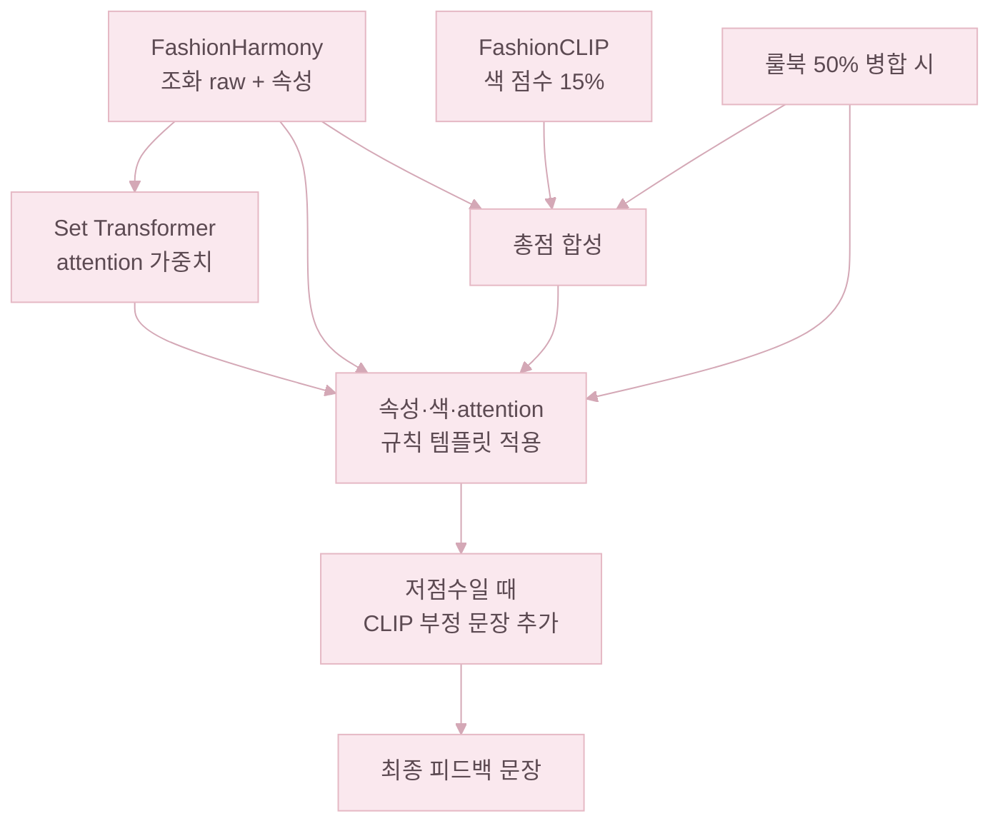

# XAI (설명 가능 AI)

HUWARI의 XAI는 딥러닝 조화 판단(FashionHarmony)과 규칙 기반 설명을 함께 쓰는 구조다. 점수만 던지지 않고, 모델 내부 신호(Attention)·속성 분석(재질·패턴·스타일)·색 분석을 모아 "왜 이 점수인지"를 한국어 문장으로 풀어 준다. 자유 생성형 문장이 아니라 규칙 템플릿을 쓰는 이유는, 모델이 만들어 내는 점수와 일관된 표현을 보장하기 위해서다.

**점수만으로는 부족한 이유**: Set Transformer는 코디 전체를 보고 조화 점수 하나를 내놓는다. 이 점수는 "얼마나 어울리는가"는 알려 주지만, "무엇 때문에 낮은가" 또는 "어떻게 바꾸면 좋은가"는 알려 주지 않는다. 사용자 입장에서 73점이라는 숫자보다 "상의와 하의의 색감 차이가 크다"는 문장이 훨씬 직접적인 정보다.

---

## XAI가 답하는 질문

| 질문 | 설명 수단 |
|------|-----------|
| 어떤 아이템 관계가 중요한가? | Set Transformer **self-attention** |
| 색·재질·패턴·스타일은 어떤가? | 속성 분류 결과 + **규칙 템플릿** |
| 룰북 기준으로 어디가 어색한가? | `harmony.py` 색·재질·패턴·스타일 조합표 |
| 색 조화는 이미지 기준으로? | **FashionCLIP** 색 점수 + 저점수 시 부정 문장 |
| 전체적으로 괜찮은가 / 고칠 곳은? | **총점 구간 요약** + 저점수 시 개선·부정 톤 |

---

## 피드백 생성 파이프라인

조화 점수가 정해진 뒤, 최종 점수를 기준으로 피드백 문장을 다시 조립한다.

---

## 1. Attention 기반 설명 (모델 내부 XAI)

Attention 가중치는 모델이 어떤 아이템 관계를 중요하게 봤는지 보여주는 내부 신호다. 상의–하의 attention이 높으면 이 두 아이템 관계를 중심으로 점수를 매겼다는 뜻이다.

- **방식**: Set Transformer 첫 번째 레이어의 self-attention에서, 유효한 메인 아이템(최대 4장) 사이의 가장 강한 쌍을 찾아 한국어 문장으로 풀어 준다.
- **출력 예**: 「상의와 하의의 조화가 코디의 핵심 요소입니다」
- **조건**: 메인 아이템이 2장 이상이고 점수가 60 이상일 때만 긍정 문장을 생성한다. 60 미만이면 개선·부정 문장 비중을 높인다.
- **확장 여지**: 화면에는 문장만 보여 주지만, attention 행렬 자체를 N×N 히트맵으로 시각화하면 사용자가 모델 시선을 직접 확인할 수 있다(미구현).

---

## 2. 속성·색 규칙 템플릿 (해석 가능 규칙 XAI)

- **입력**: 아이템별 재질·패턴·스타일(모델 예측값 + 사용자 수정값을 우선 반영), 코디 전체 대표색.
- **톤**:
  - 60점 이상: 중립~긍정 (예: 「미니멀 스타일이 통일된 깔끔한 코디입니다」)
  - 60점 미만: 개선·부정 (예: 「패턴이 겹쳐 시선이 분산됩니다」)
  - 40점 미만: 추가로 「코디 밸런스를 다시 맞춰 볼 필요」 같은 강한 안내가 붙는다.
- **문장 순서**: Attention(고점수만) → 색(최대 2줄) → 재질 → 패턴 → 스타일 → 총점 구간 요약(마지막 1줄). 한 번에 보여 주는 문장은 **최대 6줄**로 제한한다.

---

## 3. 룰북 설명 (`harmony.py`)

- **내용**: 색상환·채도·명도 차이, 재질·패턴·스타일 조합 점수표에 따른 문장 (예: 「재질: 면과 가죽 조합이 조화롭지 않음」, 「채도 차이가 커 조화가 어려움」).
- **병합**: 사용자가 속성을 입력한 경우, 모델 점수와 룰북 점수를 **50:50** 으로 섞는다.
- **필터**: 「중립으로 계산」 같은 내부 안내 문장은 사용자 말풍선에서 제외한다.

---

## 4. FashionCLIP 멀티모달 설명

- **색 점수**: 코디 합성 이미지와 "조화로운 색 / 충돌하는 색" 문장의 유사도를 비교해 0~100점을 만든다. 총점에 **15%** 로 반영된다.
- **부정 피드백 문장**: 60점 미만일 때만, 사전에 정해 둔 부정 문장(예: 「색상 톤이 맞지 않습니다」)을 최대 2줄까지 앞쪽에 추가한다.

---

## 5. 총점 구간 요약

| 점수 구간 | 마지막 요약 문장 성격 |
|---------|------------------------|
| ≥ 80 | 완성도 높음 |
| ≥ 60 | 균형 잡힘 |
| ≥ 40 | 일부 교체·조정 제안 |
| &lt; 40 | 색·스타일 통일감 개선 제안 |

---

## 6. 피드백 문장 카탈로그

말풍선에 들어가는 한국어 문장은 모두 **규칙 템플릿**이다. 점수 구간(60·40 두 단계)과 입력 속성·룰북·FashionCLIP 결과를 보고 아래 문장 중 일부를 골라 **최대 6줄**로 묶는다.

### 6.1 종합 점수 요약

항상 마지막에 한 줄 붙는다.

| 점수 구간 | 문장 |
|-----------|------|
| ≥ 80 | 전체적으로 완성도 높은 코디입니다 |
| ≥ 60 | 전반적으로 균형잡힌 코디입니다 |
| ≥ 40 | 일부 아이템 교체로 조화도를 높일 수 있습니다 |
| &lt; 40 | 색상 또는 스타일 통일감을 높이면 더 좋아집니다 |

40점 미만이면 맨 앞에 「전체적으로 코디 밸런스를 다시 맞춰 볼 필요가 있습니다」가 한 줄 더 붙는다.

### 6.2 Attention 기반 코디 핵심

60점 이상일 때만, Set Transformer 1레이어 self-attention에서 가장 강한 두 아이템 쌍을 짚는다.

| 조건 | 문장 |
|------|------|
| 상의·하의 쌍 | 상의와 하의의 조화가 코디의 핵심 요소입니다 |
| 상의·상의 (상의 두 벌) | `{a}와 {b}의 조화가 코디의 핵심 요소입니다` |
| 하의·하의 (하의 두 벌) | `{a}와 {b}의 조화가 코디의 핵심 요소입니다` |

### 6.3 색상

우세색 기준: 해당 색이 전체 픽셀의 **15% 이상**을 차지하는 경우. 평균 밝기는 `R×0.299 + G×0.587 + B×0.114` 공식으로 계산(0~255).

**저점수(60 미만)**

| 조건 | 문장 |
|------|------|
| 우세색 4개 이상 | 색이 많아 전체 톤이 산만해 보일 수 있습니다 |
| 우세색 3개 | 색상 수가 많아 통일감을 줄일 여지가 있습니다 |
| 밝기 차이 큼 (아이템 간 80 초과) | 아이템마다 밝기 차이가 커 색 조화가 어렵게 느껴질 수 있습니다 |
| 그 외 | 상·하의 색감을 한 톤으로 맞추면 더 안정적으로 보입니다 |
| 추가(40 미만) | 포인트 색을 하나로 줄이면 조화도가 올라갑니다 |

**평이/고점수(60 이상)**

| 조건 | 문장 |
|------|------|
| 평균 밝기 < 100 | 저채도 다크 톤으로 차분한 분위기입니다 |
| 평균 밝기 > 180 | 밝은 톤으로 경쾌한 분위기입니다 |
| 평균 밝기 100~180 | 중간 밝기로 균형 잡힌 색감입니다 |
| 우세색 2개 이하 | 색 수가 적어 통일감 있는 코디입니다 |
| 우세색 4개 이상 | 다양한 색으로 포인트가 풍부합니다 |

### 6.4 재질

| 조건 | 문장 |
|------|------|
| 재질 2종 이상 + 저점수 | 서로 다른 재질이 많아 질감 대비를 줄이면 더 자연스럽습니다 |
| 데님 단일 | 데님 소재 중심의 캐주얼한 코디입니다 |
| 니트 단일 | 니트 소재 중심의 포근하고 따뜻한 분위기입니다 |
| 실크 단일 | 실크 소재 중심의 고급스러운 분위기입니다 |
| 가죽 단일 | 가죽 소재 중심의 엣지 있는 코디입니다 |
| 울 단일 | 울 소재 중심의 클래식한 분위기입니다 |
| 면 단일 | 면 소재 중심의 가볍고 편안한 코디입니다 |
| 패딩 단일 | 패딩 소재 중심의 실용적인 아우터 코디입니다 |
| 혼합 | 다양한 소재가 조합된 코디입니다 |

### 6.5 패턴

충돌 쌍: 스트라이프·체크, 스트라이프·호피, 체크·호피, 스트라이프·플로럴, 체크·그래픽.

| 조건 | 문장 |
|------|------|
| 충돌쌍 + 저점수 | `{a}과 {b} 패턴이 겹쳐 시선이 분산됩니다` |
| 충돌쌍 + 평이/고점수 | 다양한 패턴이 혼재하여 과감한 스타일링입니다 |
| 무지 단일 | 무지 패턴으로 깔끔하게 통일된 코디입니다 |
| 단일(무지 아님) | `{패턴} 패턴이 돋보이는 코디입니다` |
| 무지 + 다른 패턴 1개 | `무지에 {패턴} 포인트가 더해진 코디입니다` |
| 2종 이상 + 저점수 | `{a}과 {b} 패턴 조합이 어수선해 보일 수 있습니다` |
| 2종 이상 + 평이/고점수 | `{a}과 {b} 패턴이 조합되어 풍성한 코디입니다` |

### 6.6 스타일

반대 쌍: 로맨틱·스트리트, 포멀·캐주얼, 미니멀·Y2K.

| 조건 | 문장 |
|------|------|
| 반대쌍 + 저점수 | `{a}와 {b} 스타일이 부딪혀 전체 톤이 일관되지 않습니다` |
| 반대쌍 + 평이/고점수 | `{a}와 {b}가 섞여있어 개성 있는 코디입니다` |
| 1종 | `{스타일} 스타일이 통일된 깔끔한 코디입니다` |
| 다수 중 한쪽이 우세 | `{top} 스타일이 통일된 깔끔한 코디입니다` |
| 저점수 + 산만 | 스타일 방향이 여러 갈래로 나뉘어 정리가 필요해 보입니다 |

### 6.7 룰북

사용자가 속성을 입력해 룰북이 함께 돌면, 아래 문장들이 같이 섞인다. 점수가 낮을 때는 부정형 문장을 앞쪽에 먼저 배치한다.

| 카테고리 | 문장 패턴 |
|----------|-----------|
| 재질 | `재질: {A}와(과) {B} 조합이 조화롭지 않음` / `… 잘 어울림` / `… 조합` |
| 패턴 | `패턴: {A}와(과) {B} 조합이 조화롭지 않음` / `… 잘 어울림` / `… 조합` |
| 스타일 | `스타일: {A}와(과) {B} 조합이 조화롭지 않음` / `… 잘 어울림` / `… 조합` |
| 종합 | 전반적으로 조화로운 조합 |
| 색상 (긍정) | 유사한 색상으로 조화로운 조합 / 비슷한 색상 톤으로 자연스러운 조합 / 보색 조합으로 생동감 있는 조합 |
| 색상 (부정) | 과도한 채도로 인한 시각적 충돌 / 채도 차이가 커 조화가 어려움 / 명도 차이가 커 조화가 어려움 |

「Before 아이템이 없어 중립으로 계산」·「아이템이 1개뿐이어서 비교할 수 없음」 같은 내부 안내 문장은 별도 필터로 걸러, 사용자 말풍선에는 보이지 않게 했다.

### 6.8 FashionCLIP 부정 피드백

60점 미만일 때만, 사전에 정해 둔 부정 문장을 최대 2줄까지 앞쪽에 끼워 넣는다.

| 분류 | 문장 |
|------|------|
| 색 | 색상 톤이 맞지 않습니다 |
| 패턴 | 패턴이 충돌합니다 |
| 스타일 | 스타일이 혼재합니다 |
| 재질 | 재질 조합이 어색합니다 |

긍정 문장은 60점 이상일 때만 후보가 된다.

### 6.9 점수별 출력 규칙 요약

- **60점 이상**: Attention 1줄 + 색상 한두 줄 + 재질·패턴·스타일 각 0–1줄 + 종합 요약 1줄 (긍정·중립 톤)
- **60점 미만**: 색상·재질·패턴·스타일 부정 톤 + (저점수면 CLIP 부정 최대 2줄 + 룰북 부정 최대 2줄) + 종합 요약
- **출력 한도**: 최대 6줄

---

## 개인화 피드백

HUWARI는 저장된 코디 기록을 바탕으로 **사용자에게 맞춘 짧은 피드백**을 하나 더 보여 준다. 기본 피드백이 "이 코디가 왜 어울리는지"를 설명한다면, 개인화 피드백은 **평소 사용자의 코디와 비교했을 때 어떤지**를 알려 주는 역할이다.

예를 들어 평소보다 점수가 높거나 낮은지, 자주 입던 스타일과 다른 스타일이 섞였는지, 평소보다 색을 많이 썼는지를 보고 Gini 말풍선 맨 앞에 한 줄을 추가한다. 저장된 코디가 없거나 조건에 맞는 내용이 없으면 개인화 문장은 표시하지 않는다.

| 우선순위 | 조건 | 문장 |
|---|---|---|
| 1 | 현재 점수 ≥ 프로필 역대 최고 | `최고 점수예요!` |
| 2 | 평균보다 **5점 이상 낮음** | `평소 코디보다 N점 낮아요` |
| 3 | 평균보다 **5점 이상 높음** | `평소보다 N점 높은 코디예요` |
| 4 | 평소 1순위 스타일과 다른 스타일 사용 | `평소 {top} 스타일인데 이번엔 {mixed}가 섞였어요` |
| 5 | 평균보다 색상 종류 ≥ 1.5 많음 | `평소보다 색상 수가 많아요` |
| 6 | 평균보다 색상 종류 ≥ 1.5 적음 | `평소보다 색상 수가 적어요` |

아래는 실제로 Gini 말풍선이 채워진 모습이다. 맨 위 첫 줄("평소보다 8점 높은 코디예요")이 위 표 우선순위 규칙으로 만들어진 **개인화 한 줄**이고, 그 아래는 attention·룰북·FashionCLIP에서 나온 일반 피드백 문장들이다.

